# Python tutorial

## 1. Preparation for Python(Windows):

### 1. Download and Install Thonny：

Thonny is a free and open source software platform with small size, simple interface, simple operation and rich functions. It is a Python IDE suitable for beginners. In this tutorial, we use this IDE to develop a ESP32. Thonny supports multiple operating systems including Windows, Mac OS, Linux.

#### 1.1. Download Thonny：

1). Enter the website：[https://thonny.org](https://thonny.org) to download the latest version of Thonny.

2). Thonny open-source code library：[https://github.com/thonny/thonny](https://github.com/thonny/thonny).

<table class="colwidths-auto docutils align-default">
<tbody>
<tr class="odd">
<td>System</td>
<td>Download link</td>
</tr>
<tr class="even">
<td>MAC OS：</td>
<td><a href="https://github.com/thonny/thonny/releases/download/v3.2.7/thonny-3.2.7.pkg">https://github.com/thonny/thonny/releases/download/v3.2.7/thonny-3.2.7.pkg</a></td>
</tr>
<tr class="odd">
<td>Windows：</td>
<td><a href=" https:/github.com/thonny/thonny/releases/download/v3.2.7/thonny-3.2.7.exe">https://github.com/thonny/thonny/releases/download/v3.2.7/thonny-3.2.7.exe</a></td>
</tr>
<tr class="even">
<td>Linux：</td>
<td><p>Latest version:</p>
<p><strong>Binary bundle for PC (Thonny+Python):</strong></p>
<p>bash &lt;(wget -O - https://thonny.org/installer-for-linux)</p>
<p><strong>With pip:</strong></p>
<p>pip3 install thonny</p>
<p><strong>Distro packages (may not be the latest version):</strong></p>
<p><strong>Debian, Rasbian, Ubuntu, Mint and others:</strong></p>
<p>sudo apt install thonny</p>
<p><strong>Fedora:</strong></p>
<p>sudo dnf install thonny</p></td>
</tr>
</tbody>
</table>


#### 1.2. Install Thonny (Windows System):

1). The downloaded Thonny icon is as follows:


2). Double-click“thonny-3.3.13.exe”and select install mode. You can choose 


3). You can also keep selecting **Next** to finish install.


4). If you want to change the route of installing Thonny，just click“**Browse...**”to select a new route and click **OK**.


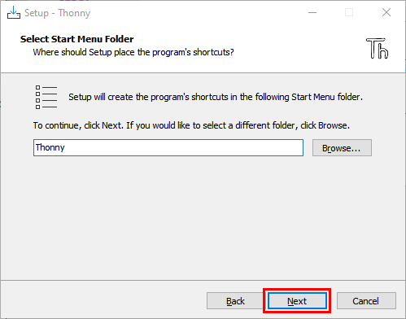

5). Click **Create desktop icon,** you will view Thonny on your desktop.


6). Click“**Install**”


7). Wait for a while but don’t click **Cancel**


8). Click **“Finish”**


#### 1.3. Basic Setting：

Double-click Thonny, choose lanuage and initial settings and click **Let’s go！**


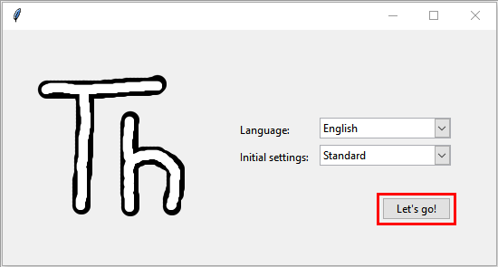

Click“**View**”→“**File**”and“**Shell**”

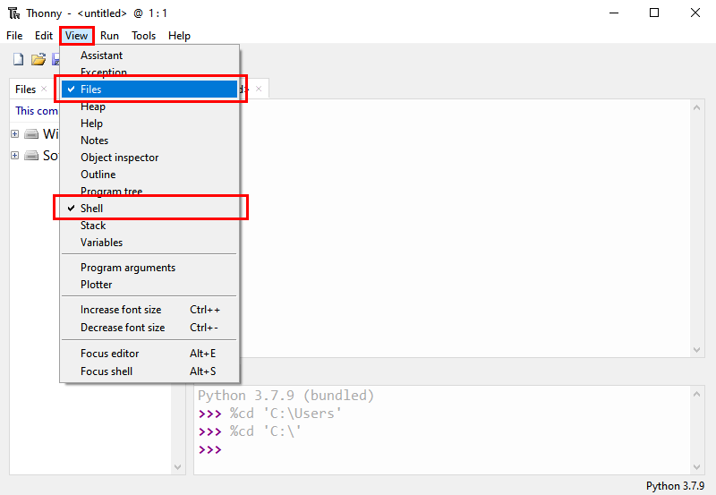


### 2. Install the CP2102 driver：

Before using the Thonny, we need to install the CP2102 driver in the computer.

**Windows system**

Check if the CP2102 driver has been installed.

1). Interface the ESP32 with your PC with a USB cable.


2). Click “This PC” and right-click “Manage”.


3). Click “Device Manager” , if the CP2102driver has been installed，"Silicon Labs CP210x USB to UART Bridge(COMx)" will be shown.

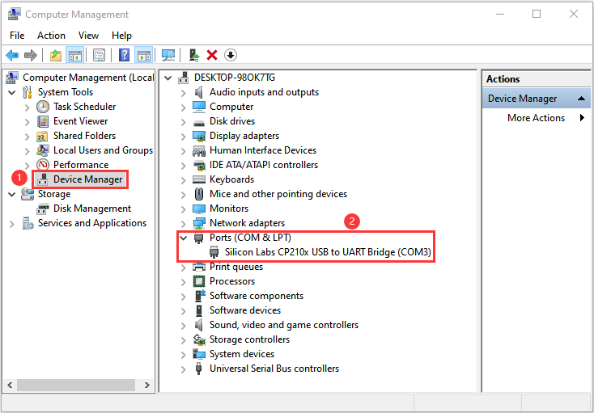

If the CP2102 has not been installed.


Click “CP2102USB to UART Bridge Controller” and “Update driver”.


Click “Browse my computer for drivers”.


Click “Browse... to” choose “CP2102 Driver File-Windows” and click “Next”.


The CP2102 driver will be installed.


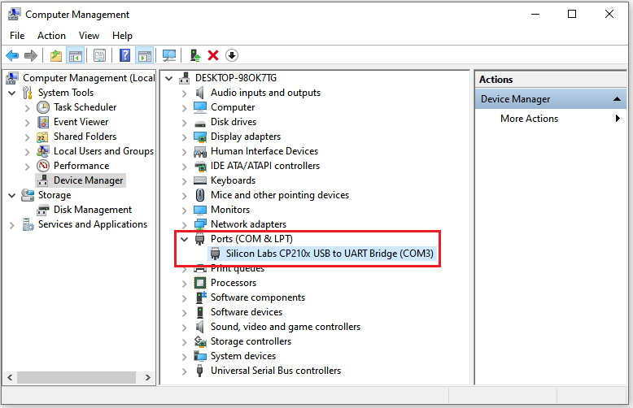


### 3. Burn Micropython firmware:

To run a Python program on the ESP32 board, we need to burn the firmware to the ESP32 board first.

Download Micropython firmware microPython website：[http://micropython.org/](http://micropython.org/)

ESP32 firmware：[https://micropython.org/download/esp32/](https://micropython.org/download/esp32/)


The firmware we use：**esp32-20210902-v1.17.bin**

Download firmware：[https://micropython.org/resources/firmware/esp32-20210902-v1.17.bin](https://micropython.org/resources/firmware/esp32-20210902-v1.17.bin)

Wo also offer the Firmware：“...\\Python\_Firmware”.

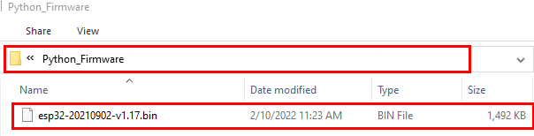

**Burn the Micropython firmware**

Connect the ESP32 to your PC with a USB cable

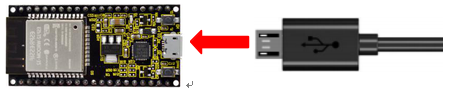

Make sure the driver has been installed successfully and the COM port can be identified correctly. Open Device Manager and  expand “Ports”.


Open Thonny，click“run”and“Select interpreter...”


Select “Micropython (ESP32)” and “Silicon Labs CP210x USB to UART Bridge(COM3)” and click “Install or update firmware”.


Select“Silicon Labs CP210x USB to UART Bridge(COM3)”，click “ Browse...”and choose the firmware **esp32-20210902-v1.17.bin.**
Check“Erase flash before installing”and“Flash mode”，then click“Install”.（<span style="color: rgb(255, 76, 65);">Note：if you fail to install the firmware，press the Boot button on the ESP32 board and click“Install”</span>）

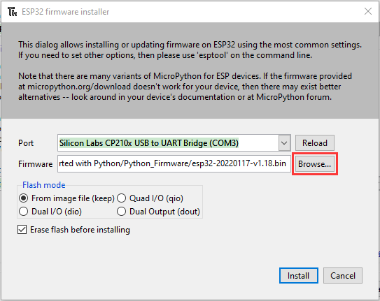

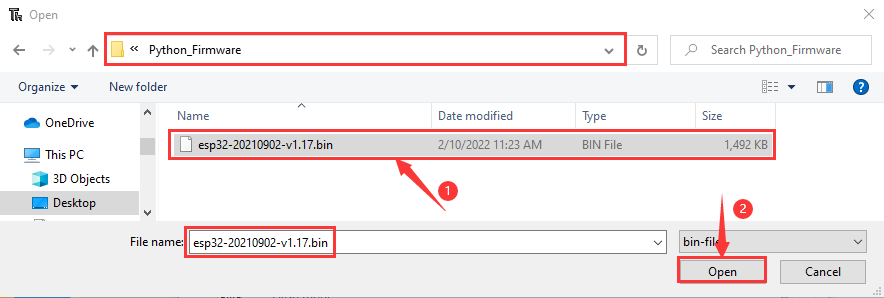

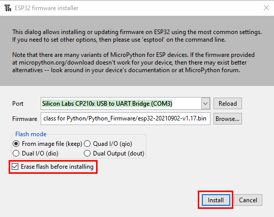

Then click “Close” and “OK”.

<span style="color: rgb(255, 76, 65);">Note：</span>During installation, you can press and hold the Boot button on the ESP32 mainboard. When the upload progress percentage appears, release the button for a while to complete the installation.


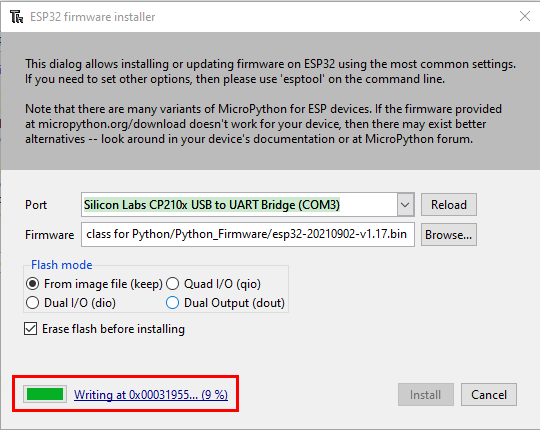

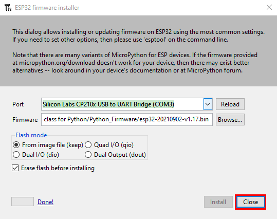


Turn off all windows and turn to the main page and click “STOP”.


### 4. Test Code:

**Test the Shell commander**

Input print('hello world') in the“Shell”and press “**Enter**”.

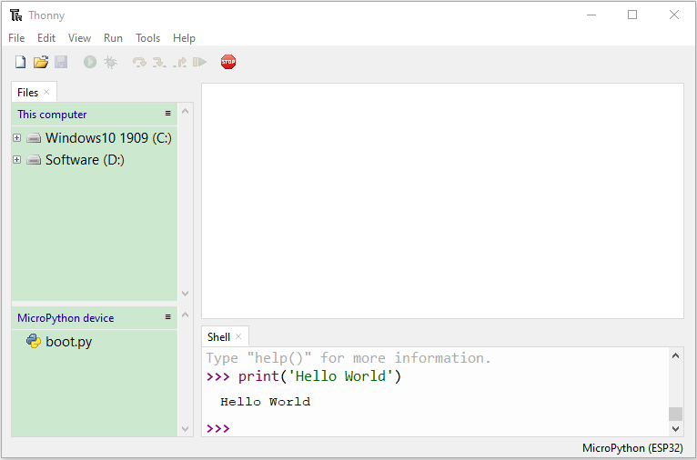

#### Run the test code(online):

Connect the ESP32 to your PC. Users can program and debug programs with Thonny.

Open Thonny and click "**Open**".

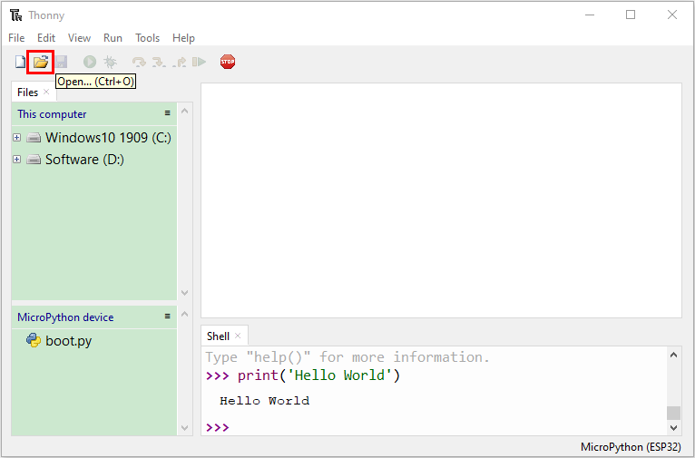

When a new window pops up, click “**This computer**”.


Select the file “**lesson\_01\_HelloWorld.py**”.

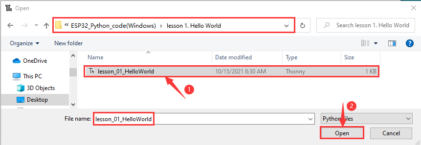

Click ,“**Hello World**”will be printed in the “**Shell**” monitor.


<span style="color: rgb(255, 76, 65);">Note: Press the reset button to reboot</span>

#### Run the test code(offline):

After rebooting the ESP32, run the boot\.py file under the root directory first then run your code file.

So, we need to add a guide program to run the code of users.

Move the file "<span style="color: rgb(255, 76, 65);">**ESP32\_code\_MicroPython(Windows)**</span>" to the disk(D)，the route is “<span style="color: rgb(255, 169, 0);">D:/ESP32\_code\_MicroPython(Windows)</span>”.

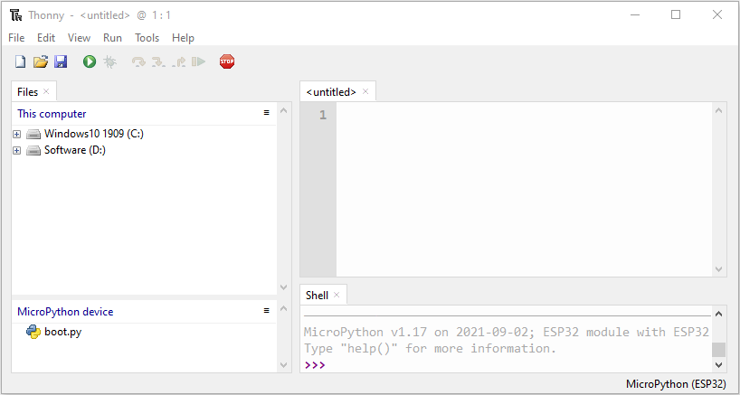

Click lesson 00. Boot and double-click boot\.py, then the code under MicroPython device can run offline.

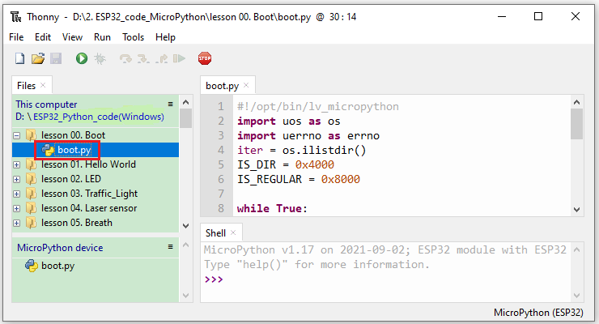

If you want to run the code offline, you nee to upload boot\.py and program code to MicroPython device, then press the ESP32’s reset button. We will take the lesson 00 and lesson 01 as an example. Select "**boot\.py**" and right-click "**Upload to/**".

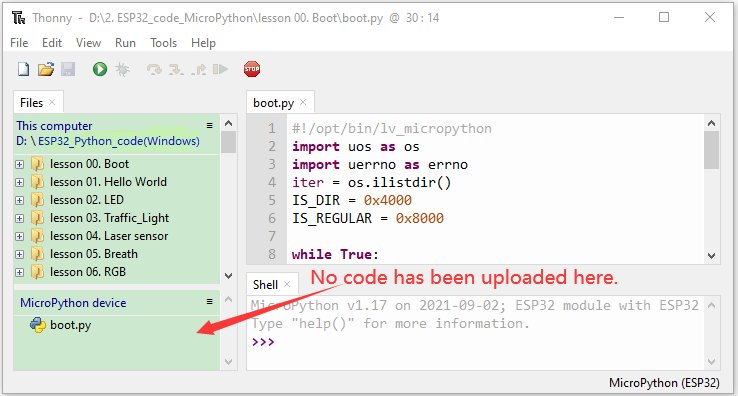

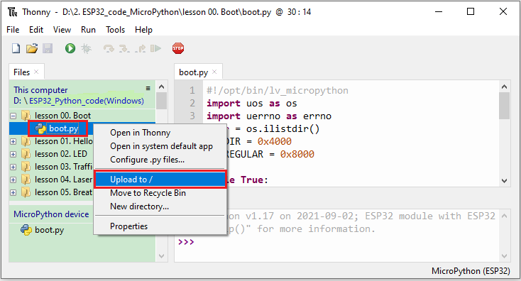

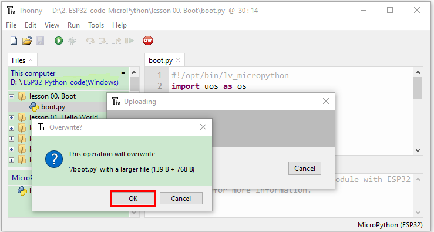

Similarly, upload the lesson 01.HelloWorld\.py file to the “**MicroPython device**”.

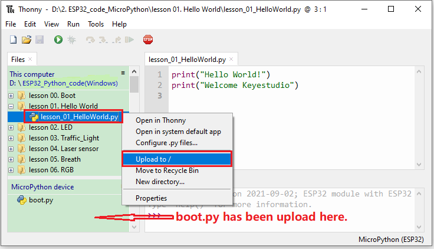

Press the Reset button, you will view code running in the "**Shell**" monitor.

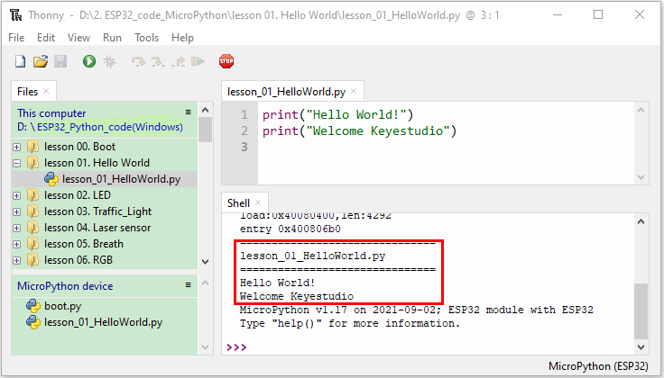

### 5. Thonny Common Operation:

**Upload the code to the ESP32**

We take the boot\.py as an example. If we add a "**boot\.py**" in each code directory, reboot the ESP32, the boot\.py will run first.

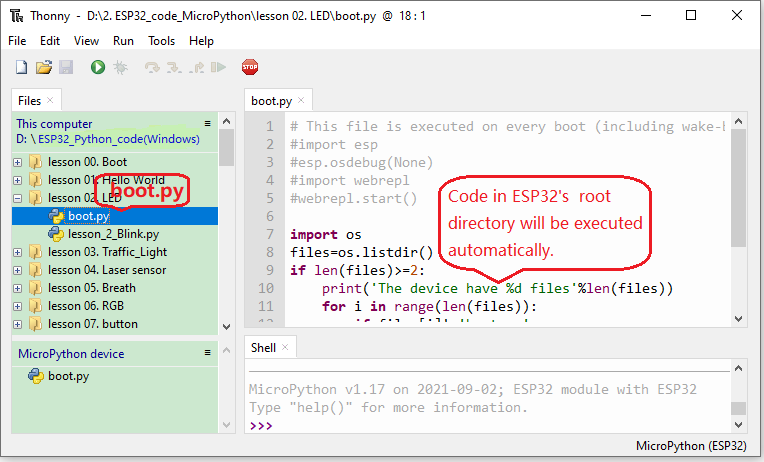

Select “**boot\.py**”in the file lesson 02. LED, right-click to select“**Upload to /**”. Then the code will be uploaded to the root directory of the ESP32 and click "**OK**".

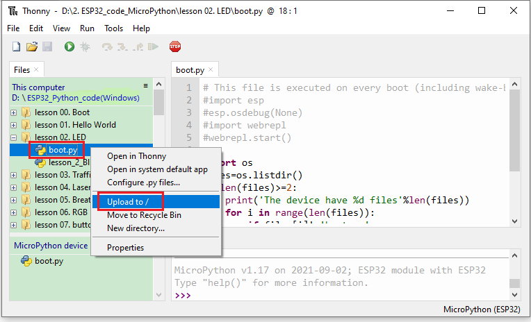

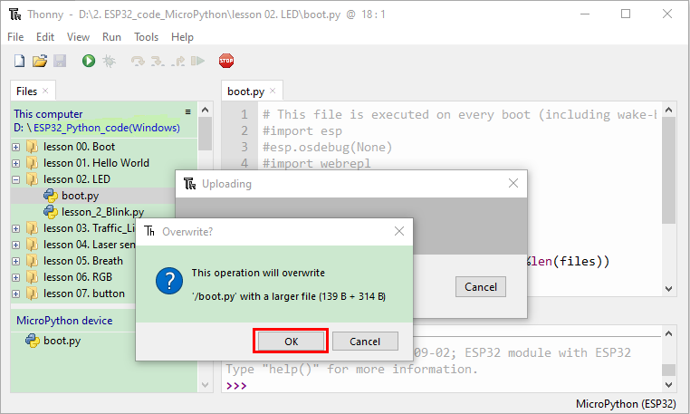

**Download the code to your PC** 

MicroPython device "**boot\.py**", then right-click "**Download to…**".

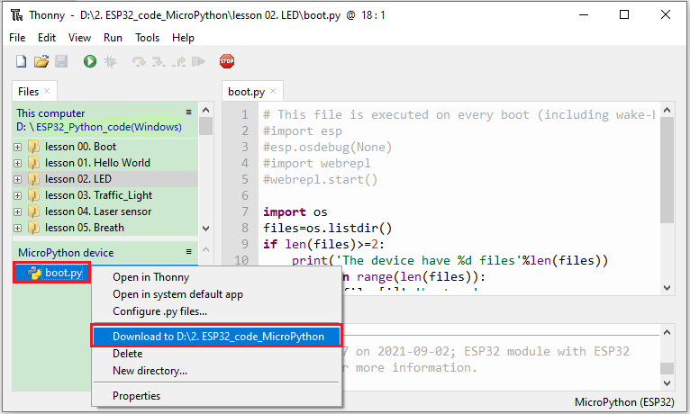

**Delete files of the ESP32**

For example, click “**boot\.py**” in the MicroPython device and right-click "**Delete**".

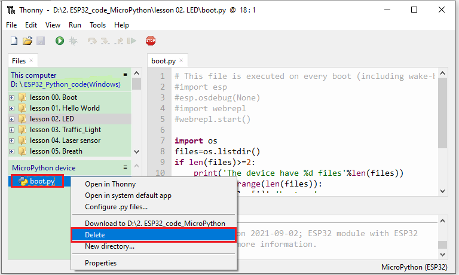

Select "**boot\.py**" in the lesson 02. LED folder, right-click "**Move to Recycle Bin**" to delete it.

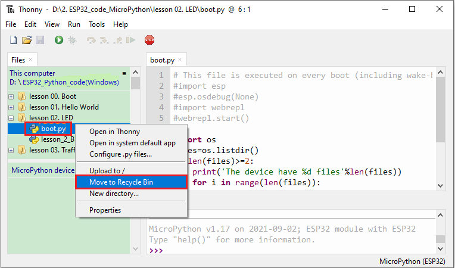

**Create and save code**

Click “**File**” → “**New**” to create and edit code.


Enter the code in the new file. We take the lesson 02. LED\.py as an example.

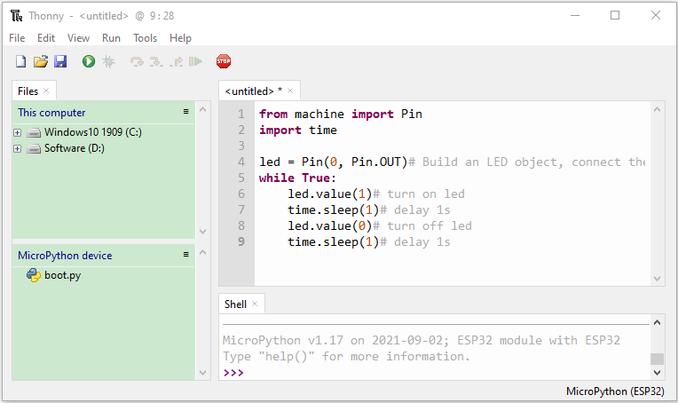

Click  to save the code to your PC or the ESP32.


Select MicroPython device and enter main\.py in the new page and click "OK".


Then the code will be uploaded to the ESP32.

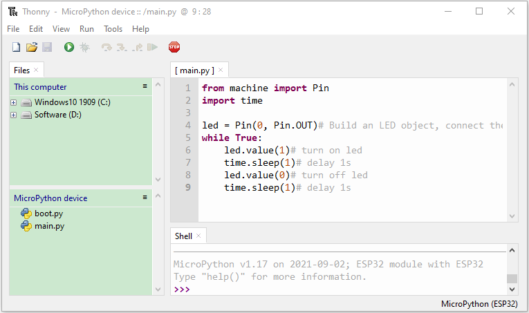

Disconnect the USB cable and connect it, you can see the effect of the LED flashing continuously in the circuit on a cycle.  

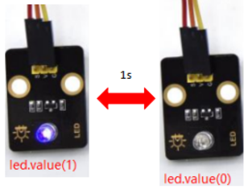


## 2. Single Sensor/Experiment Projects：

When we get the kit, we can see that there are 42 sensors/modules in the kit, which contain the corresponding ESP32 mainboard, ESP32 Expansion Board and wirings. Here, we will connect the 42 sensors individually to the ESP32 mainboard and the ESP32 Expansion Board using a wiring. Then run the corresponding test code to test the function of each sensor separately. Our next lesson is to study the principles of individual modules/sensors from simple to complex as well as some extended applications of sensors to consolidate and deepen our understanding of the kits.   

<span style="color: rgb(255, 76, 65);">Note :</span> When connecting the module/sensor wirings in the experiment, the wiring method and position must be followed in the document. What’s more, do not misconnect the power supply and signal pin, otherwise there may be no experimental results or damage to the modules/sensors.  


### Project 1: Hello World

**Overview**

For ESP32 beginners, we will start with some simple things. In this project, you only need a ESP32 mainboard, a USB cable and a computer to complete the "Hello World\!" project, which is a test of communication between the ESP32 mainboard and the computer as well as a primary project.

**Components**

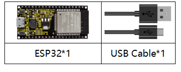

**Wiring Diagram**

In this project, we will use a USB cable to connect the ESP32 to a computer.

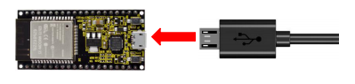

**Running code online：**

To run the ESP32 online, you need to connect the ESP32 to the computer, which allows you to compile or debug programs using Thonny software.  

Advantages:

1)\. You can use the Thonny software to compile or debug programs.

2)\.Through the "Shell" window, you can view error messages and output results generated during the running of the program as well as query related function information online to help improve the program.  

Disadvantages:

1)\. To run the ESP32 online, you must connect the ESP32 to a computer and run it with the Thonny software.  


2)\. If the ESP32 is disconnected from the computer , when they reconnect, the program won't run again.  

<span style="color: rgb(255, 169, 0);">Basic Operation:</span>
<br>
<br>

1). Open Thonny and click“Open...”.


2). Click“This computer”in the new pop-up window.


3). In the new dialog box，select“Project\_01\_HelloWorld.py”,click“Open”. The code used in this tutorial is saved in the file “**...\6.Codes\ESP32_Python_code(Windows)**”. You can move the code to anywhere. for example, we can save the file “<span style="color: rgb(255, 76, 65);">ESP32\_Python\_code(Windows)</span>” in the Disk(D), the route is <span style="color: rgb(0, 209, 0);">**D:\\ESP32\_Python\_code(Windows)**</span>.

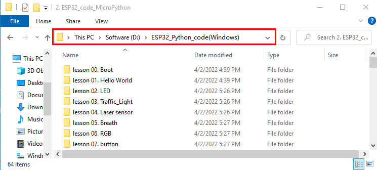

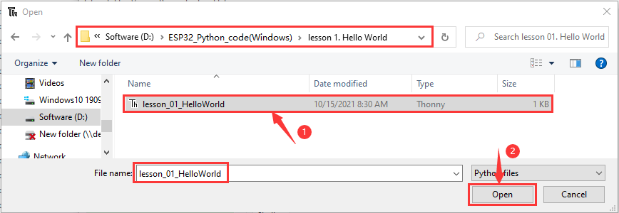

3). Click“Run current script”to execute the program“Hello World\!”, "Welcome Keyestudio" , which will be printed in the“Shell”window.

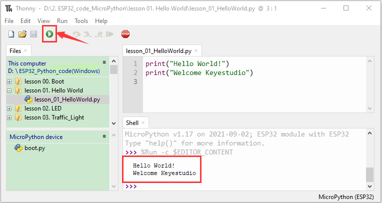

**Exit running online**

When running online, click “Stop /Restart Backend”or press “Ctrl+C”on the Thonny to exit the program.  


**Test Code**

```python
print("Hello World!")
print("Welcome Keyestudio")
```


### Project 2: Lighting up LED


**Overview**

In this kit, we have a Keyestudio Purple Module, which is very simple to control. If you want to light up the LED, you just need to make a certain voltage across it.

In the project, we will control the high and low level of the signal end S through programming, so as to control the LED on and off. 

**Working Principle**

The two circuit diagrams are given.

The left one is wrong wiring-up diagram. Why? Theoretically, when the S terminal outputs high levels, the LED will receive the voltage and light up.

Due to limitation of IO ports of ESP32 board, weak current can’t make LED brighten.

The right one is correct wiring-up diagram. GND and VCC are powered up. When the S terminal is a high level, the triode Q1 will be connected and LED will light up(note: current passes through LED and R3 to reach GND by VCC not IO ports). Conversely, when the S terminal is a low level, the triode Q1 will be disconnected and LED will go off.


**Components**

|  |   | 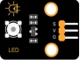 |  |  |
| ------------------------------------- | ----------------------- | ------------------------------------- | ---------------------- | ------------------------------------- |
| ESP32 Board*1                         | ESP32 Expansion Board*1 | Keyestudio Purple LED Module*1        | 3P Dupont Wire*1       | MicroUSB Cable*1                      |

**Wiring Diagram**

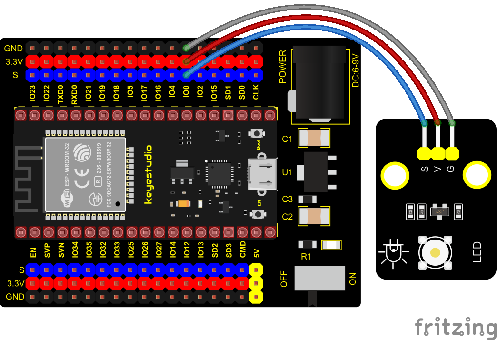

**Test Code**


```python
from machine import Pin
import time

led = Pin(0, Pin.OUT)# Build an LED object, connect the external LED light to pin 0, and set pin 0 to output mode
while True:
    led.value(1)# turn on led
    time.sleep(1)# delay 1s
    led.value(0)# turn off led
    time.sleep(1)# delay 1s
```

**Code Explanation**

**Machine** module is indispensable, we use **import machine** or **from machine import...** to program ESP32 with microPython.

**time.sleep()** function is used to set delayed time, as **time.sleep(0.01),** which means, the delayed time is 10ms.

**led = Pin(0, Pin.OUT)**，created a pin example and we name **led.**

**0** is indicative of connected pin GP0，**Pin.OUT represents output mode**， can use **.value() to output high levels** (3.3V) **led.value(1) or low levels** (0V) **led.value(0)**.

**while True is loop function**

It means that sentences under this function will loop unless **True** changes into **False.** For the function **while**，**led.value(1)**,
outputs high levels to the pin 0; then LED lights up. Then the delayed function **time.sleep(1)** will wait for 1s. When **led.value(0)**
output low levels to the pin 0, the LED will go off，and the function **time.sleep(1)** will wait for 1s, cyclically, and LED will flash.

**Test Result**

Connect the wires according to the experimental wiring diagram and power on. Click “Run current script”, the code starts executing, we will see that the LED in the circuit will flash alternately. Press “Ctrl+C”or click“Stop/Restart backend”to exit the program.

### Project 3: Traffic Lights Module


**Overview**

In this lesson, we will learn how to control multiple LED lights and simulate the operation of traffic lights.

Traffic lights are signal devices positioned at road intersections, pedestrian crossings, and other locations to control flows of traffic.

In this kit, we will use the traffic light module to simulate the traffic light.

**Working Principle**

In previous lesson, we already know how to control an LED. In this part, we only need to control three separated LEDs. Input high levels to the signal R(3.3V), then the red LED will be on.


**Components**

| 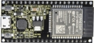 | 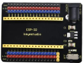  |   |  |  |
| ------------------------------------- | ----------------------- | -------------------------------------- | ------------------------------------- | -------------------------------------- |
| ESP32 Board*1                         | ESP32 Expansion Board*1 | Keyestudio DIY Traffic Lights Module*1 | 5P Dupont Wire*1                      | Micro USB Cable*1                      |

**Wiring Diagram**


**Test Code**

```python
import machine
import time

led_red = machine.Pin(15, machine.Pin.OUT)
led_yellow = machine.Pin(2, machine.Pin.OUT)
led_green = machine.Pin(0, machine.Pin.OUT)

while True:
    led_green.value(1) # green light turn on
    time.sleep(5) # delay 5s
    led_green.value(0) # green light turn off
    for i in range(3): # yellow light blinks 3 times
        led_yellow.value(1)
        time.sleep(0.5)
        led_yellow.value(0)
        time.sleep(0.5)
    led_red.value(1) # red light turn on
    time.sleep(5) # delay 5s
    led_red.value(0) #red light turn off
```

**Code Explanation**

Create pins, set pins mode and delayed functions.

We use the **for** loop.

The simplest form is **for i in range()**.

In the code, we used range(3), which means the variable i starts from 0, increase 1 for each time, to 2.

**Test Result**

Connect the wires according to the experimental wiring diagram and power on. Click “Run current script”, the code starts executing, we will see that the green LED will be on for 5s then off, the yellow LED will flash for 3s then go off and the red one will be on for 5s then off. Press “Ctrl+C”or click“Stop/Restart backend”to exit the program.

### Project 4: Laser Sensor


**Description**

Lasers are widely used to cut, weld, surface treat, and more on specific materials. The energy of the laser is very high. The toy laser pointer may cause glare to the human eye, and it may cause retinal damage for a long time. my country also prohibits the use of laser to illuminate the aircraft.

**Working Principle**

The laser head sensor module is mainly composed of a laser head with a light-emitting die, a condenser lens, and a copper adjustable sleeve.

We can see the circuit schematic diagram of this module which is very similar to the LED we have learned. They are all driven by triodes. A high-level digital signal is directly input at the signal end, then the sensor will start to work; if inputting low levels, the sensor won’t work.

Note: don’t point an laser emitter at eyes of people.

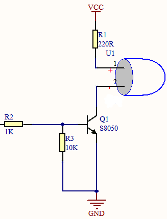

**Components**

|  |  | 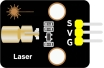 |  |  |
| -------------------------------------- | ----------------------- | -------------------------------------- | ----------------------- | --------------------------------------- |
| ESP32 Board*1                          | ESP32 Expansion Board*1 | Keyestudio DIY Laser Module*1          | 3P Dupont Wire*1        | Micro USB Cable*1                       |

**Connection Diagram**


**Test Code**

```python
from machine import Pin
import time

laser = Pin(0, Pin.OUT)# Build a laser object, connect the laser to pin 0, and set pin 0 to output mode
while True:
    laser.value(1) # Turn on the laser
    time.sleep(2) # dalay 2s
    laser.value(0) # Turn off the laser
    time.sleep(2) # delay 2s
```

**Code Explanation**

Please refer to project 2 above for the code setting instructions.

**Test Result**

Connect the wires according to the experimental wiring diagram and power on. Click “Run current script”, the code starts executing, we will see that the laser tube on the module emits a red laser signal for 2 seconds, and stops emitting a red laser signal for 2 seconds. Press “Ctrl+C”or click “Stop/Restart backend”to exit the program.

### Project 5: Breathing LED


**Overview**

A“breathing LED”is a phenomenon where an LED's brightness smoothly changes from dark to bright and back to dark, continuing to do so and giving the illusion of an LED“breathing. This phenomenon is similar to a lung breathing in and out. So how to control LED’s brightness? We need to take advantage of PWM. Please refer to Project 6.

**Components**

|  |  | 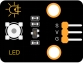 |  |  |
| --------------------------------------- | ----------------------- | --------------------------------------- | ----------------------- | --------------------------------------- |
| ESP32 Board*1                           | ESP32 Expansion Board*1 | Keyestudio Purple LED Module*1          | 3P Dupont Wire*1        | MicroUSB Cable*1                        |

**Connection Diagram**


**Test Code**

```python
import time
from machine import Pin,PWM

#The way that the ESP32 PWM pins output is different from traditionally controllers.
#It can change frequency and duty cycle by configuring PWM’s parameters at the initialization stage.
#Define GPIO 0’s output frequency as 10000Hz and its duty cycle as 0, and assign them to PWM.
pwm =PWM(Pin(0,Pin.OUT),10000,0)

try:
    while True:
#The range of duty cycle is 0-1023, so we use the first for loop to control PWM to change the duty cycle value,making PWM output 0% -100%; Use the second for loop to make PWM output 100%-0%.  
        for i in range(0,1023):
            pwm.duty(i)
            time.sleep_ms(1)
            
        for i in range(0,1023):
            pwm.duty(1023-i)
            time.sleep_ms(1)  
except:
#Each time PWM is used, the hardware Timer will be turned ON to cooperate it. Therefore, after each use of PWM, deinit() needs to be called to turned OFF the timer. Otherwise, the PWM may fail to work next time.
    pwm.deinit()
```


**Test Result**

Connect the wires according to the experimental wiring diagram and power on. Click “Run current script”, the code starts executing, we will see that the LED on the module gradually gets dimmer then brighter, cyclically, like human breathe. Press “Ctrl+C”or click“Stop/Restart backend”to exit the program.

### Project 6: RGB Module

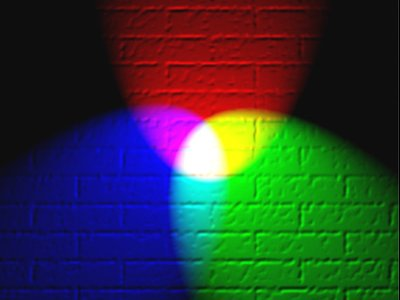

**Overview**

Among these modules is a RGB module. It adopts a F10-full color RGB foggy common cathode LED. We connect the RGB module to the PWM port of MCU and the other pin to GND(for common anode RGB, the rest pin will be connected to VCC). So what is PWM?

PWM is a means of controlling the analog output via digital means. Digital control is used to generate square waves with different duty cycles (a signal that constantly switches between high and low levels) to control the analog output. In general, the input voltages of ports are 0V and 5V. What if the 3V is required? Or a switch among 1V, 3V and 3.5V? We cannot change resistors constantly. For this reason, we resort
to PWM.


For Arduino digital port voltage outputs, there are only LOW and HIGH levels, which correspond to the voltage outputs of 0V and 5V respectively. You can define LOW as“0”and HIGH as“1’, and let the Arduino output five hundred‘0’or“1”within 1 second. If output five hundred‘1’, that is 5V; if all of which is‘0’,that is 0V; if output 250 01 pattern, that is 2.5V.

This process can be likened to showing a movie. The movie we watch are not completely continuous. Actually, it generates 25 pictures per second, which cannot be told by human eyes. Therefore, we mistake it as a continuous process. PWM works in the same way. To output different voltages, we need to control the ratio of 0 and 1. The more‘0’or‘1’ output per unit time, the more accurate the control.

**Working Principle**

For our experiment, we will control the RGB module to display different colors through three PWM values.


**Components**

|  |  | 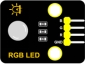 | 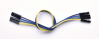 |  |
| --------------------------------------- | ----------------------- | --------------------------------------- | ----------------------- | --------------------------------------- |
| ESP32 Board*1                           | ESP32 Expansion Board*1 | Keyestudio Common Cathode RGB Module *1 | 4P Dupont Wire*1        | Micro USB Cable*1                       |

**Connection Diagram**


**Test Code**


```python
# import Pin, PWM and Random function modules.
from machine import Pin, PWM
from random import randint
import time

#Configure ouput mode of GPIO0, GPIO2 and GPIO15 as PWM output and PWM frequency as 10000Hz.
pins = [0, 2, 15]

pwm0 = PWM(Pin(pins[0]),10000)  
pwm1 = PWM(Pin(pins[1]),10000)
pwm2 = PWM(Pin(pins[2]),10000)

#define a function to set the color of RGBLED.
def setColor(r, g, b):
    pwm0.duty(1023-r)
    pwm1.duty(1023-g)
    pwm2.duty(1023-b)
    
try:
    while True:
        red   = randint(0, 1023) 
        green = randint(0, 1023)
        blue  = randint(0, 1023)
        setColor(red, green, blue)
        time.sleep_ms(200)
except:
    pwm0.deinit()
    pwm1.deinit()
    pwm2.deinit()
```

**Test Result**

Connect the wires according to the experimental wiring diagram and power on. Click “Run current script”, the code starts executing, we will see that the RGB LED on the module starts to display random colors. Press “Ctrl+C”or click “Stop/Restart backend”to exit the program.

### Project 7: Button Sensor


**Overview**

In this kit, there is a Keyestudio single-channel button module, which mainly uses a tact switch and comes with a yellow button cap.

In previous lessons, we learned how to make the pins of our single-chip microcomputer output a high level or low level. In this experiment, we will read the high level (3.3V) and low level (0V).

We can determine whether the button on the sensor is pressed by reading the high and low level of the S terminal on the sensor.

**Working Principle**

The button module has four pins. The pin 1 is connected to the pin 3 and the pin 2 is linked with the pin 4. When the button is not pressed, they are disconnected. Yet, when the button is pressed, they are connected. If the button is released, the signal end is high level.


**Components**

|  |  | 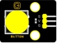 |  |  |
| --------------------------------------- | ----------------------- | --------------------------------------- | ----------------------- | --------------------------------------- |
| ESP32 Board*1                           | ESP32 Expansion Board*1 | Keyestudio DIY Button Module*1          | 3P Dupont Wire*1        | Micro USB Cable*1                       |

**Connection Diagram**

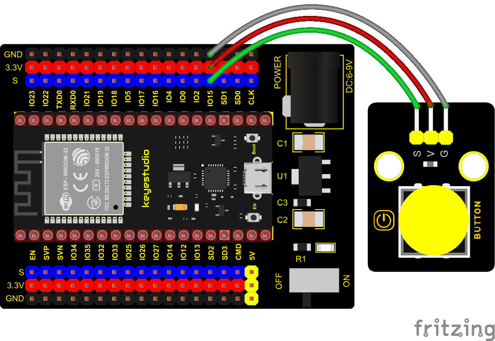

**Test Code**

```python
from machine import Pin
import time

button = Pin(15, Pin.IN, Pin.PULL_UP)

while True:
    if button.value() == 0:
        print("You pressed the button!")   #Press to print the corresponding information.
    else:
        print("You loosen the button!")
    time.sleep(0.1) #delay 0.1s
```

**Code Explanation**

**button = Pin(15, Pin.IN, Pin.PULL\_UP),** we define the pin of the button as GP15 and set to PULL-UP mode

We can use **button = Pin(15, Pin.IN) to set INPUT mode,** at this time, the pins are in high resistance state.

1). **button.value(),** read levels of buttons. Function returns High or Low

2). **if..else.. sentence,** when the logic judge is TRUE, the code under the if will be activated; otherwise, the code udder the else will be activated.

3). When ESP32 detects the button pressed, the signal end is low level (GP 15 is low level). **button.value() is 0.** If the ESP32 detects the button unpressed, **button.value()** is 1 and else sentence will be activated.

**Test Result**

Connect the wires according to the experimental wiring diagram and power on. Click “Run current script”, the code starts executing, the string will be displayed on the ”Shell“ window. 

When the button is pressed, the ”Shell“ window will show“You pressed the button\!”；when the button is released，the ”Shell“ window will show “Loosen the button”; as shown below. Press “Ctrl+C”or click“Stop/Restart backend”to exit the program.

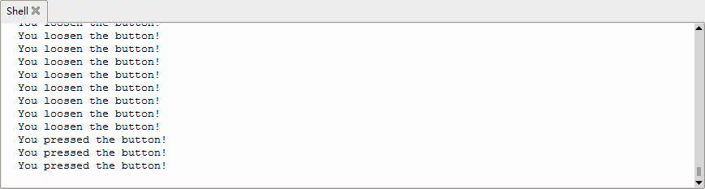

### Project 8: Capacitive Sensor


**Description**

In this kit, there is a capacitive touch module which mainly uses a TTP223-BA6 chip. It is a touch detection chip, which provides a touch button, and its function is to replace the traditional button with a variable area button. When we power on, the sensor needs about 0.5 seconds to stabilize. 

Do not touch the keys during this time period. At this time, all functions are disabled, and self-calibration is always performed. The calibration period is about 4 seconds. We display the test results in the shell.


**Working Principle**

When our fingers touch the module, the signal S outputs high levels, the red LED on the module flashes. We can determine if the button is pressed or not by reading high and low levels on the sensor.

**Required Components**

|  |  | 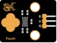 |  |  |
| --------------------------------------- | ----------------------- | --------------------------------------- | ----------------------- | --------------------------------------- |
| ESP32 Board*1                           | ESP32 Expansion Board*1 | Keyestudio DIY Capacitive Module*1      | 3P Dupont Wire*1        | Micro USB Cable*1                       |

**Connection Diagram**

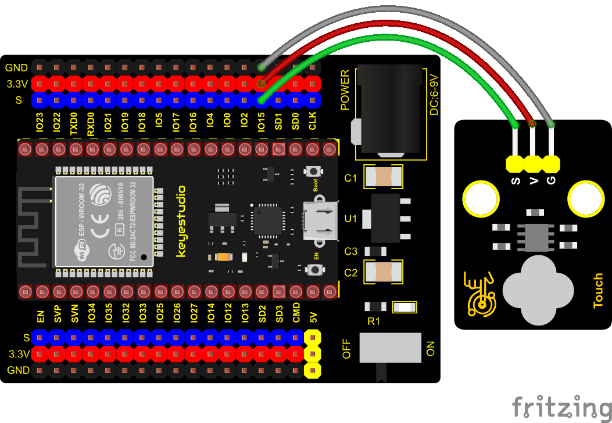

**Test Code**

```python
from machine import Pin
import time

touch = Pin(15, Pin.IN, Pin.PULL_UP)

while True:
    if touch.value() == 1:
        print("You pressed the button!")   #Press to print the corresponding information.
    else:
        print("You loosen the button!")
    time.sleep(0.1) #delay0.1s
```

**Code Explanation**

When we touch the sensor, the Shell monitor will show“You pressed the button\!”, if not,“You loosen the button\!”will be shown on the monitor.

**Test Result**

Connect the wires according to the experimental wiring diagram and power on. Click “Run current script”, the code starts executing, the string will be displayed in the ”Shell“ window. when the button is pressed, the red LED lights up and val is 1. Then the shell shows“You pressed the button\!”; if the button is released, the red LED is off and val is 0;“You loosen the button\!”will be displayed, as shown below. Press “Ctrl+C”or click“Stop/Restart
backend”to exit the program.

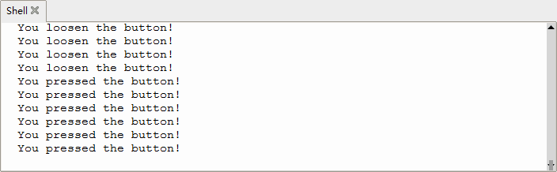

### Project 9: Obstacle Avoidance Sensor


**Overview**

In this kit, there is a Keyestudio obstacle avoidance sensor, which mainly uses an infrared emitting and a receiving tube. In the
experiment, we will determine whether there is an obstacle by reading the high and low level of the S terminal on the sensor.

**Working Principle**

NE555 circuit provides IR signals with frequency to the emitter TX, then the IR signals will fade with the increase of transmission distance. If encountering the obstacle, it will be reflected back.

When the receiver RX meets the weak signals reflected back, the receiving pin will output high levels, which indicates the obstacle is far away. On the contrary, it the reflected signals are stronger, low levels will be output, which represents the obstacle is close. There are two potentiometers on the module, and by adjusting the two potentiometers, we can adjust its effective distance.


**Components**

|  |  |     |  |  |
| --------------------------------------- | ----------------------- | ------------------------------------------ | ----------------------- | --------------------------------------- |
| ESP32 Board*1                           | ESP32 Expansion Board*1 | Keyestudio DIY Obstacle Avoidance Sensor*1 | 3P Dupont Wire*1        | Micro USB Cable*1                       |

**Connection Diagram**

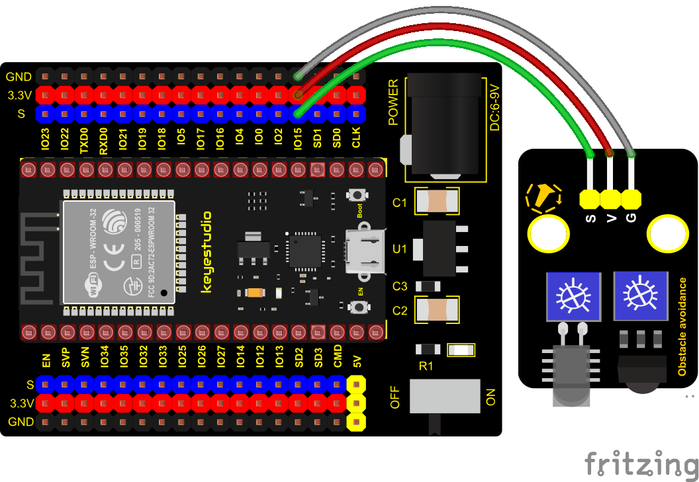

**Test Code**

```python
from machine import Pin
import time

sensor = Pin(15, Pin.IN)
while True:
    if sensor.value() == 0:
        print("There are obstacles")
    else:
        print("All going well")
    time.sleep(0.1)
```

**Code Explanation**

**Note:**

Connect the wires according to the connection diagram. After powering on, we start to adjust the two potentiometers to sense distance.


**Test Result**

Connect the wires according to the experimental wiring diagram and power on. Click “Run current script”, the code starts executing, the string will be displayed in the ”Shell“ window. When the sensor detects the obstacle, sensor.value() is 0, the shell will show “There are obstacles”, if the obstacle is not detected, sensor.value () is 1,“All going well”will be shown, as shown below.

Press “Ctrl+C”or click“Stop/Restart backend”to exit the program.


### Project 10: Line Tracking Sensor

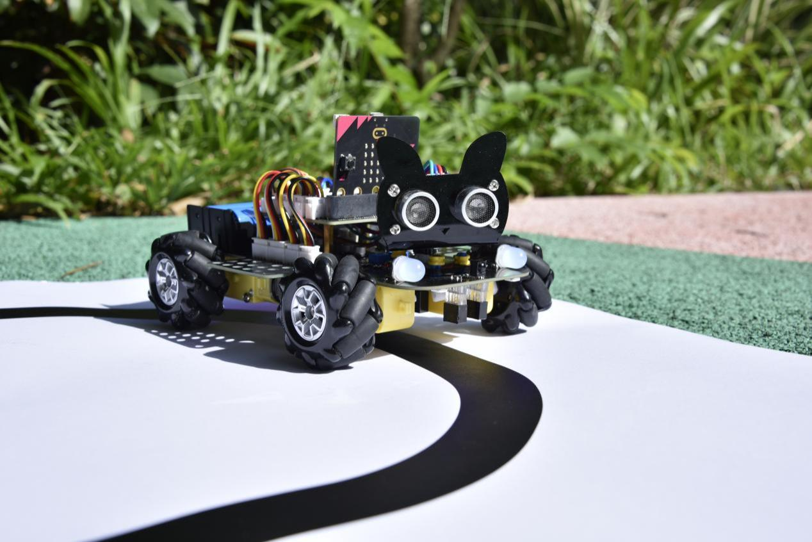

**Description**

In this kit, there is a DIY electronic building block single-channel line tracking sensor which mainly uses a TCRT5000 reflective black and white line recognition sensor element.

In the experiment, we judge the color (black and white) of the object detected by the sensor by reading the high and low levels of the S terminal on the module; and display the test results on the shell.

**Working Principle**


When a black or no object is detected, the signal terminal will output high levels; when white object is detected, the signal terminal is low level; its detection height is 0-3cm. 

We can adjust the sensitivity by rotating the potentiometer on the sensor. When the potentiometer is rotated, the sensitivity is best when the red LED on the sensor is at the critical point between off and on.

**Required Components**

|  |  |  |  |  |
| --------------------------------------- | ----------------------- | --------------------------------------- | ----------------------- | ----------------------- |
| ESP32 Board*1                           | ESP32 Expansion Board*1 | Keyestudio DIY Line Tracking Sensor*1   | 3P Dupont Wire*1        | Micro USB Cable*1       |

**Connection Diagram**


**Test Code**

```python
from machine import Pin
import time

sensor = Pin(15, Pin.IN, Pin.PULL_UP)

while True:
    if sensor.value() == 0:
        print("0   White")   #Press to print the corresponding information.
    else:
        print("1   Black")
    time.sleep(0.1) #delay 0.1s
```

**Test Result**

Connect the wires according to the experimental wiring diagram and power on. Click “Run current script”, the code starts executing, the string and data will be displayed in the ”Shell“ window.

When the sensor doesn’t detect an object or detects a black object, the val is 1, and the shell will display "Black" ; when a white object (can reflect light) is detected, the val is 0, and the shell displays "White", as shown below. Press “Ctrl+C”or click “Stop/Restart backend”to exit the program.

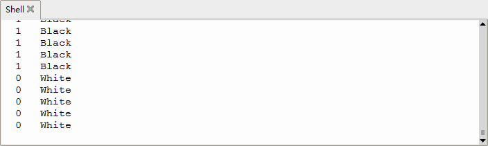

### Project 11: Photo Interrupter

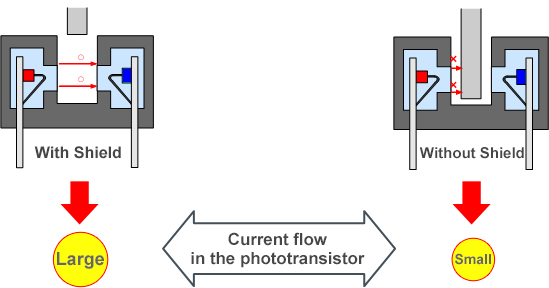

**Description**

This kit contains a photo interrupter which mainly uses 1 ITR-9608 photoelectric switch. It is a photoelectric switch optical switch
sensor.

**Working Principle**

When the paper is put in the slot, C is connected with VCC and the signal end S of the sensor are high levels; then the red LED will be off. Otherwise, the red LED will be on.

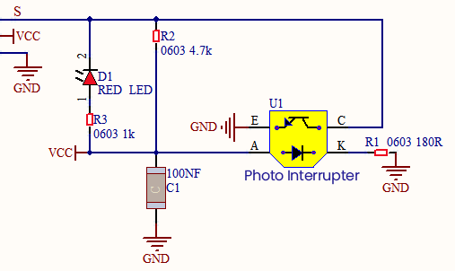

**Required Components**

|  |  | 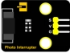 |  |  |
| --------------------------------------- | ----------------------- | --------------------------------------- | ----------------------- | --------------------------------------- |
| ESP32 Board*1                           | ESP32 Expansion Board*1 | Keyestudio DIY Photo Interrupter*1      | 3P Dupont Wire*1        | Micro USB Cable*1                       |

**Connection Diagram**


**Test Code**

```python
from machine import Pin
import time

sensor = Pin(15, Pin.IN, Pin.PULL_UP)
lastState = 0
PushCounter = 0

while True:
    State = sensor.value()
    if  State != lastState:
        if State == 1:
            PushCounter += 1
            print(PushCounter)   #Press to print the corresponding information.
    lastState = State
```

**Code Explanation**

**Logic setting :**

| Initial Setting | Set PushCounter to 0                 |
| --------------- | ------------------------------------ |
|                 | Set State to 0 (value of the sensor) |
|                 | Set lastState to 0                   |

| Condition                                          | Value                                                        | Result                                                       |
| -------------------------------------------------- | ------------------------------------------------------------ | ------------------------------------------------------------ |
| When an object enters the slot                     | lastState is 0，<br />State turns into 1; <br />lastState turns into 1 | Set PushCounter to PushCounter+1<br />print the value of PushCounter |
| When the object leaves the slot                    | lastState is 1，<br />State becomes 0，two data are not equal，<br />lastState turns into 0. | PushCounterdoesn’t change;<br />Don’t print the value of PushCounter |
| When the object goes <br />through this slot again | lastState is 0, <br />State becomes 1，two data are not equal，<br />lastState turns into 1. | Set PushCounter to PushCounter+1<br />And print the value of PushCounter |
| When the object leaves <br />this slot again       | lastState is 1，<br />State turns into 0，two data are not equal <br />lastState turns into 0 | PushCounter doesn’t change;<br />Don’t print the PushCounter value |

**Test Result**

Connect the wires according to the experimental wiring diagram and power on. Click “Run current script”, the code starts executing, data will be displayed in the ”Shell“ window. Every time when the object passes through the slot of the sensor, the PushCounter data will increase by 1 continuously, as shown below. Press“Ctrl+C”or click“Stop/Restart backend”to exit the program.

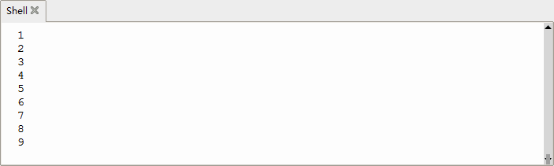

### Project 12: Tilt Module


**Overview**

In this kit, there is a Keyestudio tilt sensor. The tilt switch can output signals of different levels according to whether the module is
tilted. There is a ball inside. When the switch is higher than the horizontal level, the switch is turned on, and when it is lower than the horizontal level, the switch is turned off. This tilt module can be used for tilt detection, alarm or other detection.

**Working Principle**

The working principle is pretty simple. When pin 1 and 2 of the ball switch P1 are connected, the signal S is low level and the red LED will light up; when they are disconnected, the pin will be pulled up by the 4.7K R1 and make S a high level, then LED will be off.


**Components**

|  |  |   |  |  |
| ----------------------- | ----------------------- | ------------------------ | ----------------------- | ----------------------- |
| ESP32 Board*1           | ESP32 Expansion Board*1 | Keyestudio Tilt Sensor*1 | 3P Dupont Wire*1        | Micro USB Cable*1       |

**Connection Diagram**


**Test Code**

```python
from machine import Pin
import time

TiltSensor = Pin(15, Pin.IN)

while True:
    value = TiltSensor.value()
    print(value, end = " ")
    if  value== 0:
        print("The switch is turned on")
    else:
        print("The switch is turned off")
    time.sleep(0.1)
```

**Test Result**

Connect the wires according to the experimental wiring diagram and power on. Click “Run current script”, the code starts executing, the string and the data will be displayed in the ”Shell“ window. When the tilt module is inclined to one side, the red LED on the module will be off and the Shell“ window will display“1. the switch is turned off. 

In contrast, if you make it incline the other side, the red LED will light up and the monitor will display“0, the switch is turned on”, as shown below. Press “Ctrl+C”or click“Stop/Restart backend”to exit the program.


### Project 13: Collision Sensor


**Description**

The collision sensor uses a tact switch. This sensor is often used as a limit switch in 3D printers. In the experiment, we judge whether the sensor shrapnel is pressed down by reading the high and low levels of the S terminal on the module; and, we display the test results in the shell.

**Working Principle**

It mainly uses a tact switch. When the shrapnel of the tact switch is pressed, 2 and 3 are connected, the signal terminal S is low level, and the red LED on the module lights up; when the touch switch is not pressed, 2 and 3 are not connected, and 3 is pulled up to a high level by the 4.7K resistor R1, that is, the sensor signal terminal S is a high level, and the built-in red LED will be off at this time.

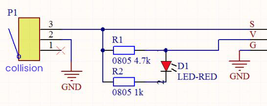

**Components Required**

|  |  | 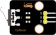       |  |  |
| ----------------------- | ----------------------- | ----------------------------- | ----------------------- | ----------------------- |
| ESP32 Board*1           | ESP32 Expansion Board*1 | Keyestudio Collision Sensor*1 | 3P Dupont Wire*1        | Micro USB Cable*1       |

**Connection Diagram**

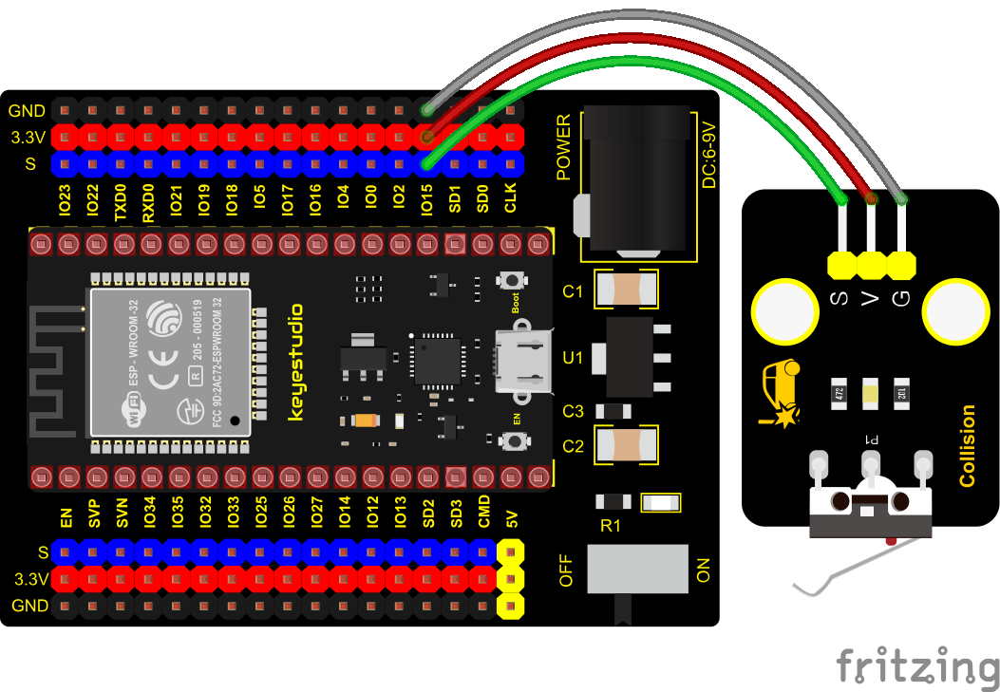

**Test Code**

```python
from machine import Pin
import time

CollisionSensor = Pin(15, Pin.IN)

while True:
    value = CollisionSensor.value()
    print(value, end = " ")
    if  value== 0:
        print("The end of this!")
    else:
        print("All going well")
    time.sleep(0.1)
```

**Test Result**

Connect the wires according to the experimental wiring diagram and power on. Click “Run current script”, the code starts executing, the string and the data will be displayed in the ”Shell“ window. When the shrapnel on the sensor is pressed down, val is 0, the red LED of the module is on, and "The end of his\!" is printed. 

When the shrapnel is released, the val is 1, the red LED of the module is off, and "All going well" is printed. \!" character, as shown below. Press “Ctrl+C”or click“Stop/Restart backend”to exit the program.

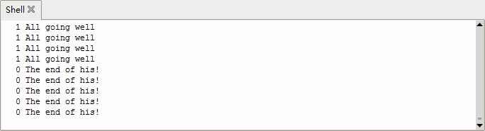

### Project 14: Hall Sensor


**Description**

In this kit, there is a Hall sensor which mainly adopts a A3144 linear Hall element. The element P1 are composed of a voltage regulator, a Hall voltage generator, a differential amplifier, a Schmitt trigger, a temperature compensation circuit and an open-collector output stage. In the experiment, we will use the Hall sensor to detect the magnetic field and display the test results on the shell.

**Working Principle**

When the sensor detects no magnetic field or a north pole magnetic field, the signal terminal will be high level; when it senses a south pole magnetic field, the signal terminal will be low levels.

The stronger the magnetic field strength is, induction distance is longer.

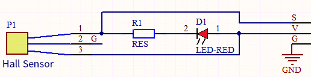

**Required Components**

|  |  | 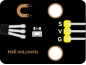      |  |  |
| ----------------------- | ----------------------- | ---------------------------- | ----------------------- | ----------------------- |
| ESP32 Board*1           | ESP32 Expansion Board*1 | Keyestudio DIY Hall Sensor*1 | 3P Dupont Wire*1        | Micro USB Cable*1       |

**Connection Diagram**


**Test Code**

```python
from machine import Pin
import time

hall = Pin(15, Pin.IN)
while True:
    value = hall.value()
    print(value, end = " ")
    if value == 0:
        print("A magnetic field")
    else:
        print("There is no magnetic field")
    time.sleep(0.1)
```

**Test Result**

Connect the wires according to the experimental wiring diagram and power on. Click “Run current script”, the code starts executing, the string and the data will be displayed in the “Shell“ window. When the sensor detects no magnetic fields or the north pole magnetic field, Shell will show“1 There is no magnetic field”and the LED on the sensor will be off. 

When it detects the south pole magnetic field, the Shell will show“0 A magnetic field”and the LED on the sensor will be on, as shown below. Press “Ctrl+C”or click“Stop/Restart backend”to exit the program.

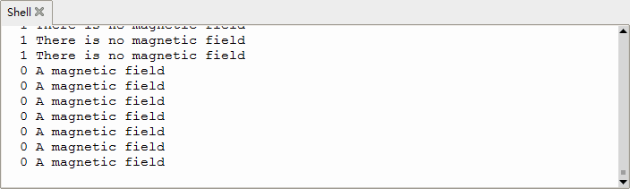

### Project 15: Reed Switch Module


**Overview**

In this kit, there is a Keyestudio reed switch module, which mainly uses a MKA10110 green reed component.

The reed switch is the abbreviation of the dry reed switch. It is a passive electronic switch element with contacts.

It has the advantages of simple structure, small size and easy control. Its shell is a sealed glass tube with two iron elastic reed electric plates.

In the experiment, we will determine whether there is a magnetic field near the module by reading the high and low level of the S terminal on the module; and, we display the test result in the shell.

**Working Principle**


In normal conditions, the glass tube in the two reeds made of special materials are separated. When a magnetic substance close to the glass tube, in the role of the magnetic field lines, the pipe within the two reeds are magnetized to attract each other in contact, the reed will suck together, so that the junction point of the connected circuit communication.

After the disappearance of the outer magnetic reed because of their flexibility and separate, the line is disconnected. The sensor uses this characteristic to build a circuit to convert magnetic field signal into high and low level signal.  

**Components**

|  |  | 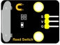             |  |  |
| ----------------------- | ----------------------- | ----------------------------------- | ----------------------- | ----------------------- |
| ESP32 Board*1           | ESP32 Expansion Board*1 | Keyestudio DIY Reed Switch Module*1 | 3P Dupont Wire*1        | Micro USB Cable*1       |

**Connection Diagram**


**Test Code**

```python
from machine import Pin
import time

ReedSensor = Pin(15, Pin.IN)
while True:
    value = ReedSensor.value()
    print(value, end = " ")
    if value == 0:
        print("A magnetic field")
    else:
        print("There is no magnetic field")
    time.sleep(0.1)
```

**Test Result**

Connect the wires according to the experimental wiring diagram and power on. Click “Run current script”, the code starts executing, the string and the data will be displayed in the ”Shell“ window.

When the sensor detects a magnetic field, val is 0 and the red LED of the module lights up, "0 A magnetic field" will be displayed. When no magnetic field is detected, val is 1, and the LED on the module goes out, "1 There is no magnetic field" will be shown, as shown below. Press “Ctrl+C”or click“Stop/Restart backend”to exit the program.

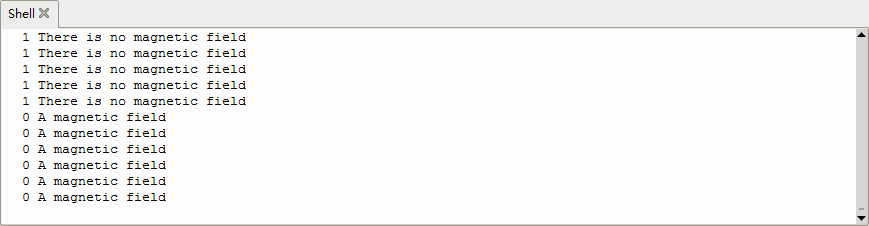

### Project 16: PIR Motion Sensor


**Overview**

In this kit, there is a Keyestudio PIR motion sensor, which mainly uses an RE200B-P sensor elements. It is a human body pyroelectric motion sensor based on pyroelectric effect, which can detect infrared rays emitted by humans or animals, and the Fresnel lens can make the sensor's detection range farther and wider.

In the experiment, we determine if there is someone moving nearby by reading the high and low levels of the S terminal on the module. The detected results will be displayed on the Shell.

**Working Principle**

The upper left part is voltage conversion(VCC to 3.3V). The working voltage of sensors we use is 3.3V, therefore we can’t use 5V directly. The voltage conversion circuit is needed.

When no person is detected or no infrared signal is received, and pin 1 of the sensor outputs low level. At this time, the LED on the module will light up and the MOS tube Q1 will be connected and the signal terminal S will detect Low levels.

When one is detected or an infrared signal is received, and pin 1 of the sensor outputs a high level. Then LED on the module will go off, the MOS tube Q1 is disconnected and the signal terminal S will detect high levels.

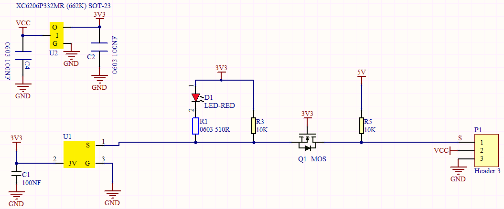

**Required Components**

|  |  | 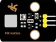            |  |  |
| ----------------------- | ----------------------- | ---------------------------------- | ----------------------- | ----------------------- |
| ESP32 Board*1           | ESP32 Expansion Board*1 | Keyestudio DIY PIR Motion Sensor*1 | 3P Dupont Wire*1        | Micro USB Cable*1       |

**Connection Diagram**


**Test Code**


```python
from machine import Pin
import time

PIR = Pin(15, Pin.IN)
while True:
    value = PIR.value()
    print(value, end = " ")
    if value == 1:
        print("Some body is in this area!")
    else:
        print("No one!")
    time.sleep(0.1)
```

**Test Result**

Connect the wires according to the experimental wiring diagram and power on. Click “Run current script”, the code starts executing, the string and the data will be displayed in the ”Shell“ window. When the sensor detects someone nearby, value is 1, the LED will go off and the ”Shell“ window will show“1 Somebody is in this area\!”.

On the contrary, the value is 0, the LED will go up and“0 No one\!”will be shown, as shown below. Press “Ctrl+C”or click“Stop/Restart backend”to exit the program.


### Project 17: Active Buzzer


**Overview**

In this kit, it contains an active buzzer module and a power amplifier module (the principle is equivalent to a passive buzzer). In this experiment, we control the active buzzer to emit sounds. Since it has its own oscillating circuit, the buzzer will automatically sound if given large voltage.

**Working Principle**

From the schematic diagram, the pin of buzzer is connected to a resistor R2 and another port is linked with a NPN triode Q1. So, if this triode Q1 is powered, the buzzer will sound.

If the base electrode of the triode connected to the R1 resistor is a high level, the triode Q1 will be connected.If the base electrode is pulled down by the resistor R3, the triode is disconnected.

When we output a high level from the IO port to the triode, the buzzer will emit sounds; if outputting low levels, the buzzer won’t emit sounds.


**Components**

|  |  |     |  |  |
| ----------------------- | ----------------------- | -------------------------- | ----------------------- | ----------------------- |
| ESP32 Board*1           | ESP32 Expansion Board*1 | Keyestudio Active Buzzer*1 | 3P Dupont Wire*1        | Micro USB Cable*1       |

**Connection Diagram**


**Test Code**

```python
from machine import Pin
import time

buzzer = Pin(15, Pin.OUT)
while True:
    buzzer.value(1)
    time.sleep(1)
    buzzer.value(0)
    time.sleep(1)
```

**Code Explanation**

In the experiment, we set the pin to GPIO15. When setting to high, the active buzzer will beep. When setting to low, the active buzzer will stop emitting sounds.

**Test Result**

Connect the wires according to the experimental wiring diagram and power on. Click “Run current script”, the code starts executing. The active buzzer will emit sound for 1 second, and stop for 1 second. Press “Ctrl+C”or click“Stop/Restart backend”to exit the program.

### Project 18: 8002b Audio Power Amplifier


**Overview**

In this kit, there is a Keyestudio 8002b audio power amplifier. The main components of this module are an adjustable potentiometer, a speaker, and an audio amplifier chip;

The main function of this module is: it can amplify the output audio signal, with a magnification of 8.5 times, and play sound or music through the built-in low-power speaker, as an external amplifying device for some music playing equipment.

In the experiment, we used the 8002b power amplifier speaker module to emit sounds of various frequencies.

**Working Principle**

In fact, it is similar to a passive buzzer. The active buzzer has its own oscillation source. Yet, the passive buzzer does not have internal oscillation. When controlling the circuit, we need to input square waves of different frequencies to the positive pole of the component and ground the negative pole to control the buzzer to chime sounds of different frequencies.


**Components**

|  |  | 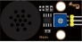                  |  |  |
| ----------------------- | ----------------------- | ---------------------------------------- | ----------------------- | ----------------------- |
| ESP32 Board*1           | ESP32 Expansion Board*1 | Keyestudio 8002b Audio Power Amplifier*1 | 3P Dupont Wire*1        | Micro USB Cable*1       |

**Connection Diagram**


**Test Code**

```python
from machine import Pin, PWM
from time import sleep
buzzer = PWM(Pin(15))

buzzer.duty(1000)

buzzer.freq(523)#DO
sleep(0.5)
buzzer.freq(586)#RE
sleep(0.5)
buzzer.freq(658)#MI
sleep(0.5)
buzzer.freq(697)#FA
sleep(0.5)
buzzer.freq(783)#SO
sleep(0.5)
buzzer.freq(879)#LA
sleep(0.5)
buzzer.freq(987)#SI
sleep(0.5)
buzzer.duty(0)
```

**Code Explanation**

In this experiment, we use the PWM class of the machine module, buzzer = PWM(Pin(15)) to create an instance of the PWM class, and the buzzer pin is connected to GPIO15.

The buzzer.duty(1000): set the duty cycle, and the duty cycle is 1000/4095. The larger the value, the louder the buzzer. When set to 0, the buzzer does not emit sound. **buzzer.freq()** is the frequency setting method.

In the experiment, we use the PWM on the machine module. **buzzer = PWM(Pin(15))**

**Test Result**

Connect the wires according to the experimental wiring diagram and power on. Click “Run current script”, the code starts executing. The power amplifier module will emit the sound of the corresponding frequency corresponding to the beat :DO for 0.5s, Re for 0.5s, Mi for 0.5s, Fa for 0.5s, So for 0.5s, La 0.5s and Si for 0.5s.

Press “Ctrl+C”or click“Stop/Restart backend”to exit the program.

### Project 19: 130 Motor


**Description**

The 130 motor driver module is compatible with servo motors, which has high efficiency and good quality fans.

It adopts a HR1124S motor control chip. HR1124S is a single-channel H-bridge driver chip for DC motor solutions. In addition, this chip has low standby current and low quiescent current.

The module is compatible with various single-chip control boards. In the experiment, we can control the rotation direction of the motor by outputting the voltage directions of the two signal terminals IN+ and IN- to make the motor rotate.

**Working Principle**

The chip is used to help drive the motor. We can’t drive it with a triode or an IO port due to its a large current of need. It is very
simple to make the motor rotate. Just apply voltage to both ends of the motor. The direction of the motor is different in different voltage directions. Within the rated voltage, the higher the voltage, the faster the motor rotates; on the contrary, the lower the voltage, the slower the motor rotates, or even unable to rotate.

So we can use the PWM port to control the speed of the motor. We haven't learned PWM here, so we use the high and low levels to control the motor first.

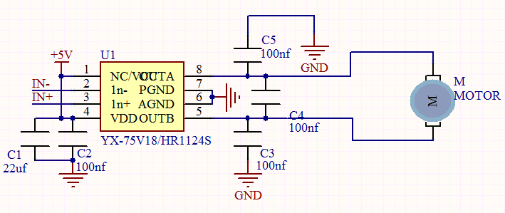

**Required Components**

|  |  |     |  |
| ----------------------- | ----------------------- | -------------------------- | ----------------------- |
| ESP32 Board*1           | ESP32 Expansion Board*1 | keyestudio DIY 130 Motor*1 | 4P Dupont Wire*1        |
|  |  |     |                         |
| Micro USB Cable*1       | Battery Holder*1        | Battery (not included)*6   |                         |


Note: the motor is separated with its fan, you need to assemble it first.

**Connection Diagram**

| 130 Motor | ESP32 Expansion Board |
| --------- | --------------------- |
| G         | G                     |
| V         | 5V                    |
| IN+       | IO15                  |
| IN-       | IO4                   |


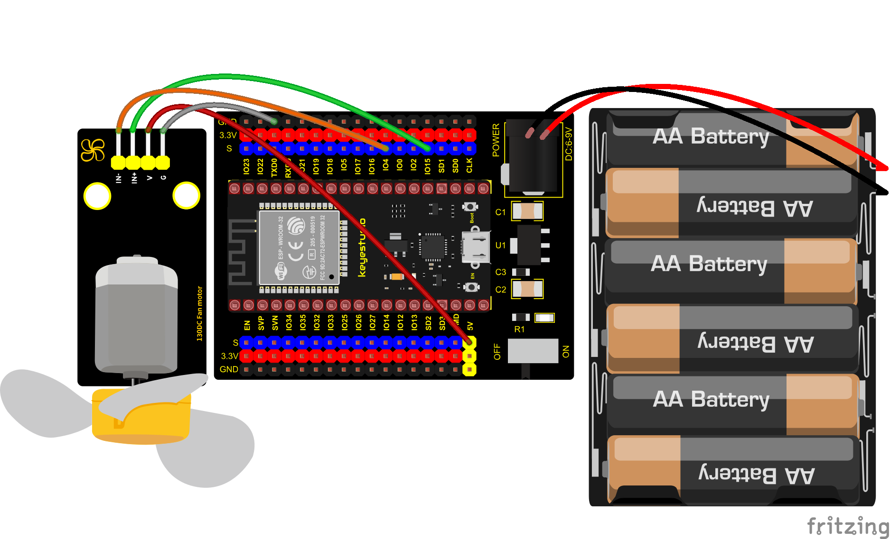

**Test Code**


```python
from machine import Pin
import time

#Two pins of the motor
INA = Pin(15, Pin.OUT) #INA corresponds to IN+
INB = Pin(4, Pin.OUT)#INB corresponds to IN- 

while True:
    #Counterclockwise 2s
    INA.value(1)
    INB.value(0)
    time.sleep(2)
    #stop 1s
    INA.value(0)
    INB.value(0)
    time.sleep(1)
    #Turn clockwise for 2s
    INA.value(0)
    INB.value(1)
    time.sleep(2)
    #stop 1s
    INA.value(0)
    INB.value(0)
    time.sleep(1)
```

**Code Explanation**

Set pins to GPIO4, GPIO15, when the pin GPIO4 outputs low levels and the pin GPIO15 outputs high levels, the motor will rotate counterclockwise; when both pins are set to low, the motor stops rotating.

**Test Result**

Connect the wires according to the experimental wiring diagram and power on. Switch the DIP switch ON the ESP32 expansion board to the ON end, after powering on, click “Run current script”, the code starts executing, then the fan will rotate counterclockwise for 2 s, stop for 1 s; and rotate clockwise for 2 s and stop for 1 s, cycle alternately. Press “Ctrl+C”or click“Stop/Restart backend”to exit the program.

### Project 20: Potentiometer


**Overview**

The following we will introduce is the Keyestudio rotary potentiometer which is an analog sensor.

The digital IO ports can read the voltage value between 0 and 3.3V and the module only outputs high levels. However, the analog sensor can read the voltage value through 16 ADC analog ports on the ESP32 board. In the experiment, we will display the test results on the Shell.

**Working Principle**


It uses a 10K adjustable resistor. We can change the resistance by rotating the potentiometer. The signal S can detect the voltage
changes(0-3.3V) which are analog quantity.

**ADC** The more bits an ADC has, the denser the partitioning of the simulation, the higher the accuracy of the final conversion.


Subsection 1: The analog value within 0V—3.3/4095 V corresponds to the number 0;
Subsection 2: The analog value within 3.3/4095V—2*3.3/4095V corresponds to the number 1;
……

The conversion formula is as follows:

**DAC** The higher the precision of DAC, the higher the precision of the output voltage value.  

The conversion formula is as follows:  


**ADC on ESP32：**

The ESP32 has 16 pins that can be used to measure analog signals.  GPIO pin serial numbers and analog pin definitions are shown below:  

| ADC number in ESP32 | ESP32 GPIO number |
| :-----------------: | :---------------: |
|        ADC0         |      GPIO 36      |
|        ADC3         |      GPIO 39      |
|        ADC4         |      GPIO 32      |
|        ADC5         |      GPIO33       |
|        ADC6         |      GPIO34       |
|        ADC7         |      GPIO 35      |
|        ADC10        |      GPIO 4       |
|        ADC11        |       GPIO0       |
|        ADC12        |       GPIO2       |
|        ADC13        |      GPIO15       |
|        ADC14        |      GPIO13       |
|        ADC15        |      GPIO 12      |
|        ADC16        |      GPIO 14      |
|        ADC17        |      GPIO27       |
|        ADC18        |      GPIO25       |
|        ADC19        |      GPIO26       |

**DAC on ESP32：**

The ESP32 has two 8-bit digital-to-analog converters connected to GPIO25 and GPIO26 pins, which are immutable, as shown below :

| Simulate pin number | GPIO number |
| :-----------------: | :---------: |
|        DAC1         |   GPIO25    |
|        DAC2         |   GPIO26    |

**Components**

|  |  | 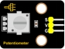           |  |  |
| ----------------------- | ----------------------- | --------------------------------- | ----------------------- | ----------------------- |
| ESP32 Board*1           | ESP32 Expansion Board*1 | Keyestudio Rotary Potentiometer*1 | 3P Dupont Wire*1        | Micro USB Cable*1       |

**Connection Diagram**


**Test Code**


```python
# Import Pin, ADC and DAC modules.
from machine import ADC,Pin,DAC
import time

# Turn on and configure the ADC with the range of 0-3.3V 
adc=ADC(Pin(34))
adc.atten(ADC.ATTN_11DB)
adc.width(ADC.WIDTH_12BIT)

# Read ADC value once every 0.1seconds, convert ADC value to DAC value and output it,
# and print these data to “Shell”. 
try:
    while True:
        adcVal=adc.read()
        dacVal=adcVal//16
        voltage = adcVal / 4095.0 * 3.3
        print("ADC Val:",adcVal,"DACVal:",dacVal,"Voltage:",voltage,"V")
        time.sleep(0.1)
except:
    pass
```

**Code Explanation**

1)\. In the experiment, add "From Machine import ADC" to the top of your Python file every time you use the ACD module, the same goes for DAC modules. 

2)\. **machine.ADC(pin):** Create an ADC object associated with the given pin. 3)\. **pin:** The available pins are Pin(36)、Pin(39)、Pin(34）、Pin(35)、Pin(32)、Pin(33). DAC(pin). Create an DAC object associated with the given pin. 

4)\. **machine.ADC(pin):** The available pins are pin (25) 、pin (26).

5)\. ADC. Read():Read ADC value and return ADC value.  

6)\.**ADC.atten(db)**: Set attenuation ration (that is, the full range voltage, such as the voltage of 11db full range is 3.3V)

**db**：attenuation ratio

**ADC.ATTIN\_0DB** —full range of 1.2V

**ADC.ATTN\_2\_5\_DB** —full range of 1.5V

**ADC.ATTN\_6DB** —full range of 2.0 V

**ADC.ATTN\_11DB** —full range of 3.3V

**ADC.width(bit)**: Set data width.

**bit**：data bit

**ADC.WIDTH\_9BIT** —9 data width

**ADC.WIDTH\_10BIT** — 10 data width

**ADC.WIDTH\_11BIT** — 11 data width

**ADC.WIDTH\_12BIT** — 12 data width

7)\. **The read()method reads the** ADCvalue，rang is 0\~4095，the **adc.read()** reads the ADC value input by the ADC(Pin(34)) Pin and assigns it to a variable named adcVal.  

8)\. DAC.write(value):Output the voltage value, the data rang : 0-255，the corresponding output voltage is 0-3.3V.

**Test Result**

Connect the wires according to the experimental wiring diagram and poweron. Click “Run current script”, the code starts executing. The "Shell" window prints and displays the potentiometer ADC value, DAC value and voltage value. Rotating the potentiometer handle, the ADC value, DAC value and voltage value will change. Press “Ctrl+C”or click“Stop/Restart backend”to exit the program.


### Project 21: Steam Sensor


**Description**

This is a DIY electronic building block water drop sensor. It is an analog (digital) input module, also called rain, rain sensor. It can be used to monitor various weather conditions, detect whether it is raining and the amount of rain, convert it into digital signal (DO) and analog signal (AO) output, and is widely used in Arduino robot kits, raindrops, rain sensors, and can be used for various circumstances. It can monitor various weather conditions, and convert it into digital signal and AO output, and can also be used for automobile automatic wiper system, intelligent lighting system and intelligent sunroof system.

In the experiment, we input the sensor signal terminal (S terminal) to the analog port of the ESP32 development board, sense the change of the analog value, and display the corresponding analog value on the shell.

**Working Principle**

Its principle is to detect the amount of water through the exposed printed parallel lines on the circuit board. The more water there is, the more wires will be connected, and the conductive contact area increases. The voltage output by pin 2 will gradually increase. The larger the analog value detected by the signal terminal S is.

It can also detect steam in the air. Two position holes are used to install on the other devices.

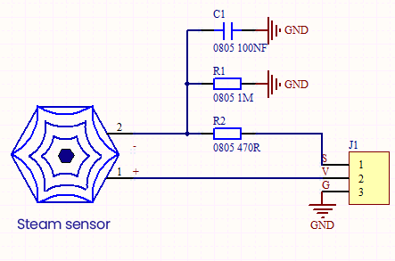

**Required Components**

|  |  | 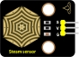       |  |  |
| ----------------------- | ------------------------ | ------------------------------ | ------------------------ | ------------------------ |
| ESP32 Board*1           | ESP32 Expansion Board*1  | Keyestudio DIY Steam Sensor *1 | 3P Dupont Wire*1         | Micro USB Cable*1        |

**Connection Diagram**

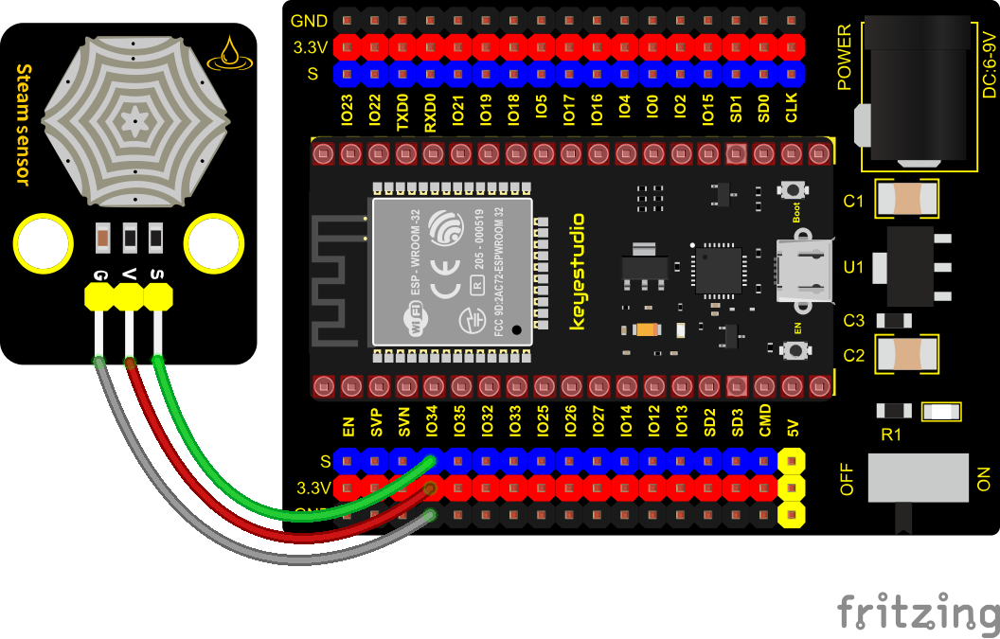

**Test Code**


```python
# Import Pin, ADC and DAC modules.
from machine import ADC,Pin,DAC
import time

# Turn on and configure the ADC with the range of 0-3.3V 
adc=ADC(Pin(34))
adc.atten(ADC.ATTN_11DB)
adc.width(ADC.WIDTH_12BIT)

# Read ADC value once every 0.1seconds, convert ADC value to DAC value and output it,
# and print these data to “Shell”. 
try:
    while True:
        adcVal=adc.read()
        dacVal=adcVal//16
        voltage = adcVal / 4095.0 * 3.3
        print("ADC Val:",adcVal,"DACVal:",dacVal,"Voltage:",voltage,"V")
        time.sleep(0.1)
except:
    pass
```

**Test Result**

Wiring up and powering on, then click “Run current script”, the code starts executing. The Shell will display ADC value, DAC value and voltage value of the sensor. When a few drops of water are placed in the sensor sensing area, the ADC value, DAC value and voltage value will change. The more water volume, the greater the output voltage value , ADC value and the DAC value. Press“Ctrl+C”or click“Stop/Restart backend”to exit the program.


### Project 22: Sound Sensor


**Overview**

In this kit, there is a Keyestudio DIY electronic block and a sound sensor. In the experiment, we test the analog value corresponding to the sound level in the current environment with it. The louder the sound, the larger the ADC, DAC and the voltage value, and the “shell” window will display the test results.

**Working Principle**

It uses a high-sensitive microphone component and an LM386 chip. We build the circuit with the LM386 chip and amplify the sound through the high-sensitive microphone. In addition, we can adjust the sound volume by the potentiometer. Rotate it clockwise, the sound will get louder.


**Components**

|  |  | 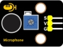      |  |  |
| ------------------------ | ------------------------ | ----------------------------- | ------------------------ | ------------------------ |
| ESP32 Board*1            | ESP32 Expansion Board*1  | Keyestudio DIY Sound Sensor*1 | 3P Dupont Wire*1         | Micro USB Cable*1        |

**Connection Diagram**


**Test Code**


```python
# Import Pin, ADC and DAC modules.
from machine import ADC,Pin,DAC
import time

# Turn on and configure the ADC with the range of 0-3.3V 
adc=ADC(Pin(34))
adc.atten(ADC.ATTN_11DB)
adc.width(ADC.WIDTH_12BIT)

# Read ADC value once every 0.1seconds, convert ADC value to DAC value and output it,
# and print these data to “Shell”. 
try:
    while True:
        adcVal=adc.read()
        dacVal=adcVal//16
        voltage = adcVal / 4095.0 * 3.3
        print("ADC Val:",adcVal,"DACVal:",dacVal,"Voltage:",voltage,"V")
        time.sleep(0.1)
except:
    pass
```

**Test Result**

Connect the wires according to the experimental wiring diagram and power on. Click “Run current script”, the code starts executing. The "Shell" window will display the sound sensor ADC value, DAC value and voltage value. 

Rotate the potentiometer clockwise and speak at the MIC. Then you can see the analog value get larger, as shown below. Press “Ctrl+C”or click“Stop/Restart backend”to exit the program.


### Project 23: Photoresistor


**Description**

In this kit, there is a photoresistor which consists of photosensitive resistance elements. Its resistance changes with the light intensity. Also, it converts the resistance change into a voltage change through the characteristic of the photosensitive resistive element. When wiring it up, we interface its signal terminal (S terminal) with the analog port of ESP32 , so as to sense the change of the analog value, and display the corresponding analog value in the shell.

**Working Principle**

If there is no light, the resistance is 0.2MΩ and the detected voltage at the terminal 2 is close to 0. When the light intensity increases, the resistance of photoresistor and detected voltage will diminish, and the detected voltage is increasing. 


**Components**

|  |  | 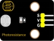       |  |  |
| ------------------------ | ------------------------ | ------------------------------ | ------------------------ | ------------------------ |
| ESP32 Board*1            | ESP32 Expansion Board*1  | Keyestudio DIY Photoresistor*1 | 3P Dupont Wire*1         | Micro USB Cable*1        |

**Connection Diagram**


**Test Code**

```python
# Import Pin, ADC and DAC modules.
from machine import ADC,Pin,DAC
import time

# Turn on and configure the ADC with the range of 0-3.3V 
adc=ADC(Pin(34))
adc.atten(ADC.ATTN_11DB)
adc.width(ADC.WIDTH_12BIT)

# Read ADC value once every 0.1seconds, convert ADC value to DAC value and output it,
# and print these data to “Shell”. 
try:
    while True:
        adcVal=adc.read()
        dacVal=adcVal//16
        voltage = adcVal / 4095.0 * 3.3
        print("ADC Val:",adcVal,"DACVal:",dacVal,"Voltage:",voltage,"V")
        time.sleep(0.1)
except:
    pass
```


**Test Result**

Connect the wires according to the experimental wiring diagram and poweron. Click “Run current script”, the code starts executing. The "Shell" window will display the photoresistor ADC value, DAC value and voltage value. The brighter the light, the greater the analog value, as shown below. Press “Ctrl+C”or click“Stop/Restart backend”to exit the program.


### Project 24: NTC-MF52AT Thermistor


**Overview**

In the experiment, there is a NTC-MF52AT analog thermistor. We connect its signal terminal to the analog port of the ESP32 mainboard and read the corresponding ADC value, voltage value and thermistor value.

We can use analog values to calculate the temperature of the current environment through specific formulas. Since the temperature calculation formula is more complicated, we only read the corresponding analog value.

**Working Principle**


This module mainly uses NTC-MF52AT thermistor element, which can can sense the changes of the surrounding environment temperature. Resistance changes with the temperature, causing the voltage of the signal terminal S to change.

This sensor uses the characteristics of NTC-MF52AT thermistor element to convert resistance changes into voltage changes.

**Components**

|  |  | 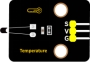           |  |  |
| ------------------------ | ------------------------ | ---------------------------------- | ------------------------ | ------------------------ |
| ESP32 Board*1            | ESP32 Expansion Board*1  | Keyestudio NTC-MF52AT Thermistor*1 | 3P Dupont Wire*1         | Micro USB Cable*1        |

**Connection Diagram**


**Test Code**


```python
from machine import Pin, ADC
import time
import math

#Set ADC
adc=ADC(Pin(34))
adc.atten(ADC.ATTN_11DB)
adc.width(ADC.WIDTH_12BIT)

try:
    while True:
        adcValue = adc.read()
        voltage = adcValue / 4095 * 3.3
        Rt = (3.3 - voltage) / voltage * 4.7;
        tempK = (1 / (1 / (273.15+25) + (math.log(Rt/10)) / 3950))
        tempC = (tempK - 273.15)
        print("ADC value:",adcValue,"  Voltage:",voltage,"V","  Temperature: ",tempC,"C");
        time.sleep(1)
except:
    pass
```

**Test Result**

Connect the wires according to the experimental wiring diagram and power on. Click “Run current script”, the code starts executing. The "Shell" window will display the thermistor ADC value, voltage value and temperature value, as shown below. Press “Ctrl+C”or click“Stop/Restart backend”to exit the program.


### Project 25: Thin-film Pressure Sensor


**Overview**

In this kit, there is a Keyestudio thin-film pressure sensor. The thin-film pressure sensor composed of a new type of nano
pressure-sensitive material and a comfortable ultra-thin film substrate, has waterproof and pressure-sensitive functions.

In the experiment, we determine the pressure by collecting the analog signal on the S end of the module. The smaller the ADC value, DAC value and voltage value, the greater the pressure; and the displayed results will shown on the Shell.

**Working Principle**

When the sensor is pressed by external forces, the resistance value of sensor will vary. We convert the pressure signals detected by the sensor into the electric signals through a circuit. Then we can obtain the pressure changes by detecting voltage signal changes.


**Components**

|  |  |               |  |  |
| ------------------------ | ------------------------ | ------------------------------------- | ------------------------ | ------------------------ |
| ESP32 Board*1            | ESP32 Expansion Board*1  | KeyestudioThin-film Pressure Sensor*1 | 3P Dupont Wire*1         | Micro USB Cable*1        |

**Connection Diagram**

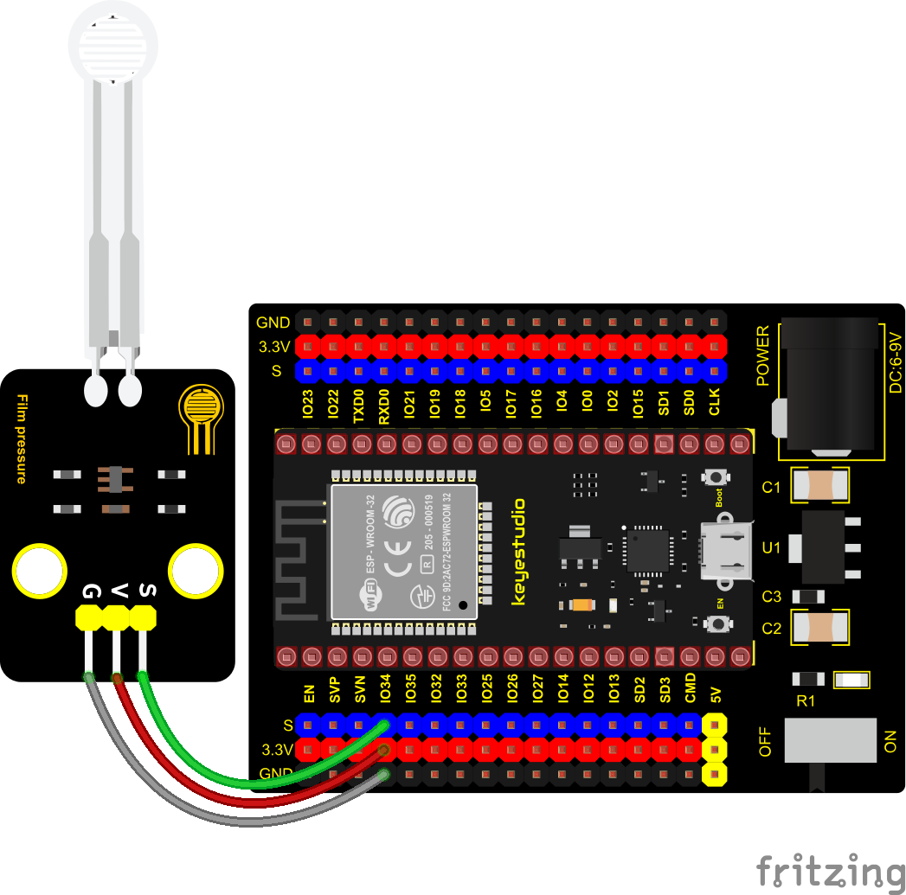

**Test Code**

```python
# Import Pin, ADC and DAC modules.
from machine import ADC,Pin,DAC
import time

# Turn on and configure the ADC with the range of 0-3.3V 
adc=ADC(Pin(34))
adc.atten(ADC.ATTN_11DB)
adc.width(ADC.WIDTH_12BIT)

# Read ADC value once every 0.1seconds, convert ADC value to DAC value and output it,
# and print these data to “Shell”. 
try:
    while True:
        adcVal=adc.read()
        dacVal=adcVal//16
        voltage = adcVal / 4095.0 * 3.3
        print("ADC Val:",adcVal,"DACVal:",dacVal,"Voltage:",voltage,"V")
        time.sleep(0.1)
except:
    pass
```

**Test Result**

Connect the wires according to the experimental wiring diagram and power on. Click “Run current script”, the code starts executing. The "Shell" window will display the thin-film pressure sensor ADC value, voltage value and DAC value. When the thin-film is pressed by fingers, the analog value will decrease, as shown below. Press “Ctrl+C”or click“Stop/Restart backend” to exit the program.


### Project 26: Flame Sensor


**Description**

In daily life, it is often seen that a fire broke out without any precaution. It will cause great economic and human loss. So how can we avoid this situation? Right, install a flame sensor and a speaker in those places that easily break out a fire. When the flame sensor detects a fire, the speaker will alarm people quickly to put out the fire.

So in this project, you will learn how to use a flame sensor and an active buzzer module to simulate the fire alarm system.

**Working Principle**

This flame sensor can be used to detect fire or other light sources with wavelength stands at 700nm \~ 1000nm. Its detection angle is about 60°. You can rotate the potentiometer on the sensor to control its sensitivity. Adjust the potentiometer to make the LED at the critical point between on and off state. The sensitivity is the best.

From the below figure, power up. When detecting fire, the digital pin outputs low levels, the red LED2 will light up first, the digital signal terminal D0 outputs a low level, and the red LED1 will light up. The stronger the external infrared light, the smaller the value; the weaker the infrared light, the larger the value.

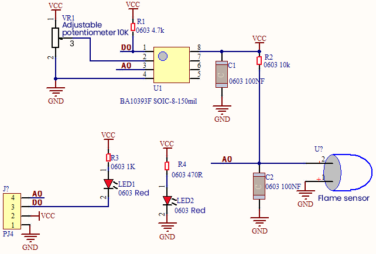

**Required Components**

|  |  |       |  |  |
| ------------------------ | ------------------------ | ----------------------------- | ------------------------ | ------------------------ |
| ESP32 Board*1            | ESP32 Expansion Board*1  | keyestudio DIY Flame Sensor*1 | 4P Dupont Wire*1         | Micro USB Cable*1        |

**Connection Diagram**

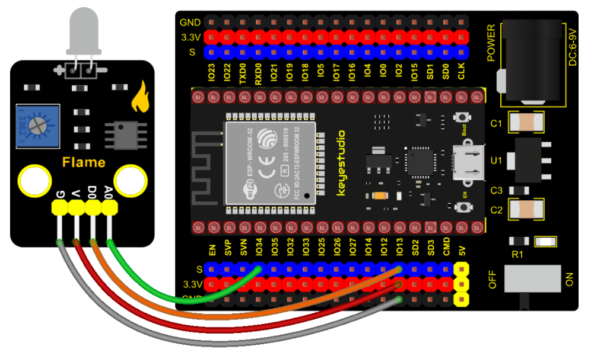

**Test Code**

```python
# Import Pin, ADC and DAC modules.
from machine import ADC,Pin,DAC
import time

flame_D = Pin(13, Pin.IN)
# Turn on and configure the ADC with the range of 0-3.3V
adc=ADC(Pin(34))
adc.atten(ADC.ATTN_11DB)
adc.width(ADC.WIDTH_12BIT)

# Read digital value and ADC value once every 0.1seconds, convert ADC value to DAC value and Voltage value and output it,
# and print these data to “Shell”. 
try:
    while True:
        digitalVal = flame_D.value() 
        adcVal=adc.read()
        dacVal=adcVal//16
        voltage = adcVal / 4095.0 * 3.3
        print("digitalVal:",digitalVal,"ADC Val:",adcVal,"DACVal:",dacVal,"Voltage:",voltage,"V")
        time.sleep(0.1)
except:
    pass
```

**Code Explanation**

Two pins we use are defined as GPIO13 and GPIO34 according to the wiring-up diagram, and print digital signals and analog signals respectively.

**Test Result**

Connect the wires according to the experimental wiring diagram and power on. Click “Run current script”, the code starts executing. After powering on, rotating the potentiometer on the sensor, we can adjust the red LED bright and not bright critical point. The red LED2 on the sensor module is lit, while the red LED1 is not.

The "Shell" window will print and display the digital value, ADC value, DAC value and voltage value of the flame sensor. When fire is detected, the LED1 will be on. the digital value will change from 1 to 0, and the analog value will become smaller, as shown below. Press “Ctrl+C”or click“Stop/Restart backend”to exit the program.

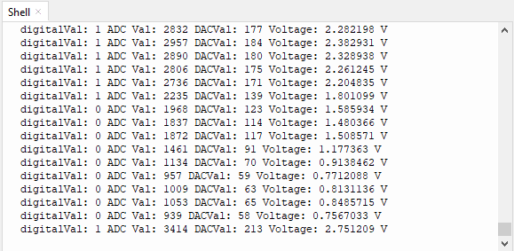

### Project 27: MQ-2 Gas Sensor


**Description**

This analog gas sensor - MQ2 is used in gas leakage detecting equipment in consumer electronics and industrial markets.

This sensor is suitable for detecting LPG, I-butane, propane, methane, alcohol, Hydrogen and smoke. It has high sensitivity and quick response.

In addition, the sensitivity can be adjusted by rotating the potentiometer.

In the experiment, we read the analog value at the A0 port and the D0 port to determine the content of gas.

**Working Principle**

The greater the concentration of smoke, the greater the conductivity, the lower the output resistance, the greater the output analog signal.

When in use, the A0 terminal reads the analog value of the corresponding gas; the D0 terminal is connected to an LM393 chip (voltage comparator), we can adjust the alarm threshold of the measured gas through the potentiometer, and output the digital value at D0. When the measured gas content exceeds the critical point, the D0 terminal outputs a low level. When the measured gas content does not exceed the critical point, the D0 terminal outputs a high level.

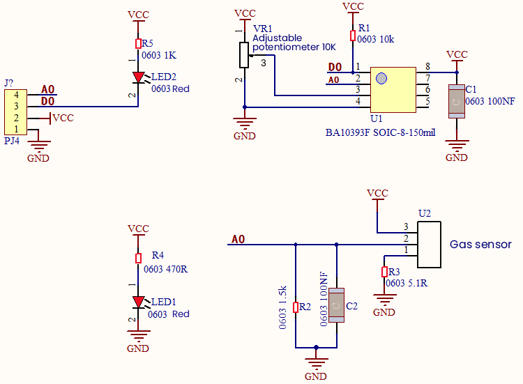

**Required Components**

|  |  |            |  |  |
| ------------------------ | ------------------------ | ---------------------------------- | ------------------------ | ------------------------ |
| ESP32 Board*1            | ESP32 Expansion Board*1  | keyestudio DIY Analog Gas Sensor*1 | 4P Dupont Wire*1         | Micro USB Cable*1        |

**Connection Diagram**


**Test Code**

```python
# Import Pin, ADC and DAC modules.
from machine import ADC,Pin,DAC
import time

# Turn on and configure the ADC with the range of 0-3.3V
mq2_D = Pin(13, Pin.IN)
adc=ADC(Pin(34))
adc.atten(ADC.ATTN_11DB)
adc.width(ADC.WIDTH_12BIT)

# Read digital value and ADC value once every 0.1seconds, convert ADC value to DAC value and Voltage value and output it,
# and print these data to “Shell”.  

while True:
    digitalVal = mq2_D.value()
    adcVal=adc.read()
    dacVal=adcVal//16
    voltage = adcVal / 4095.0 * 3.3
    print("digitalVal:",digitalVal,"ADC Val:",adcVal,"DACVal:",dacVal,"Voltage:",voltage,"V", end = "  ")
    if digitalVal == 0:
        print("Exceeding")
    else:
        print("Normal")
    time.sleep(0.1)
```

**Test Result**

Connect the wires according to the experimental wiring diagram and power on. Click “Run current script”, the code starts executing. The “shell” window will display the corresponding data and  string. After powering on, by rotating the potentiometer on the sensor, we can adjust the red LED bright and not bright critical point.

When the sensor detects the smoke or combustible gas, the red LED lights up and the digital value in the "Shell" window changes from 1 to 0, the ADC value, DAC value and voltage value increase, as shown below. Press “Ctrl+C”or click“Stop/Restart backend”to exit the program.

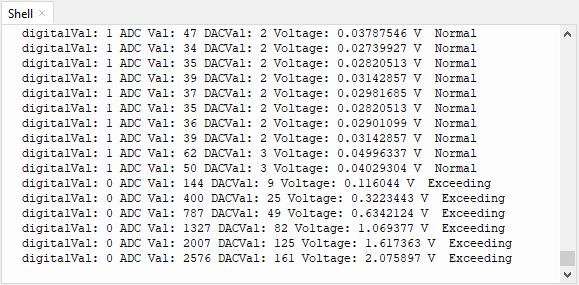

### Project 28: MQ-3 Alcohol Sensor


**Description**

In this kit, there is a MQ-3 alcohol sensor, which uses the gas-sensing material is tin dioxide (SnO2) which has a low conductivity in clean air. When there is alcohol vapor in the environment where the sensor is located, the conductivity of the sensor increases with the increase of the alcohol gas concentration in the air. The change in conductivity can be converted into an output signal corresponding to the gas concentration using a simple circuit.

In the experiment, we read the analog value at the A0 end of the sensor and the digital value at the D0 end to judge the content of alcohol vapor in the air and whether they exceed the standard.

**Working Principle**

At a certain temperature, the conductivity changes with the composition of the ambient gas. When in use, A0 terminal reads the analog value corresponding to alcohol vapor; D0 terminal is connected to an LM393 chip (comparator), we can adjust and measure the alcohol vapor alarm threshold through the potentiometer, and output the digital value at D0.

When the measured alcohol vapor content exceeds the critical point, the D0 terminal outputs a low level; when the measured alcohol vapor content does not exceed the critical point, the D0 terminal outputs a high level.

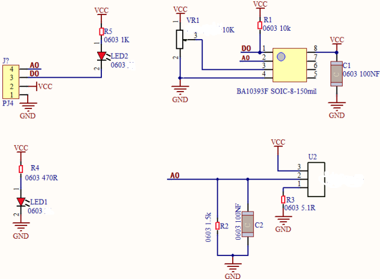

**Components Required**

|  |  | 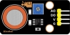    |  |  |
| ------------------------ | ------------------------ | --------------------------- | ------------------------ | ------------------------ |
| ESP32 Board*1            | ESP32 Expansion Board*1  | keyestudio Alcohol Sensor*1 | 4P Dupont Wire*1         | Micro USB Cable*1        |

**Connection Diagram**

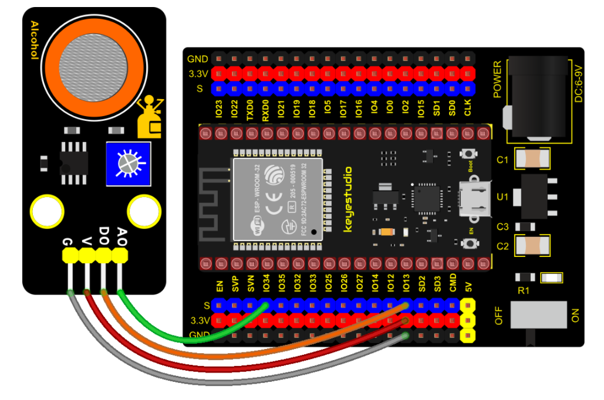

**Test Code**


```python
# Import Pin, ADC and DAC modules.
from machine import ADC,Pin,DAC
import time

# Turn on and configure the ADC with the range of 0-3.3V
mq3_D = Pin(13, Pin.IN)
adc=ADC(Pin(34))
adc.atten(ADC.ATTN_11DB)
adc.width(ADC.WIDTH_12BIT)

# Read digital value and ADC value once every 0.1seconds, convert ADC value to DAC value and Voltage value and output it,
# and print these data to “Shell”. 

while True:
    digitalVal = mq3_D.value()
    adcVal=adc.read()
    dacVal=adcVal//16
    voltage = adcVal / 4095.0 * 3.3
    print("digitalVal:",digitalVal,"ADC Val:",adcVal,"DACVal:",dacVal,"Voltage:",voltage,"V", end = "  ")
    if digitalVal == 0:
        print("Exceeding")
    else:
        print("Normal")
    time.sleep(0.1)
```

**Test Result**

Connect the wires according to the experimental wiring diagram and power on. Click “Run current script”, the code starts executing. The “shell” window will display the corresponding data and string. After powering on, by rotating the potentiometer on the sensor, we can adjust the yellow and green LED bright and not bright critical point.

When the sensor detects the alcohol gas, the yellow and green LED lights up and the digital value in the "Shell" window changes from 1 to 0, the ADC value, DAC value and voltage value increase, as shown below. Press “Ctrl+C”or click“Stop/Restart backend”to exit the program.


### Project 29: Five-key AD Button Module


**Description**

When we talked about analog and digital sensors earlier, we talked about the single-channel key module. When we press the key, it outputs a low level, and when we release the key, it outputs a high level. We can only read these two digital signals. In fact, the key module ADC acquisition can also be performed. In this kit, a DIY electronic building block five-way AD button module is included.

We can judge which key is pressed through the analog value. In the experiment, we print out the key press information in the shell.

**Working Principle**

Let’s look at the schematic diagram, when we do not press the key, the OUT of S output to the signal end is pulled down by R1. At this time, we read the low level 0V. When we press the key SW1, the OUT of the output to the signal end S is directly connected to the VCC. At this time, we read the high level 3.3V(the figure is marked as a 12-bit ADC(0\~4095) and VCC is 5V. The principle is the same. Here we have VCC of 3.3V and ADC mapped to 12 bits), which is an analog value of 4095.

Next,when we press the key SW2, the OUT terminal voltage of the signal we read is the voltage between R2 and R1, namely VCC\*R1/(R2+R1), which is about 2.64V, and the analog value is about 3276. 

When we press the key SW3, the OUT terminal voltage of the signal we read is the voltage between R2+R3 and R1, namely VCC\*R1/(R3+R2+R1), which is about 1.99V, and the analog value is about 2469. 

When we press the key SW4, the OUT terminal voltage of the signal we read is the voltage between R2+R3+R4 and R1, namely
VCC\*R1/(R4+R3+R2+R1), about 1.31V, and the analog value is about 1626.

Similarly, when we press the key SW5, the OUT terminal voltage of the signal we read is the voltage between R2+R3+R4+R5 and R1, namely VCC\*R1/(R5+R4+R3+R2+R1), which is about 0.68V, and the analog value is about 844.  

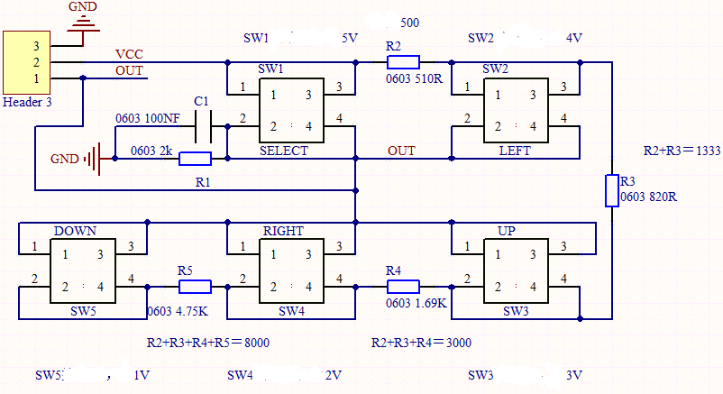

**Components Required**

|  |  |                  |  |  |
| ------------------------ | ------------------------ | ---------------------------------------- | ------------------------ | ------------------------ |
| ESP32 Board*1            | ESP32 Expansion Board*1  | keyestudio  5-Channel AD Button Module*1 | 3P Dupont Wire*1         | Micro USB Cable*1        |

**Connection Diagram**

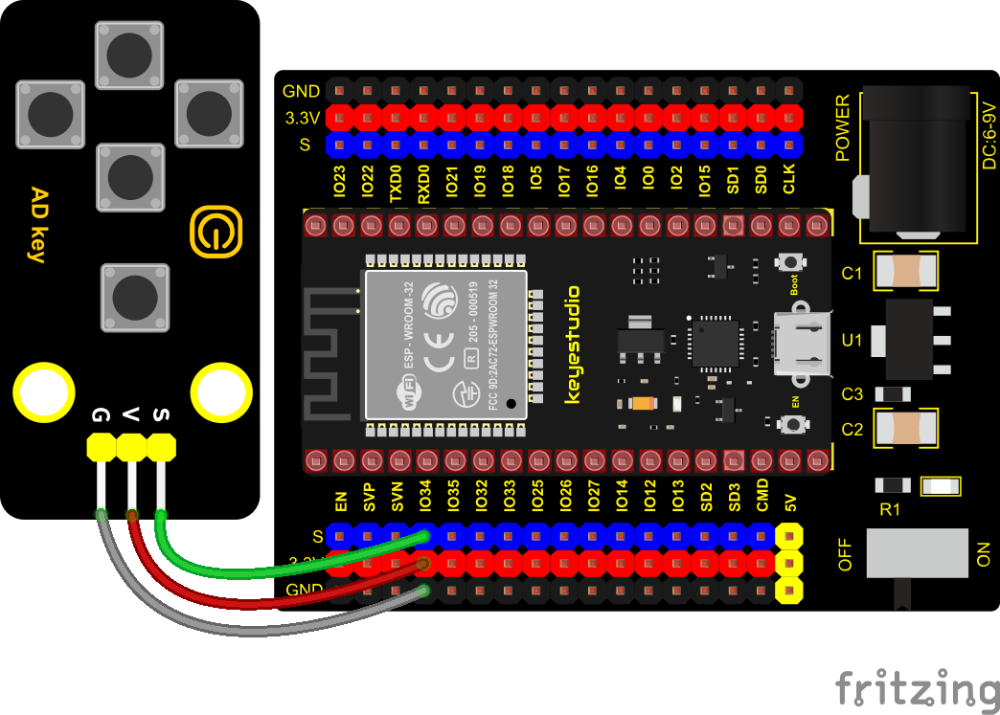

**Test Code**


```python
# Import Pin and ADC modules.
from machine import ADC,Pin
import time 

# Turn on and configure the ADC with the range of 0-3.3V 
adc=ADC(Pin(34))
adc.atten(ADC.ATTN_11DB)
adc.width(ADC.WIDTH_12BIT)

while True:
    adcvalue = adc.read() 
    print(adcvalue, end = '')
    if adcvalue <= 500:
        print("  no key  is pressed")
    elif adcvalue <= 1000:
        print("  SW5 is pressed")
    elif adcvalue <= 2000:
        print("  SW4 is pressed")
    elif adcvalue <= 3000:
        print("  SW3 is pressed")
    elif adcvalue <= 4000:
        print("  SW2 is pressed")
    else:
        print("  SW1 is pressed")
    time.sleep(0.5)
```

**Code Explanation**

We assign the read analog value to the variable val, and the shell displays the value of val, (our default setting is 9600, which can be changed). We judge the read analog value. When the analog value is lower than 6000, we judge that the button is not pressed. When the analog value is between 6000 and 20000, we judge that the button SW5 is pressed. Between 20000 and 32000, we judge that the button SW4 is pressed.

when the analog value is between 32000 and 45000, we judge that the button SW3 is pressed. When the analog value is between 45000 and 59000, we judge that the button SW2 is pressed. Press. Otherwise, when the analog value is above 59000, we judge that the button SW1 is pressed. If we only use a fixed value, there will inevitably be errors, so we use the interval to judge.

**Test Result**

Connect the wires according to the experimental wiring diagram and power on. Click “Run current script”, the code starts executing. when the button is pressed, the shell prints out the corresponding information, as shown in the figure below. Press “Ctrl+C”or click“Stop/Restart backend”to exit the program.

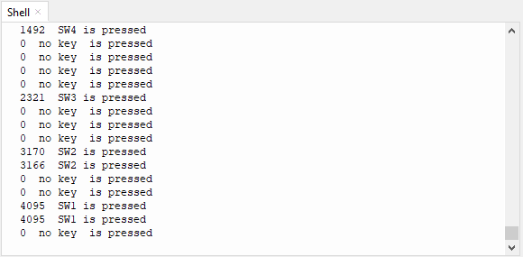

### Project 30: Joystick Module


**Overview**

Game handle controllers are ubiquitous. It mainly uses PS2 joysticks. When controlling it, we need to connect
the X and Y ports of the module to the analog port of the single-chip microcomputer, port B to the digital port of the single-chip
microcomputer, VCC to the power output port(3.3-5V), and GND to the GND of the MCU. We can read the high and low levels of two analog values and one digital port) to determine the working status of the joystick on the module.

In the experiment, two analog values(x axis and y axis) will be shown on Shell.

**Working Principle**


In fact, its working principle is very simple. Its inside structure is equivalent to two adjustable potentiometers and a button. When this button is not pressed and the module is pulled down by R1, low levels will be output ; on the contrary, when the button is pressed, VCC will be connected (high levels). When we move the joystick, the internal potentiometer will adjust to output different voltages, and we can read the analog value.

**Components**

|  |  |      |  |  |
| ------------------------ | ------------------------ | ---------------------------- | ------------------------ | ------------------------ |
| ESP32 Board*1            | ESP32 Expansion Board*1  | Keyestudio Joystick Module*1 | 5P Dupont Wire*1         | Micro USB Cable*1        |

**Connection Diagram**


**Test Code**


```python
from machine import Pin, ADC
import time
# Initialize the joystick module (ADC function)
rocker_x=ADC(Pin(34)) 
rocker_y=ADC(Pin(35))
button_z=Pin(13,Pin.IN,Pin.PULL_UP)

# Set the acquisition range of voltage of the two ADC channels to 0-3.3V,
# and the acquisition width of data to 0-4095.
rocker_x.atten(ADC.ATTN_11DB)
rocker_y.atten(ADC.ATTN_11DB)
rocker_x.width(ADC.WIDTH_12BIT)
rocker_y.width(ADC.WIDTH_12BIT)
 
# In the code, configure Z_Pin to pull-up input mode.
# In loop(), use Read () to read the value of axes X and Y 
# and use value() to read the value of axis Z, and then display them.
while True:
    print("X,Y,Z:",rocker_x.read(),",",rocker_y.read(),",",button_z.value())
    time.sleep(0.5)
```

**Code Explanation**

In the experiment, according to the wiring diagram, the x pin is set to GPIO34, the y pin is set to GPIO35 and the pin of the joystick is set to GPIO13.

**Test Result**

Wire up, power on and click “Run current script”, the code starts executing. The "Shell" window will print the analog and digital values of the current joystick. Moving the joystick or pressing it will change the analog and digital values in "Shell". Press“Ctrl+C”or click“Stop/Restart backend”to exit the program.


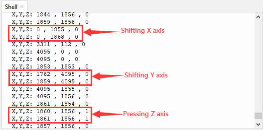

### Project 31: Relay Module

**Overview**

In our daily life, we usually use communication to drive electrical equipments, and sometimes we use switches to control electrical equipments. If the switch is connected directly to the ac circuit, leakage occurs and people are in danger. Therefore, from the perspective of safety, we specially designed this relay module with NO(normally open) end and NC(normally closed) end.  

**Working Principle**

Relay is compatible with a variety of micro-controller control board, such as Arduino series micro-controller, which is a small current to control the operation of large current "automatic switch".  

Input Voltage：3.3V-5V


It can let the MCU control board drive 3A load, such as an LED lamp belt, a DC motor, a micro water pump and a solenoid valve plugable interface design, which is easy to use.  

**Components Required**

|  |  |    |  |  |
| ------------------------ | ------------------------ | -------------------------- | ------------------------ | ------------------------ |
| ESP32 Board*1            | ESP32 Expansion Board*1  | Keyestudio  Relay Module*1 | 3P Dupont Wire*2         | Micro USB Cable*1        |

**Connection Diagram**


**Test Code**

```python
from machine import Pin
import time

# create relay from Pin 15, Set Pin 15 to output 
relay = Pin(15, Pin.OUT)
 
# The relay is opened, COM and NO are connected on the relay, and COM and NC are disconnected.
def relay_on():
    relay(1)
 
# The relay is closed, the COM and NO on the relay are disconnected, and the COM and NC are connected.
def relay_off():
    relay(0)
 
# Loop, the relay is on for one second and off for one second
while True:
    relay_on()
    time.sleep(1)
    relay_off()
    time.sleep(1)
```

**Test Result**

Connect the wires according to the experimental wiring diagram and power on. Click “Run current script”, the code starts executing. The relay will cycle on and off, on for 1 second, off for 1 second. At the same time, you can hear the sound of the relay on and off as well as see the change of the indicator light on the relay.

Press“Ctrl+C”or click“Stop/Restart backend”to exit the program.

### Project 32: SK6812 RGB Module

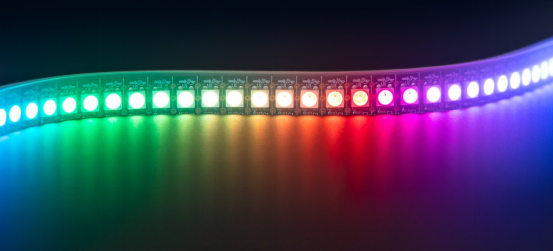

**Overview**

In previous lessons, we learned about the plug-in RGB module and used PWM signals to color the three pins of the module.

There is a Keyestudio 6812 RGB module whose the driving principle is different from the plug-in RGB module. It can only control with one pin.
This is a set. It is an intelligent externally controlled LED light source with the control circuit and the light-emitting circuit. Each LED element is the same as a 5050 LED lamp bead, and each component is a pixel. There are four lamp beads on the module, which indicates four pixels.

In the experiment, we make different lights show different colors.

**Working Principle**

From the schematic diagram, we can see that these four pixel lighting beads are all connected in series. In fact, no matter how many they are, we can use a pin to control a light and let it display any color. The pixel point contains a data latch signal shaping amplifier drive circuit, a high-precision internal oscillator and a 12V high-voltage programmable constant current control part, which effectively ensures the color of the pixel point light is highly consistent.

The data protocol adopts a single-wire zero-code communication method. After the pixel is powered up and reset, the S terminal receives the data transmitted from the controller. The first 24bit data sent is extracted by the first pixel and sent to the data latch of the pixel.


**Components**

|  |  | 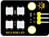     |  |  |
| ------------------------ | ------------------------ | ---------------------------- | ------------------------ | ------------------------ |
| ESP32 Board*1            | ESP32 Expansion Board*1  | Keyestudio 6812 RGB Module*1 | 3P Dupont Wire*1         | Micro USB Cable*1        |

**Connection Diagram**

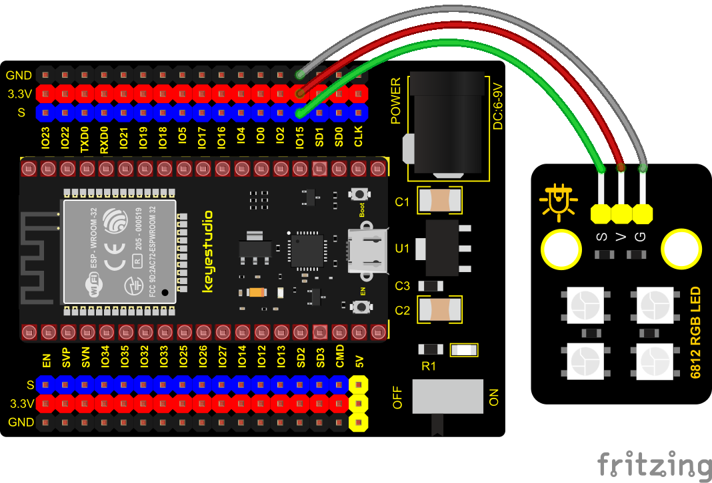

**Test Code**

```python
#Import Pin, neopiexl and time modules.
from machine import Pin
import neopixel
import time

#Define the number of pin and LEDs connected to neopixel.
pin = Pin(15, Pin.OUT)
np = neopixel.NeoPixel(pin, 4) 

#brightness :0-255
brightness=100                                
colors=[[brightness,0,0],                    #red
        [0,brightness,0],                    #green
        [0,0,brightness],                    #blue
        [brightness,brightness,brightness],  #white
        [0,0,0]]                             #close

#Nest two for loops to make the module repeatedly display five states of red, green, blue, white and OFF.    
while True:
    for i in range(0,5):
        for j in range(0,4):
            np[j]=colors[i]
            np.write()
            time.sleep_ms(50)
        time.sleep_ms(500)
    time.sleep_ms(500)
```

**Code Explanation**

A few function ports and functions:

**np = neopixel.NeoPixel(pin, 4)** , there are four LED beads, so we set to 4.

**pin = Pin(15, Pin.OUT)** , this is the pin number, we connect to GP15.

**brightness = 100**, brightness setting 255 implies brightest.

**Test Result**

Connect the wires according to the experimental wiring diagram and power on. Click “Run current script”, the code starts executing.  Then we can see the four RGB LEDs show various colors.

Press “Ctrl+C”or click“Stop/Restart backend”to exit the program.

### Project 33: Rotary Encoder


**Overview**

In this kit, there is a Keyestudio rotary encoder, dubbed as switch encoder. It is applied to automotive electronics, multimedia audio,
instrumentation, household appliances, smart home, medical equipment and so on.

In the experiment, it it used for counting. When we rotate the rotary encoder clockwise, the set data falls by 1. If you rotate it anticlockwise, the set data is up 1, and when the middle button is pressed, the value will be show on Shell.

**Working Principle**

The incremental encoder converts the displacement into a periodic electric signal, and then converts this signal into a counting pulse, and the number of pulses indicates the size of the displacement.

This module mainly uses 20pulse rotary encoder components. It can calculate the number of pulses output during clockwise and reverse rotation. There is no limit to count rotation. It resets to the initial state, that is, starts counting from 0.           


**Components**

|  |  | 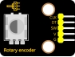 |  |  |
| ------------------------------------- | ------------------------------------- | ------------------------------------- | ------------------------------------- | ------------------------------------- |
| ESP32 Board*1                         | ESP32 Expansion Board*1               | Keyestudio Rotary Encoder*1           | 5P Dupont Wire*1                      | Micro USB Cable*1                     |

**Connection Diagram**


**Add Library**

Open“Thonny”，click“This computer”→“D:”→“2. ESP32\_code\_MicroPython”→“lesson 30. Rotary encoder counting”. Select“rotary\.py”and“rotary\_irq\_rp2.py”，right-click“Upload to /”，

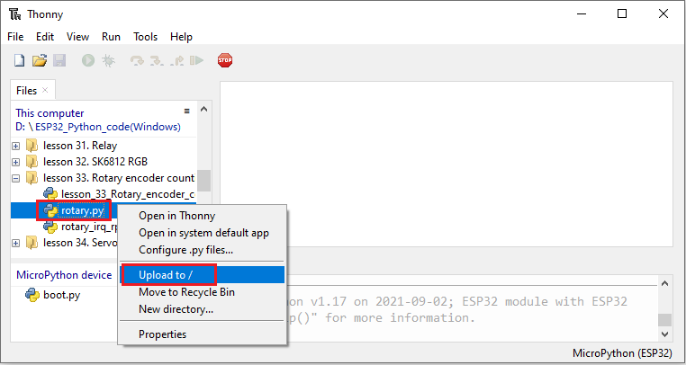

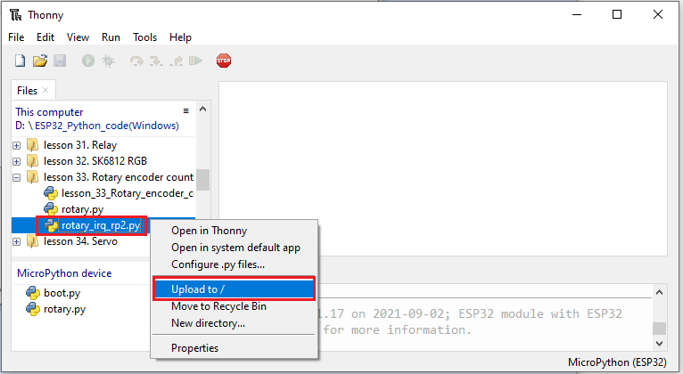

**Test Code**

```python
import time
from rotary_irq_rp2 import RotaryIRQ
from machine import Pin

SW=Pin(27,Pin.IN,Pin.PULL_UP)  
r = RotaryIRQ(pin_num_clk=12,
              pin_num_dt=14,
              min_val=0,
              reverse=False,
              range_mode=RotaryIRQ.RANGE_UNBOUNDED)
val_old = r.value()
while True:
    try:
        val_new = r.value()
        if SW.value()==0 and n==0:
            print("Button Pressed")
            print("Selected Number is : ",val_new)
            n=1
            while SW.value()==0:
                continue
        n=0
        if val_old != val_new:
            val_old = val_new
            print('result =', val_new)
        time.sleep_ms(50)
    except KeyboardInterrupt:
        break
```

**Code Explanation**

1). We will see the file rotary\.py and rotary\_irq\_rp2.py. This meansthat we save them in the ESP32 successfully. Then we can use **from rotary\_irq\_rp2 import RotaryIRQ.**

2). **SW=Pin(20,Pin.\IN,Pin.PULL\_UP)** indicates that the SW pin is connected to GPIO27, **pin\_num\_clk=12** indicates that the pin CLK is connected to GPIO12, and **pin\_num\_dt=14** means that the DT pin is connected to GPIO14. We can change these pin numbers.

3). **try/except** is the python language exception capture processing statement, **try** executes the code, **except** executes the code
when an exception occurs, and when we press Ctrl+C, the program exits.

4). **r.value()** returns the value of the encoder

**Test Result**

Connect the wires according to the experimental wiring diagram and power on. Click “Run current script”, the code starts executing. Rotate the encoder clockwise, the displayed data decrease, rotate the encoder counterclockwise, the displayed data increase. 

Press the middle button of the encoder, the displayed data is the value of the encoder, as shown in the figure below. Press “Ctrl+C”or click“Stop/Restart backend”to exit the program.

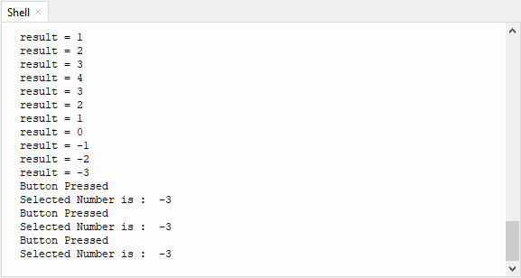

### Project 34: Servo Control


**Overview**

Servo is a position control rotary actuator. It mainly consists of a housing, a circuit board, a core-less motor, a gear and a position
sensor. 

In general, servo has three lines in brown, red and orange. The brown wire is grounded, the red one is a positive pole line and the orange one is a signal line.


**Working Principle**

The rotation angle of servo motor is controlled by regulating the duty cycle of PWM (Pulse-Width Modulation) signal. The standard cycle of PWM signal is 20ms (50Hz). Theoretically, the width is distributed between 1ms-2ms, but in fact, it's between 0.5ms-2.5ms. The width corresponds the rotation angle from 0° to 180°. But note that for different brand motors, the same signal may have different rotation angles. 


**Components**

|  |  |  |  |
| ------------------------------------- | ------------------------------------- | ------------------------------------- | ------------------------------------- |
| ESP32 Board*1                         | ESP32 Expansion Board*1               | Servo*1                               | Micro USB Cable*1                     |

**Connection Diagram**

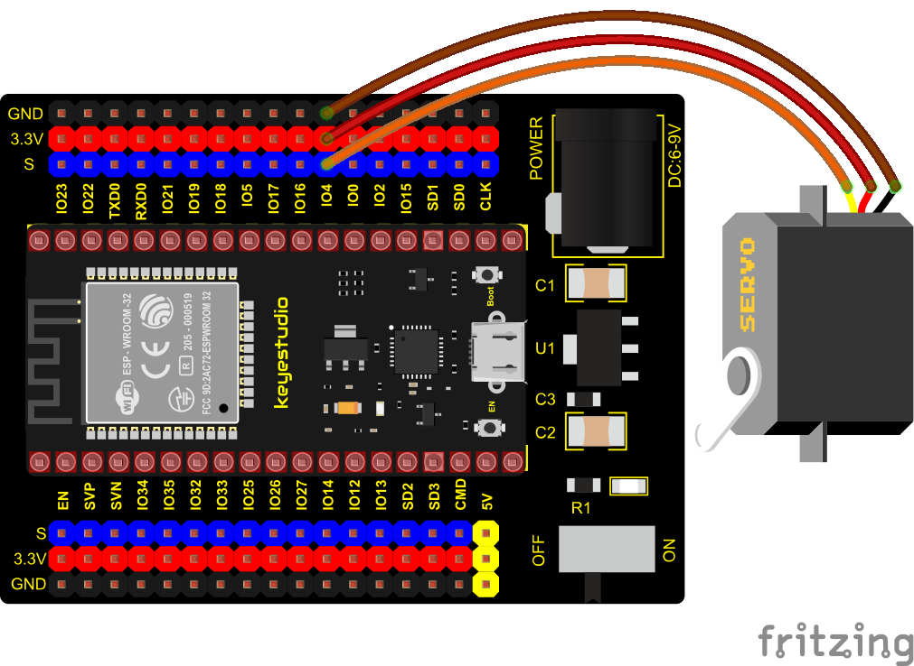

**Test Code 1**

```python
from machine import Pin, PWM
import time
pwm = PWM(Pin(4))  
pwm.freq(50)

'''
Duty cycle corresponding to the Angle
0°----2.5%----25
45°----5%----51.2
90°----7.5%----77
135°----10%----102.4
180°----12.5%----128
'''
angle_0 = 25
angle_90 = 77
angle_180 = 128

while True:
    pwm.duty(angle_0)
    time.sleep(1)
    pwm.duty(angle_90)
    time.sleep(1)
    pwm.duty(angle_180)
    time.sleep(1)
```

**Code Explanation 1**

According to the angle of the signal pulse width, it is converted into a duty cycle. The formula is: 2.5+angle/180\*10. The PWM pin resolution of ESP32 is 2^10 = 1024. When converted to 0 degree, its duty cycle is 1024 \* 2.5% = 25.6 , when the angle is 180 degrees, its duty cycle value is 1024\* 12.5% = 128, these two values will be related to the program, considering the error and rotation angle, I set the duty cycle at between 10 and 150, the servo can rotate smoothly 0\~180 degrees

**Test Result 1：**

Connect the wires according to the experimental wiring diagram and power on. Click “Run current script”, the code starts executing, the servo will rotate 0°，90° and 180° cyclically. Press “Ctrl+C”or click“Stop/Restart backend” to exit the program.

**Test Code 2**

```python
from utime import sleep
from machine import Pin
from machine import PWM

pwm = PWM(Pin(4))#Steering gear pin is connected to GP4.
pwm.freq(50)#20ms period, so the frequency is 50Hz
'''
Duty cycle corresponding to the Angle
0°----2.5%----25
45°----5%----51.2
90°----7.5%----77
135°----10%----102.4
180°----12.5%----128
'''
# Set the servo motor rotation Angle
def setServoCycle (position):
    pwm.duty(position)
    sleep(0.01)

# Convert the rotation Angle to duty cycle
def convert(x, i_m, i_M, o_m, o_M):
    return max(min(o_M, (x - i_m) * (o_M - o_m) // (i_M - i_m) + o_m), o_m)

while True:
    for degree in range(0, 180, 1):#servo goes from 0 to 180
        pos = convert(degree, 0, 180, 20, 150)
        setServoCycle(pos)

    for degree in range(180, 0, -1):#servo goes from 180 to 0
        pos = convert(degree, 0, 180, 20, 150)
        setServoCycle(pos)
```

**Code Explanation 2**

**convert(x, i\_m, i\_M, o\_m, o\_M)**: x is the value we want to map; **i\_m, i\_M** are the lower and upper limits of the current value; o\_m, o\_M are the lower and upper limits of the target range we want to map to.

**Test Result 2**

Connect the wires according to the experimental wiring diagram and power on. Click “Run current script”, the code starts executing. The servo rotates from 0° to 180° by moving 1° for each 15ms.

Press “Ctrl+C”or click“Stop/Restart backend”to exit the program.

### Project 35: Ultrasonic Sensor


Bats and some marine animals are able to use high frequencies of sound for echolocation or communication. They can emit ultrasonic waves from the larynx through the mouth or nose and use the sound waves that bounce back to orient and determine the position, size and whether nearby objects are moving.

Ultrasonic is a frequency higher than 20000 Hz sound wave, which has a good direction, a strong penetration ability, and is easy to obtain more concentrated sound energy as well as spread far in the water. It can be used for ranging, speed measurement, cleaning, welding, gravel, sterilization and disinfection. What‘s more, it has many applications in medicine, military, industry and agriculture.

**Overview**

In this kit, there is a keyes HC-SR04 ultrasonic sensor, which can detect obstacles in front and the detailed distance between the sensor and the obstacle. Its principle is the same as that of bat flying. It can emit the ultrasonic signals that cannot be heard by humans. When these signals hit an obstacle and come back immediately. The distance between the sensor and the obstacle can be calculated by the time gap of emitting signals and receiving signals.

In the experiment, we use the sensor to detect the distance between the sensor and the obstacle, and print the test result.

**Working Principle**

The most common ultrasonic ranging method is the echo detection. As shown below; when the ultrasonic emitter emits the ultrasonic waves towards certain direction, the counter will count. The ultrasonic waves travel and reflect back once encountering the obstacle. Then the counter will stop counting when the receiver receives the ultrasonic waves coming back.

The ultrasonic wave is also sound wave, and its speed of sound V is related to temperature. Generally, it travels 340m/s in the air.
According to time t, we can calculate the distance s from the emitting spot to the obstacle.

$$
s=340t/2
$$
The HC-SR04 ultrasonic ranging module can provide a non-contact distance sensing function of 2cm-400cm, and the ranging accuracy can reach as high as 3mm; the module includes an ultrasonic transmitter, receiver and control circuit. Basic working principle:

1)\. First pull down the TRIG, and then trigger it with at least 10us high level signal;

2)\. After triggering, the module will automatically transmit eight 40KHZ square waves, and automatically detect whether there is a signal to return.

3)\. If there is a signal returned back, through the ECHO to output a high level, the duration time of high level is actually the time from emission to reception of ultrasonic.


**Components**

|  |  |  |  |  |
| --------------------------------------- | ----------------------- | --------------------------------------- | ----------------------- | --------------------------------------- |
| ESP32 Board*1                           | ESP32 Expansion Board*1 | keyestudio SR01 Ultrasonic Sensor*1     | 4P Dupont Wire*1        | Micro USB Cable*1                       |

**Connection Diagram**


**Test Code**

```python
from machine import Pin
import time

# Define the control pins of the ultrasonic ranging module. 
Trig = Pin(13, Pin.OUT, 0) 
Echo = Pin(14, Pin.IN, 0)

distance = 0 # Define the initial distance to be 0.
soundVelocity = 340 #Set the speed of sound.

# The getDistance() function is used to drive the ultrasonic module to measure distance,
# the Trig pin keeps at high level for 10us to start the ultrasonic module.
# Echo.value() is used to read the status of ultrasonic module’s Echo pin,
# and then use timestamp function of the time module to calculate the duration of Echo
# pin’s high level,calculate the measured distance based on time and return the value.
def getDistance():
    Trig.value(1)
    time.sleep_us(10)
    Trig.value(0)
    while not Echo.value():
        pass
    pingStart = time.ticks_us()
    while Echo.value():
        pass
    pingStop = time.ticks_us()
    pingTime = time.ticks_diff(pingStop, pingStart) // 2
    distance = int(soundVelocity * pingTime // 10000)
    return distance

# Delay for 2 seconds and wait for the ultrasonic module to stabilize,
# Print data obtained from ultrasonic module every 500 milliseconds. 
time.sleep(2)
while True:
    time.sleep_ms(500)
    distance = getDistance()
    print("Distance: ", distance, "cm")
```

**Test Result**

Connect the wires according to the experimental wiring diagram and power on. Click “Run current script”, the code starts executing. The "Shell" window will print the distance between the ultrasonic sensor and the object. Press“Ctrl+C”or click“Stop/Restart backend”to exit the program.


### Project 36: IR Receiver Module


**Overview**

Infrared remote control is currently the most widely used means of communication and remote control, which has the characteristics of small volume, low power consumption, strong function and low cost. Therefore, recorder, audio equipment, air conditioning machine and toys and other small electrical devices have also used the infrared remote control.

Its transmitting circuit is the use of infrared light emitting diode to emit modulated infrared light wave. The circuit is composed of infrared receiving diode, triode or silicon photocell. They convert infrared light emitted by infrared emitter into corresponding electrical signal, and then send back amplifier.    ​    

In this experiment, we need to know how to use the infrared receiving sensor, which mainly uses the VS1838B infrared receiving sensor element. It integrates receiving, amplifying, and demodulating. The internal IC has already completed the demodulation, and the output is a digital signal. It can receive 38KHz modulated remote control signal. In the experiment, we use the IR receiver to receive the infrared signal emitted by the external infrared transmitting device, and display the received signal in the shell.

**Working Principle**

The main part of the IR remote control system is modulation, transmission and reception. The modulated carrier frequency is generally between 30khz and 60khz, and most of them use a square wave of 38kHz and a duty ratio of 1/3. A 4.7K pull-up resistor R3 is added to the signal end of the infrared receiver.


**Components**

|  |  | 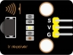 |  | 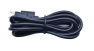 |  |
| --------------------------------------- | ----------------------- | --------------------------------------- | ----------------------- | --------------------------------------- | --------------------------------------- |
| ESP32 Board*11                          | ESP32 Expansion Board*1 | Keyestudio DIYIR Receiver*1             | 3P Dupont Wire*1        | Micro USB Cable*1                       | Remote Control*1                        |

**Connection Diagram**

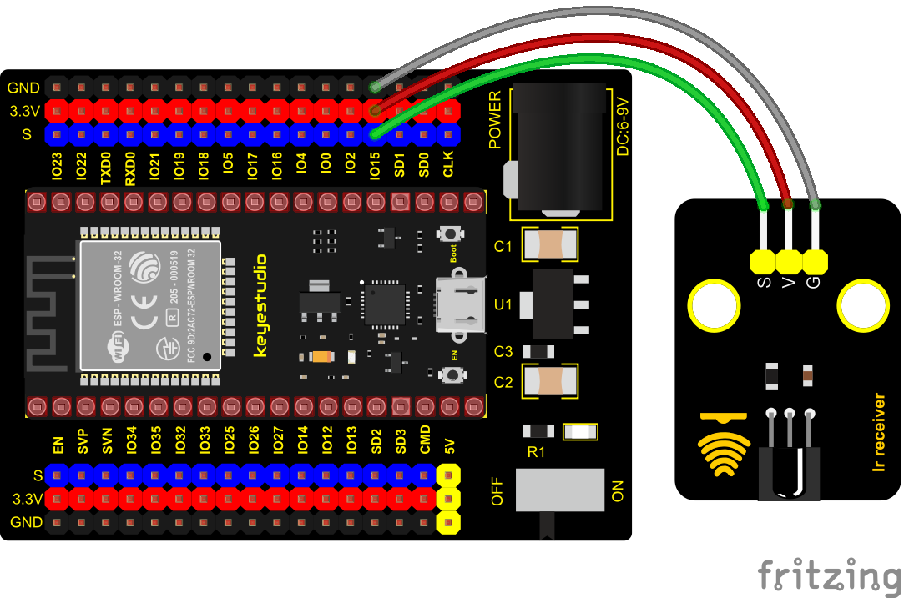

**Test Code**

```python
import utime
from machine import Pin 

ird = Pin(15,Pin.IN)

act = {"1": "LLLLLLLLHHHHHHHHLHHLHLLLHLLHLHHH","2": "LLLLLLLLHHHHHHHHHLLHHLLLLHHLLHHH","3": "LLLLLLLLHHHHHHHHHLHHLLLLLHLLHHHH",
       "4": "LLLLLLLLHHHHHHHHLLHHLLLLHHLLHHHH","5": "LLLLLLLLHHHHHHHHLLLHHLLLHHHLLHHH","6": "LLLLLLLLHHHHHHHHLHHHHLHLHLLLLHLH",
       "7": "LLLLLLLLHHHHHHHHLLLHLLLLHHHLHHHH","8": "LLLLLLLLHHHHHHHHLLHHHLLLHHLLLHHH","9": "LLLLLLLLHHHHHHHHLHLHHLHLHLHLLHLH",
       "0": "LLLLLLLLHHHHHHHHLHLLHLHLHLHHLHLH","Up": "LLLLLLLLHHHHHHHHLHHLLLHLHLLHHHLH","Down": "LLLLLLLLHHHHHHHHHLHLHLLLLHLHLHHH",
       "Left": "LLLLLLLLHHHHHHHHLLHLLLHLHHLHHHLH","Right": "LLLLLLLLHHHHHHHHHHLLLLHLLLHHHHLH","Ok": "LLLLLLLLHHHHHHHHLLLLLLHLHHHHHHLH",
       "*": "LLLLLLLLHHHHHHHHLHLLLLHLHLHHHHLH","#": "LLLLLLLLHHHHHHHHLHLHLLHLHLHLHHLH"}

def read_ircode(ird):
    wait = 1
    complete = 0
    seq0 = []
    seq1 = []

    while wait == 1:
        if ird.value() == 0:
            wait = 0
    while wait == 0 and complete == 0:
        start = utime.ticks_us()
        while ird.value() == 0:
            ms1 = utime.ticks_us()
        diff = utime.ticks_diff(ms1,start)
        seq0.append(diff)
        while ird.value() == 1 and complete == 0:
            ms2 = utime.ticks_us()
            diff = utime.ticks_diff(ms2,ms1)
            if diff > 10000:
                complete = 1
        seq1.append(diff)

    code = ""
    for val in seq1:
        if val < 2000:
            if val < 700:
                code += "L"
            else:
                code += "H"
    # print(code)
    command = ""
    for k,v in act.items():
        if code == v:
            command = k
    if command == "":
        command = code
    return command

while True:
    command = read_ircode(ird)
    print(command)
    utime.sleep(0.5)
```

**Test Result**

Connect the wires according to the experimental wiring diagram and power on. Click “Run current script”, the code starts executing. Find the infrared remote control, pull out the insulating sheet, and press the button at the receiving head of the infrared receiving sensor. After receiving the signal, the LED on the infrared receiving sensor also starts to flash, as shown in the figure below.

Press “Ctrl+C”or click“Stop/Restart backend”to exit the program.


### Project 37: DS18B20 Temperature Sensor


**Description**

In this kit, there is a DS18B20 temperature sensor, which is from maxim. The MCU can communicate with the DS18B20 through 1-Wire protocol, and finally read the temperature.  In this experiment, we will use this temperature sensor to measure the temperature in the current environment. The test result is **℃**, ranging from -55**℃** to +125**℃**. We will display the test result on shell.

**Working Principle**

The hardware interface of the 1-Wire bus is very simple, just connect the data pin of the DS18B20 to an IO port of the microcontroller. The timing of the 1-Wire bus is relatively complex. Many students can’t understand the timing diagram independently here. We have encapsulated the complex timing operations in the library, and you can use the library functions directly.

Schematic Diagram of DS18B20

This can save up to 12-bit temperature vale. In the register, save in code complement. As shown below;

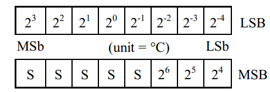

A total of 2 bytes, LSB is the low byte, MSB is the high byte, where MSb is the high byte of the byte, LSb is the low byte of the byte. As you can see, the binary number, the meaning of the temperature represented by each bit, is expressed. Among them, S represents the sign bit, and the lower 11 bits are all powers of 2, which are used to represent the final temperature. The temperature measurement range of DS18B20 is from -55 degrees to +125 degrees, and the expression form of temperature data, S represents positive and negative temperature, and the resolution is 2﹣⒋, which is 0.0625.


**Required Components**

|  |  | 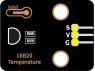   |  |  |
| --------------------------------------- | --------------------------------------- | ----------------------------------------- | --------------------------------------- | --------------------------------------- |
| ESP32 Board*1                           | ESP32 Expansion Board*1                 | Keyestudio DIY 18B20 Temperature Sensor*1 | 3P Dupont Wire*1                        | Micro USB Cable*1                       |

**Required Components**


**Add Library**

Open“Thonny”, click“This computer”→“D:”→“2. ESP32\_code\_MicroPython”→“lesson 37. DS18B20”.

Select“ds18x20\.py”and“onewire\.py”，right-click and select“Upload to”，waiting for the “ds18x20\.py” and “onewire\.py”to be uploaded to the ESP32.

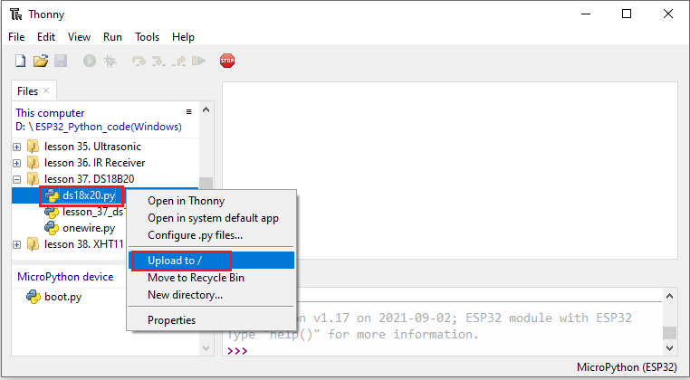

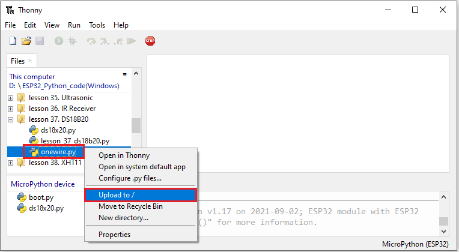

**Test Code**

```python
import machine, onewire, ds18x20, time

ds_pin = machine.Pin(15)

ds_sensor = ds18x20.DS18X20(onewire.OneWire(ds_pin))

roms = ds_sensor.scan()

print('Found DS devices: ', roms)

while True:

  ds_sensor.convert_temp()

  time.sleep_ms(750)

  for rom in roms:

    #print(rom)

    print(ds_sensor.read_temp(rom))

  time.sleep(1)
```

**Code Explanation**

1)\. We set the pin to GPIO15 and obtain the temperature in the unit of ℃.  

2)\. The Shell window displays the temperature value. Ds\_sensor. Read\_temp (ROM) indicates the temperature value.

**Test Result**

Connect the wires according to the experimental wiring diagram and power on. Click “Run current script”, the code starts executing, the shell displays the temperature of the current environment, as shown below. Press “Ctrl+C”or click“Stop/Restart backend”to exit the program.

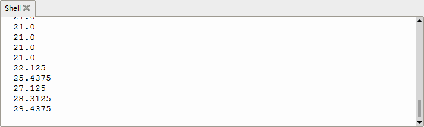

### Project 38: XHT11 Temperature and Humidity Sensor


**Description**

This DHT11 temperature and humidity sensor is a composite sensor which contains a calibrated digital signal output of the temperature and humidity.

DHT11 temperature and humidity sensor uses the acquisition technology of the digital module and temperature and humidity sensing technology, ensuring high reliability and excellent long-term stability. It includes a resistive element and a NTC temperature measuring device.


**Working Principle**

The communication and synchronization between the single-chip microcomputer and XHT11 adopts the single bus data format. The communication time is about 4ms. The data is divided into fractional part and integer part.

Operation process: A complete data transmission is 40bit, high bit first out. Data format: 8bit humidity integer data + 8bit humidity decimal data + 8bit temperature integer data + 8bit temperature decimal data + 8bit checksum

8-bit checksum: 8-bit humidity integer data + 8-bit humidity decimal data + 8-bit temperature integer data + 8-bit temperature decimal data "Add the last 8 bits of the result.

**Required Components**

|  | 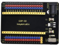 |                       |  |  |
| --------------------------------------- | --------------------------------------- | ------------------------------------------------------------ | --------------------------------------- | --------------------------------------- |
| ESP32Board*1                            | ESP32 Expansion Board*1                 | XHT11 Temperature and <br />Humidity Sensor*1<br />（compatible with DHT11) | 3P Dupont Wire*1                        | Micro USB Cable*1                       |

**Connection Diagram**

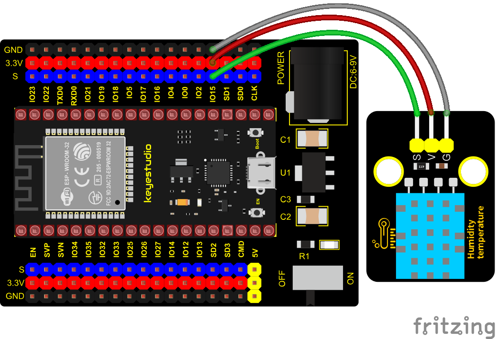

**Test Code**


```python
# Import machine, time and dht modules. 
import machine
import time
import dht

#Associate DHT11 with Pin(15).
DHT = dht.DHT11(machine.Pin(15))

# Obtain temperature and humidity data once per second and print them out. 
while True:
    DHT.measure() # Start DHT11 to measure data once.
   # Call the built-in function of DHT to obtain temperature
   # and humidity data and print them in “Shell”.
    print('temperature:',DHT.temperature(),'℃','humidity:',DHT.humidity(),'%')
    time.sleep_ms(1000)
```

**Test Result**

Connect the wires according to the experimental wiring diagram and power on. Click “Run current script”, the code starts executing, the shell displays the temperature and humidity data of the current environment, as shown below. Press“Ctrl+C”or click“Stop/Restart backend”to exit the program.

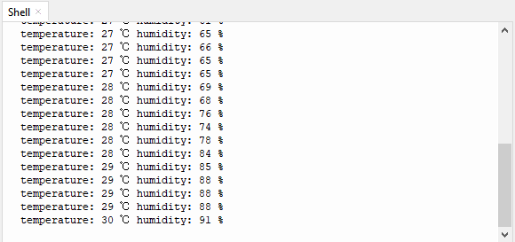

### Project 39: DS1307 Clock Module


**Overview**

This module mainly uses the real-time clock chip DS1307, which is the I2C bus interface chip that has second, minute, hour, day, month, year and other functions as well as leap year automatic adjustment function introduced by DALLAS. It can work independently of CPU, and won‘t’ affected by the CPU main crystal oscillator and capacitance as well as keep accurate time. What‘s more, monthly cumulative error is generally less than 10 seconds.

The chip also has a clock protection circuit in case of main power failure and runs on a back-up battery that denies the CPU read and write access. At the same time, it contains automatic switching control circuit of standby power supply, so it can guarantee the accuracy of system clock in case of power failure of main power supply and other bad environment.

Going forward, the DS1307 chip internal integration has a certain capacity, with power failure protection characteristics of static RAM, which can be used to save some key data. 

In the experiment, we use the DS1307 clock module to obtain the system time and print the test results.  

**Working Principle**

Serial real-time clock records year, month, day, hour, minute, second and week; AM and PM indicate morning and afternoon respectively; 56 bytes of NVRAM store data; 2-wire serial port; programmable square wave output; power failure detection and automatic switching circuit; battery current is less than 500nA.

Pins description： 

X1, X2：32.768kHz crystal terminal ;

VBAT: +3V input;

SDA：serial data;

SCL：serial clock;

SQW/OUT：square waves/output drivers


**Components**

|  |  | 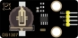 |  |  |
| --------------------------------------- | --------------------------------------- | --------------------------------------- | --------------------------------------- | --------------------------------------- |
| ESP32 Board*1                           | ESP32 Expansion Board*1                 | Keyestudio DS1307 Clock Module*1        | 4P Dupont Wire*1                        | Micro USB Cable*1                       |

**Connection Diagram**


**Add Library**

Open “Thonny”, click “This computer”→”D:”→”2. ESP32\_code\_MicroPython”→“lesson 39. DS1307 Real Time Clock”. Select“urtc\.py”，right-click and select“Upload to /”，waiting for the“urtc\.py”to be uploaded to the ESP32.

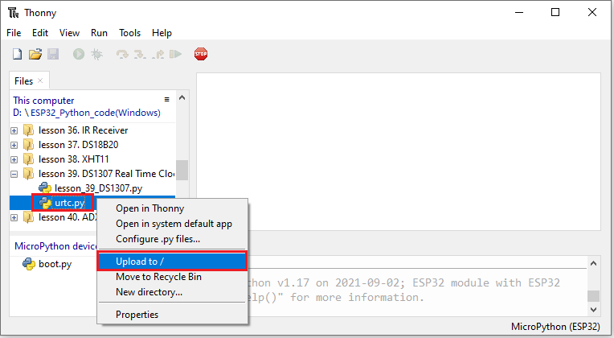

**Test Code**

```python
from machine import I2C, Pin
from urtc import DS1307 
import utime

i2c = I2C(1,scl = Pin(22),sda = Pin(21),freq = 400000)
rtc = DS1307(i2c)

year = int(input("Year : "))
month = int(input("month (Jan --> 1 , Dec --> 12): "))
date = int(input("date : "))
day = int(input("day (1 --> monday , 2 --> Tuesday ... 0 --> Sunday): "))
hour = int(input("hour (24 Hour format): "))
minute = int(input("minute : "))
second = int(input("second : "))

now = (year,month,date,day,hour,minute,second,0)
rtc.datetime(now)

#(year,month,date,day,hour,minute,second,p1) = rtc.datetime()
while True:
    DateTimeTuple = rtc.datetime()
    print(DateTimeTuple[0], end = '-')
    print(DateTimeTuple[1], end = '-')
    print(DateTimeTuple[2], end = '  ')
    print(DateTimeTuple[4], end = ':')
    print(DateTimeTuple[5], end = ':')
    print(DateTimeTuple[6], end = '  week:')
    print(DateTimeTuple[3])
    utime.sleep(1)
```

**Code Explanation**

rtc.datetime()：Return a tuple of time. When the program is running, we set the "please input" program, run the code, it will prompt us to input the time and date, after the input is completed, the data will be printed every second.

DateTimeTuple\[0\]: save years

DateTimeTuple\[1\]: save months

DateTimeTuple\[2\]: save days

DateTimeTuple\[3\]: save weeks

Rtc.GetDateTime().Month(): return months

DateTimeTuple\[4\]: save hours

DateTimeTuple\[5\]: save minutes

DateTimeTuple\[6\]: save seconds

**Test Result**

Connect the wires according to the experimental wiring diagram and power on. Click “Run current script”, the code starts executing, the shell will display “Year：”. Then we enter year, month, day, hour, minute and second, once complete, printed the data every second, as shown below. Press “Ctrl+C”or click “Stop/Restart backend”to exit the program.


### Project 40: ADXL345 Acceleration Sensor

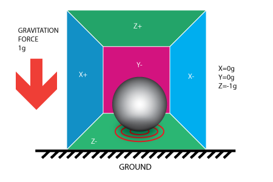

**Overview**

In this kit, there is a DIY electronic building block ADXL345 acceleration sensor module, which uses the ADXL345BCCZ chip. The chip is a small, thin, low-power 3-axis accelerometer with a high resolution (13 bits) and a measurement range of ±16g that can measure both dynamic acceleration due to motion or impact as well as stationary acceleration such as gravitational acceleration, making the device usable as a tilt sensor.  

**Working Principle**

The ADXL345 is a complete 3-axis acceleration measurement system with a selection of measurement ranges of ±2 g, ±4 g, ±8 g or ±16 g.  Its digital output data is in 16-bit binary complement format and can be accessed through an SPI (3-wire or 4-wire) or I2C digital interface.


The sensor can measure static acceleration due to gravity in tilt detection applications, as well as dynamic acceleration due to motion or impact. Its high resolution (3.9mg/LSB) enables measurement of tilt Angle changes of less than 1.0°.

**Components Required**

|  |  | 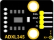        |  |  |
| --------------------------------------- | --------------------------------------- | ---------------------------------------------- | --------------------------------------- | --------------------------------------- |
| ESP32 Board*1                           | ESP32 Expansion Board*1                 | Keyestudio ADXL345 <br />Acceleration Module*1 | 4P Dupont Wire*1                        | Micro USB Cable*1                       |

**Connection Diagram**

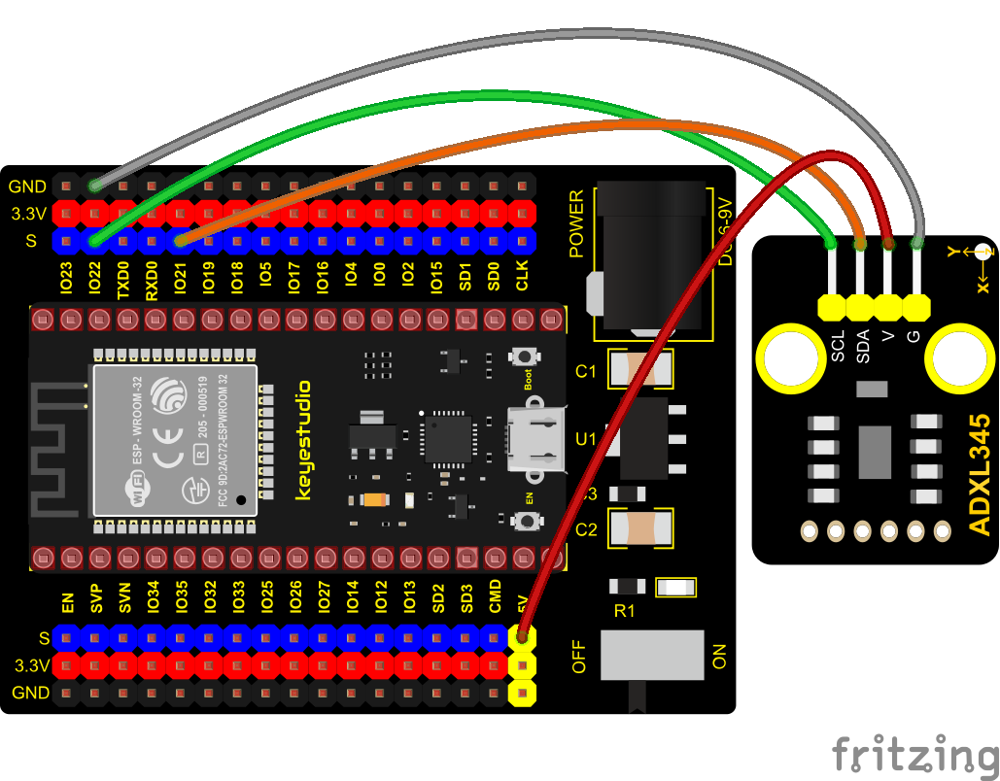

**Add Library**

Open“Thonny”, click“This computer”→“D:”→“2. ESP32\_code\_MicroPython”→“lesson 40. ADXL345”.

Select“ADXL345\.py”，right-click and select“Upload to /”，waiting for the “ADXL345\.py” to be uploaded to the ESP32.

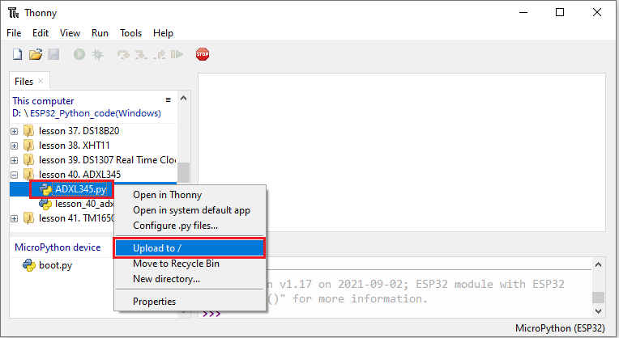

**Test Code**

```python
from machine import Pin
import time
from ADXL345 import adxl345

scl = Pin(22) 
sda = Pin(21)
bus = 0
snsr = adxl345(bus, scl, sda)
while True:
    x,y,z = snsr.readXYZ()
    print('x:',x,'y:',y,'z:',z,'uint:mg')
    time.sleep(0.1)
```

**Code Explanation**

Set IIC pins, select IIC0，sda--\>21, scl--\>22，then assign the value to x, y and z. The shell shows the value of x,y and z，unit is mg.

**Test Result**

Connect the wires according to the experimental wiring diagram and power on. Click“Run current script”, the code starts executing, the shell will display the corresponding value of the three-axis acceleration in mg, as shown in the following figure, as shown below. Press “Ctrl+C”or click “Stop/Restart backend”to exit the program.

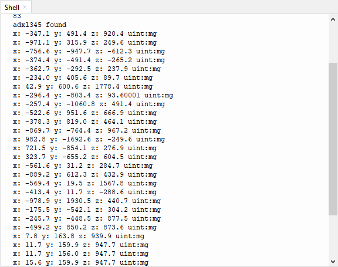

### Project 41: TM1650 4-Digit Tube Display

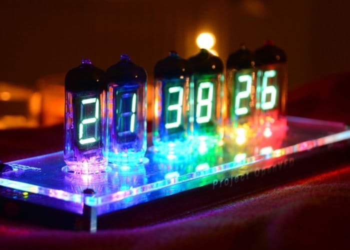

**Overview**

This module is mainly composed of a 0.36 inch red common cathode 4-digit digital tube, and its driver chip is TM1650. When using it, we only need two signal lines to make the single-chip microcomputer control a 4-bitdigit tube, which greatly saves the IO port resources of the control board.

TM1650 is a special circuit for LED (light emitting diode display) drive control. It integrates MCU input and output control digital interface, data latch, LED drivers, keyboard scanning, brightness adjustment and other circuits.

TM1650 has stable performance, reliable quality and strong anti-interference ability.

It can be applied to the application of long-term continuous working for 24 hours.

TM1650 uses 2-wire serial transmission protocol for communication (note that this data transmission protocol is not a standard I2C protocol). The chip can drive the digital tube and save MCU pin resources through two pins and MCU communication.

**Working Principle**

TM1650 adopts IIC treaty, which uses DIO and CLK buses.


**Data command setting**: 0x48 means that we light up the digital tube, instead of enable the function of key scanning


**Command display setting:**

bit\[6:4\]：set the brightness of tube display, and 000 is brightest

bit\[3\]：set to show decimal points

bit\[0\]：start the display of the tube display

**Components**

|  |  |         |  |  |
| --------------------------------------- | --------------------------------------- | ---------------------------------------------- | --------------------------------------- | --------------------------------------- |
| ESP32 Board*1                           | ESP32 Expansion Board*1                 | Keyestudio TM1650 <br />4-Digit Tube Display*1 | 4P Dupont Wire*1                        | Micro USB Cable*1                       |

**Connection Diagram**


**Test Code**


```python
from machine import Pin
import time

# definitions for TM1650
ADDR_DIS = 0x48  #mode command
ADDR_KEY = 0x49  #read key value command

# definitions for brightness
BRIGHT_DARKEST = 0
BRIGHT_TYPICAL = 2
BRIGHTEST      = 7

on  = 1
off = 0

# number:0~9
NUM = [0x3f,0x06,0x5b,0x4f,0x66,0x6d,0x7d,0x07,0x7f,0x6f] 
# DIG = [0x68,0x6a,0x6c,0x6e]
DIG = [0x6e,0x6c,0x6a,0x68]
DOT = [0,0,0,0]

clkPin = 22
dioPin = 21
clk = Pin(clkPin, Pin.OUT)
dio = Pin(dioPin, Pin.OUT)

DisplayCommand = 0

def writeByte(wr_data):
    global clk,dio
    for i in range(8):
        if(wr_data & 0x80 == 0x80):
            dio.value(1)
        else:
            dio.value(0)
        clk.value(0)
        time.sleep(0.0001)
        clk.value(1)
        time.sleep(0.0001)
        clk.value(0)
        wr_data <<= 1
    return

def start():
    global clk,dio
    dio.value(1)
    clk.value(1)
    time.sleep(0.0001)
    dio.value(0)
    return
    
def ack():
    global clk,dio
    dy = 0
    clk.value(0)
    time.sleep(0.0001)
    dio = Pin(dioPin, Pin.IN)
    while(dio.value() == 1):
        time.sleep(0.0001)
        dy += 1
        if(dy>5000):
            break
    clk.value(1)
    time.sleep(0.0001)
    clk.value(0)
    dio = Pin(dioPin, Pin.OUT)
    return 
    
def stop():
    global clk,dio
    dio.value(0)
    clk.value(1)
    time.sleep(0.0001)
    dio.value(1)
    return
    
def displayBit(bit, num):
    global ADDR_DIS
    if(num > 9 and bit > 4):
        return
    start()
    writeByte(ADDR_DIS)
    ack()
    writeByte(DisplayCommand)
    ack()
    stop()
    start()
    writeByte(DIG[bit-1])
    ack()
    if(DOT[bit-1] == 1):
        writeByte(NUM[num] | 0x80)
    else:
        writeByte(NUM[num])
    ack()
    stop()
    return
    
def clearBit(bit):
    if(bit > 4):
        return
    start()
    writeByte(ADDR_DIS)
    ack()
    writeByte(DisplayCommand)
    ack()
    stop()
    start()
    writeByte(DIG[bit-1])
    ack()
    writeByte(0x00)
    ack()
    stop()
    return
            
    def setBrightness(b = BRIGHT_TYPICAL):
        global DisplayCommand,brightness
        DisplayCommand = (DisplayCommand & 0x0f)+(b<<4)
        return
    def setMode(segment = 0):
    global DisplayCommand
    DisplayCommand = (DisplayCommand & 0xf7)+(segment<<3)
    return
    
def displayOnOFF(OnOff = 1):
    global DisplayCommand
    DisplayCommand = (DisplayCommand & 0xfe)+OnOff
    return

def displayDot(bit, OnOff):
    if(bit > 4):
        return
    if(OnOff == 1): 
        DOT[bit-1] = 1;
    else:
        DOT[bit-1] = 0;
    return
        
def InitDigitalTube():
    setBrightness(2)
    setMode(0)
    displayOnOFF(1)
    for _ in range(4):
        clearBit(_)
    return

def ShowNum(num): #0~9999
    displayBit(1,num%10)
    if(num < 10):
        clearBit(2)
        clearBit(3)
        clearBit(4)
    if(num > 9 and num < 100):
        displayBit(2,num//10%10)
        clearBit(3)
        clearBit(4)
    if(num > 99 and num < 1000):
        displayBit(2,num//10%10)
        displayBit(3,num//100%10)
        clearBit(4)
    if(num > 999 and num < 10000):
        displayBit(2,num//10%10)
        displayBit(3,num//100%10)
        displayBit(4,num//1000)

InitDigitalTube()

while True:
    #displayDot(1,on)     # on or off, DigitalTube.Display(bit,number); bit=1---4  number=0---9
    for i in range(0,9999):
        ShowNum(i)
        time.sleep(0.01)
```

**Code Explanation**

**clkPin = 22、dioPin = 21is pin number**，CLK is connected to GPIO22，DIO is connected to GPIO21. We can set any two pins at random.

**displayBit(bit, num):** show numbers at bit(1\~4) bit num(0\~9)

**clearBit(bit): clear up** bit(1\~4)

**setBrightness(): brightness setting**

**displayOnOFF()** 0 means OFF, 1 means ON

**displayDot(bit, OnOff)** shows dots，0 means OFF, 1 means ON

**ShowNum(num): show integer** num，in the range of 0\~9999

**Test Result**

Connect the wires according to the experimental wiring diagram and power on. Click “Run current script”, the code starts executing. The 4-digit tube display will show integer from 0 to 99999, an increase of 1 for each 10ms, then start from 0 once reaching 99999.

Press “Ctrl+C”or click “Stop/Restart backend”to exit the program.

### Project 42: HT16K33\_8X8 Dot Matrix Module


**Overview**

What is the dot matrix display? 

If we apply the previous circuit, there will be must one IO port to control only one LED. When more LED need to be controlled, we may adopt a dot matrix.

The 8X8 dot matrix is composed of 64 light-emitting diodes, and each light-emitting diode is placed at the intersection of the row line and the column line. Refer to the experimental schematic diagram below , when the corresponding column is set to a high level and a certain row to low, the corresponding diode will light up. For instance, set pin 13 to a high level and pin 9 to low, and then the first LED will light up.

In the experiment, we display icons via this dot matrix.

**Working Principle**

As the schematic diagram shown, to light up the LED at the first row and column, we only need to set C1 to high level and R1 to low level. To turn on LEDs at the first row, we set R1 to low level and C1-C8 to high level.

16 IO ports are needed, which will highly waste the MCU resources.

Therefore, we designed this module, using the HT16K33 chip to drive an 8\*8 dot matrix, which greatly saves the resources of the single-chip microcomputer.

There are three DIP switches on the module, all of which are set to I2C communication address. The setting method is shown below. A0，A1 and A2 are grounded, that is, the address is 0x70.

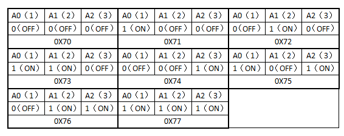

**Components**

|  |  |   |  |  |
| --------------------------------------- | --------------------------------------- | ---------------------------------------- | --------------------------------------- | --------------------------------------- |
| ESP32 Board*1                           | ESP32 Expansion Board*1                 | Keyestudio HT16K33<br />8X8 Dot Matrix*1 | 4P Dupont Wire*1                        | Micro USB Cable*1                       |

**Connection Diagram**


**Add Library**

Open “Thonny”, click “This computer” → “D:” → “2. ESP32\_code\_MicroPython” → “lesson 42. HT16K33 dot matrix”. Select “ht16k33\.py” and “ht16k33matrix\.py”, right-click and select “Upload to /”, waiting for the “ht16k33\.py” and “ht16k33matrix\.py” to be uploaded to the ESP32.

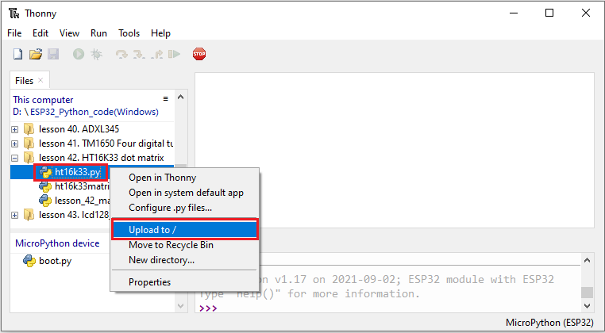

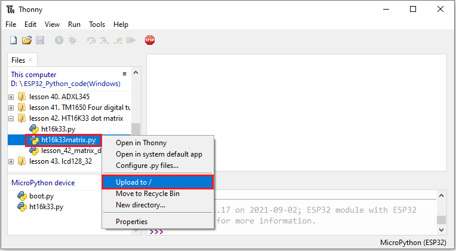

**Test Code**

```python
# IMPORTS
import utime as time
from machine import I2C, Pin, RTC
from ht16k33matrix import HT16K33Matrix

# CONSTANTS
DELAY = 0.01
PAUSE = 3

# START
if __name__ == '__main__':
    i2c = I2C(scl=Pin(22), sda=Pin(21))
    display = HT16K33Matrix(i2c)
    display.set_brightness(2)

    # Draw a custom icon on the LED
    icon = b"\x00\x66\x00\x00\x18\x42\x3c\x00"
    display.set_icon(icon).draw()
    # Rotate the icon
    display.set_angle(0).draw()
    time.sleep(PAUSE)
```

**Test Result**

Connect the wires according to the experimental wiring diagram and power on. Click “Run current script”, the code starts executing. The dot matrix displays a“ smile ”pattern. Press “Ctrl+C”or click “Stop/Restart backend”to exit the program.

### Project 43: LCD\_128X32\_DOT Module


**Description**

This is a 128\*32 pixel LCD module, which uses IIC communication mode and ST7567A driver chip. At the same time, the code contains all the English letters and common symbols of the library that can be directly called. When used, we can also set English letters and symbols to display different text sizes in our code. To make it easy to set up the pattern display, we also provide a mold capture software that can convert a specific pattern into control code and then copy it directly into the test code for use. 

In the experiment, we will set up the display screen to display various English words, common symbols and numbers.  

**Working Principle**


The module uses the IIC communication principle, the underlying functions have been encapsulated in the library surface, we can directly call the library function, if interested, you can also go to understand the underlying driver of the module.  

**Components**

|  |  |   |  |  |
| --------------------------------------- | --------------------------------------- | ---------------------------------------- | --------------------------------------- | --------------------------------------- |
| ESP32 Board*1                           | ESP32 Expansion Board*1                 | Keyestudio LCD 128X32 <br />DOT Module*1 | 4P Dupont Wire*1                        | Micro USB Cable*1                       |

**Connection Diagram**

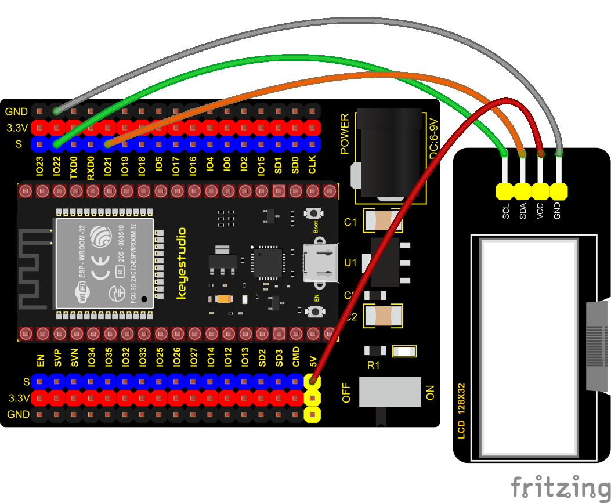

**Add Library**

Open “Thonny”, click “This computer” → “D:” → “2. ESP32\_code\_MicroPython” → “lesson 43. lcd128\_32”. Select “lcd128\_32.py” and “lcd128\_32\_fonts.py”, right-click and select “Upload to /”, waiting for the “lcd128\_32.py” and “lcd128\_32\_fonts.py” to be uploaded to the ESP32.

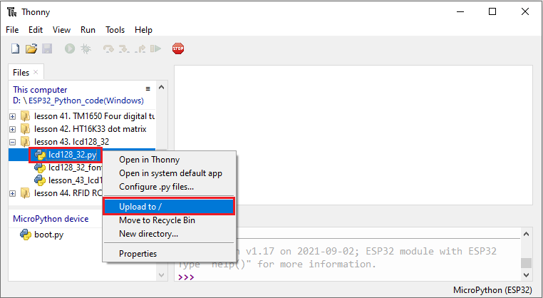

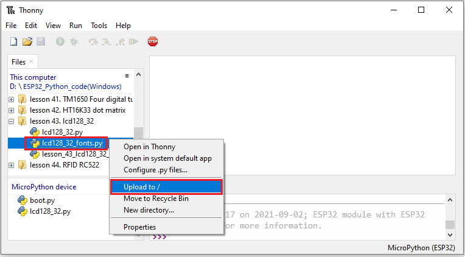

**Test Code**

```python
import machine
import time 
import lcd128_32_fonts
from lcd128_32 import lcd128_32

#i2c config
clock_pin = 22
data_pin = 21
bus = 0
i2c_addr = 0x3f
use_i2c = True

def scan_for_devices():
    i2c = machine.I2C(bus,sda=machine.Pin(data_pin),scl=machine.Pin(clock_pin))
    devices = i2c.scan()
    if devices:
        for d in devices:
            print(hex(d))
    else:
        print('no i2c devices')

if use_i2c:
    scan_for_devices()
    lcd = lcd128_32(data_pin, clock_pin, bus, i2c_addr)
        
    lcd.Clear()
    lcd.Cursor(0, 7)
lcd.Display("KEYES")
lcd.Cursor(1, 0)
lcd.Display("ABCDEFGHIJKLMNOPQR")
lcd.Cursor(2, 0)
lcd.Display("123456789+-*/<>=$@")
lcd.Cursor(3, 0)
lcd.Display("%^&(){}:;'|?,.~\\[]")

while True:
    #scan_for_devices()
    time.sleep(0.5)
```

**Code Explanation**

**Scan\_for\_devices()** 

This function is an IIC addressing function; if an IIC device is identified, the IIC address of the device is printed, as shown in the figure:

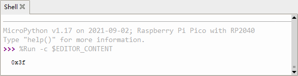

If the device is not recognized, print no i2c devices, and then report an error, as shown in the figure:

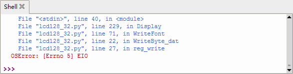

**lcd.Cursor(0, 7)**

In order to set the cursor function, that is, to set the position where the character is displayed on the lcd, the first parameter is the parameter of the row, the second is the parameter of the column, then it is expressed as, the first row, the seventh column starts to display the characters.

**lcd.Display("KEYES")**

In order to set the character content to be displayed, "KEYES" is displayed here

**Test Result**

Connect the wires according to the experimental wiring diagram and power on. 

Click “Run current script”, the code starts executing, the first line of the 128X32LCD module displays "KEYES", the second line displays "ABCDEFGHIJKLMNOPQR", the third line displays "123456789+-\*/\<\>=$@",  the fourth line displays "%^&(){}:;'|?,.~\\[]", as shown in the following image.

Press “Ctrl+C”or click “Stop/Restart backend”to exit the program.

### Project 44: RFID Module


**Description**

RFIDRFID-RC522 radio frequency module adopts a Philips MFRC522 original chip to design card reading circuit, easy to use and low cost, suitable for equipment development and card reader development and so on.

RFID or Radio Frequency Identification system consists of two main components, a transponder/tag attached to an object to be identified, and a transceiver also known as interrogator/Reader.

In the experiment, the data read by the card swipe module is 4 hexadecimal numbers, and we print these four hexadecimal numbers as strings. For example, we read the data of the IC card below: 237, 247,148,90 and the data read from the keychain is: 76, 9, 107, 110. Different IC cards and different key chains have diverse data.

**Working Principle**

Radio frequency identification, the card reader is composed of a radio frequency module and a high-level magnetic field. The Tag transponder is a sensing device, and this device does not contain a battery. It only contains tiny integrated circuit chips and media for storing data and antennas for receiving and transmitting signals. To read the data in the tag, first put it into the reading range of the card reader. The reader will generate a magnetic field, and because the magnetic energy generates electricity according to Lenz's law, the RFID tag will supply power, thereby activating the device.


**Components Required**

|  |  | 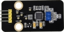 |  |
| --------------------------------------- | --------------------------------------- | --------------------------------------- | --------------------------------------- |
| ESP32 Board*1                           | ESP32 Expansion Board*1                 | Keyestudio DIY RFID Module*1            | 4P Dupont Wire*1                        |
|  |  |                  |                                         |
| Micro USB Cable*1                       | Key*1                                   | IC Card*1                               |                                         |

**Connection Diagram**


**Add Library**

Open “Thonny”, click “This computer” → “D:” → “2. ESP32\_code\_MicroPython” → “lesson 44. RFID RC522”. 

Select “mfrc522\_config.py”, “mfrc522\_i2c.py” and “soft\_iic.py”, right-click and select “Upload to /”, waiting for the “mfrc522\_config.py”, “mfrc522\_i2c.py” and “soft\_iic.py” to be uploaded to the ESP32.

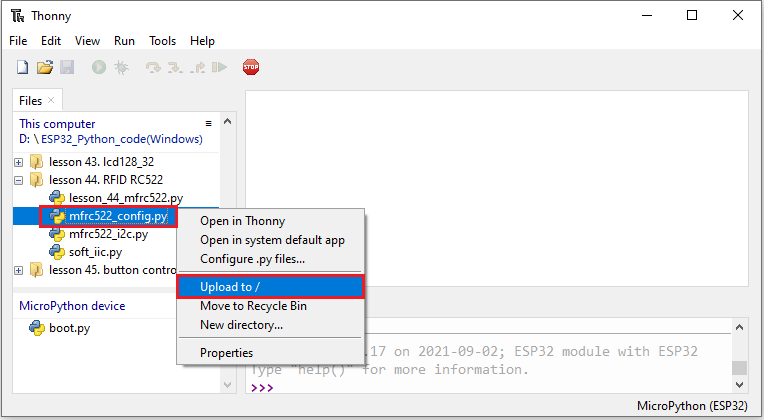

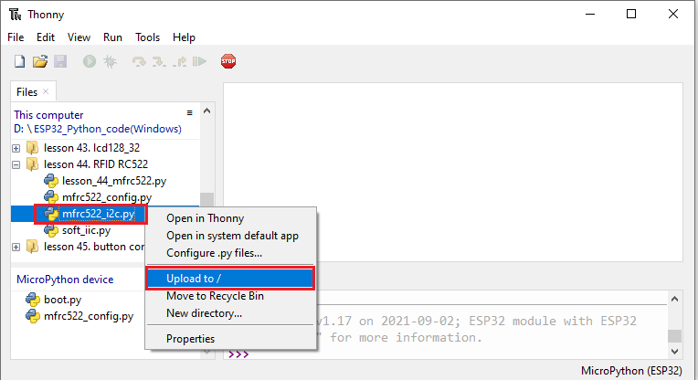

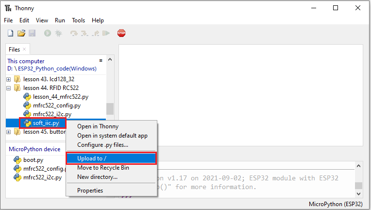

**Test Code**

```python
import machine
import time
from mfrc522_i2c import mfrc522

#i2c config
addr = 0x28
scl = 22
sda = 21
    
rc522 = mfrc522(scl, sda, addr)
rc522.PCD_Init()
rc522.ShowReaderDetails()            # Show details of PCD - MFRC522 Card Reader details

while True:
    if rc522.PICC_IsNewCardPresent():
        #print("Is new card present!")
        if rc522.PICC_ReadCardSerial() == True:
            print("Card UID:")
            print(rc522.uid.uidByte[0 : rc522.uid.size])
    #time.sleep(1)
```

**Code Explanation**

**mfrc522\_config.py;** This is a configuration file that defines some parameters and commands

**mfrc522\_i2c.py;** Initialization and read and write functions

**Soft\_iic.py;** It is the bottom-level read and write function of software I2C. We use the io port to simulate I2C here.

**Test Result**

Connect the wires according to the experimental wiring diagram and power on. Click“Run current script”, the code starts executing. When we make the IC card and key chain close to the RFID module, the information will be printed out, as shown in the figure below. Press “Ctrl+C”or click “Stop/Restart backend”to exit the program.

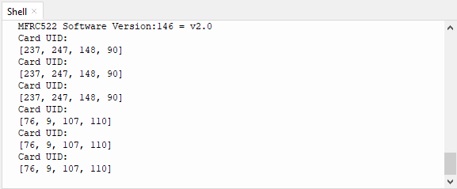

Note: Different **RFID-RC522** door cards and key chains have diverse values.

## 3. Comprehensive Experiments:

The previous projects are related to single sensor or module. In the following part, we will combine various sensors and modules to create some comprehensive experiments to perform special functions.

### Project 45: Button-controlled LED


**Overview**

In this lesson, we will make an extension experiment with a button and an LED. When the button is pressed and low levels are output, the LED will light up; when the button is released, the LED will go off. Then we can control a module with another module.

**Components**

|  | 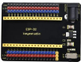 | 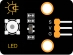 |
| --------------------------------------- | --------------------------------------- | --------------------------------------- |
| ESP32 Board*1                           | ESP32 Expansion Board*1                 | Keyestudio Purple LED Module*1          |
|  |  |  |
| Keyestudio DIY  Button Module*1         | 3P Dupont Wire*2                        | Micro USB Cable*1                       |

**Connection Diagram**


**Test Code**


```python
from machine import Pin
import time

led = Pin(4, Pin.OUT) # create LED object from Pin 4,Set Pin 4 to output                   
button = Pin(15, Pin.IN, Pin.PULL_UP) #Create button object from Pin15,Set GP15 to input

#Customize a function and name it reverseGPIO(),which reverses the output level of the LED
def reverseGPIO():
    if led.value():
        led.value(0)     #Set led turn off
    else:
        led.value(1)     #Set led turn on

try:
    while True:
        if not button.value():
            time.sleep_ms(20)
            if not button.value():
                reverseGPIO()
                while not button.value():
                    time.sleep_ms(20)
except:
    pass
```

**Test Result**

Connect the wires according to the experimental wiring diagram and power on. Click “Run current script”, the code starts executing.When the button is pressed, the LED will light up, when pressed again, the LED will go off, cycle this operation. Press “Ctrl+C”or “Stop/Restart backend”to exit the program.

### Project 46: Alarm Experiment


**Overview**

In the previous experiment, we control an output module though an input module. In this lesson, we will make an experiment that the active buzzer will emit sounds once an obstacle appears.

**Components**

| 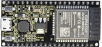    | 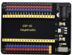 | 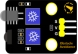 |
| -------------------------- | ----------------------- | --------------------------------------- |
| ESP32 Board*1              | ESP32 Expansion Board*1 | Keyestudio Obstacle Avoidance Sensor*1  |
|     |  |                  |
| Keyestudio Active Buzzer*1 | 3P Dupont Wire*2        | Micro USB Cable*1                       |

**Connection Diagram**

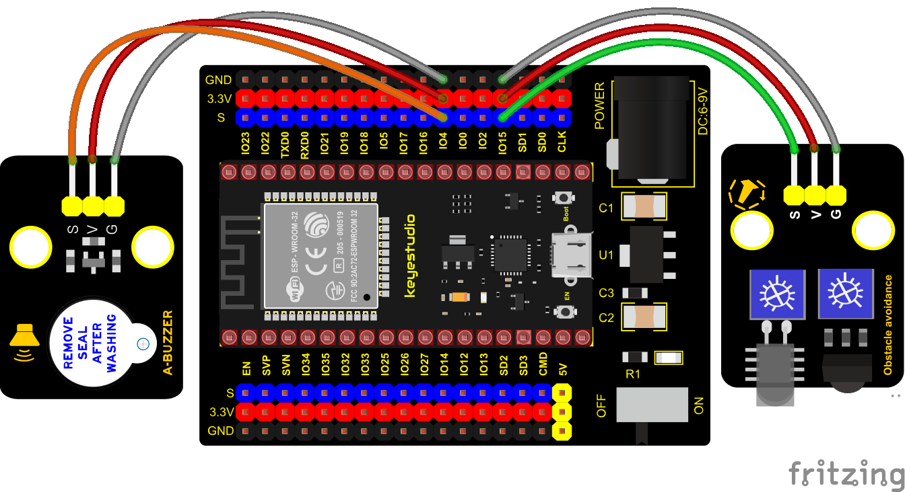

**Test Code**

```python
from machine import Pin
import time

buzzer = Pin(4, Pin.OUT)
sensor = Pin(15, Pin.IN)
while True:
    buzzer.value(not(sensor.value()))
    time.sleep(0.01)
```

**Code Explanation**

When an obstacle is detected, **sensor.value()** will return a low level signal. So when an obstacle is detected, the GPIO4 connected to the buzzer pin will output a high level signal, the buzzer will emit sounds.

**Test Result**

Connect the wires according to the experimental wiring diagram and power on. Click  “Run current script”, the code starts executing. The active buzzer will emit sound if detecting obstacles; otherwise, it won’t emit sound. Press “Ctrl+C” or click “Stop/Restart backend” to exit the program.

### Project 47: Intrusion Detection


**Description**

In this experiment, we use a PIR motion sensor to control an active buzzer to emit sounds and the onboard LED to flash rapidly.

**Required Components**

|  |  | 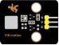                 |  |
| --------------------------------------- | ----------------------- | --------------------------------------- | --------------------------------------- |
| ESP32 Board*1                           | ESP32 Expansion Board*1 | DIY PIR Motion Sensor*1                 | DIY Active Buzzer*1                     |
|                  |  |  |                                         |
| Purple LED Module*1                     | 3P Dupont Wire*2        | Micro USB Cable*1                       |                                         |


**Connection Diagram**


**Test Code**

```python
# Import Pin and time modules.
from machine import Pin 
import time 

# Define the pins of the Human infrared sensor,led and Active buzzer. 
sensor_pir = Pin(15, Pin.IN)
led = Pin(22, Pin.OUT)
buzzer = Pin(4, Pin.OUT)

while True: 
      if sensor_pir.value():
          print("Warning! Intrusion detected！")
          buzzer.value(1)
          led.value(1)
          time.sleep(0.2)
          buzzer.value(0)
          led.value(0)
          time.sleep(0.2)         
      else:
          buzzer.value(0)
          led.value(0)
```

**Test Result**

Connect the wires according to the experimental wiring diagram and power on. Click“Run current script”, the code starts executing. If the PIR Motion sensor detects someone moving nearby, the buzzer will emit an alarm , and the LED will flash continuously. At the same time, the “shell” will display“Warning\! Intrusion detected！”.

Press “Ctrl+C”or click “Stop/Restart backend”to exit the program.


### Project 48: Extinguishing Robot


**Description**

Today we will use Arduino simulation to build an extinguishing robot that will automatically sense the fire and start the fan. In this project we will learn how to build a very simple robot using ESP32, (detecting flames with a flame sensor, blowing out candles with a fan) can teach us basic concepts about robotics. Once you understand the basics below, you can build more complex robots.

**Components Required**

|                  |  | 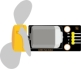 |
| --------------------------------------- | ----------------------- | ----------------------- |
| ESP32 Board*1                           | ESP32 Expansion Board*1 | 130 Motor*1             |
|                  |  |  |
| 3P Dupont Wire*1                        | 4P Dupont Wire*1        | Micro USB Cable*1       |
|  | 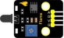 |  |
| Battery (provided by yourself)*6        | Flame Sensor*1          | Battery Holder*1        |

**Connection Diagram**

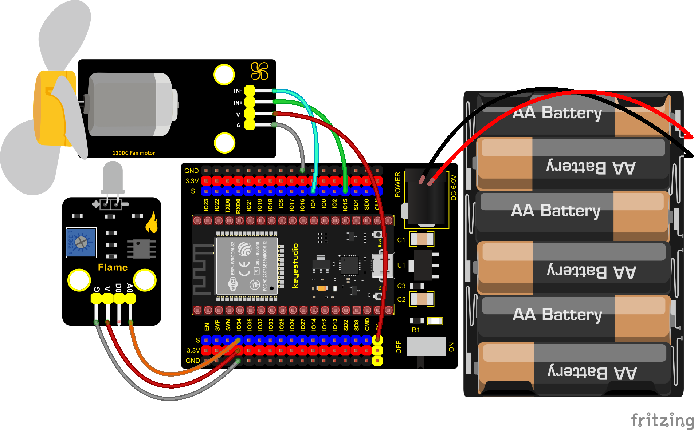

**Test Code**


```python
# Import Pin and ADCmodules.
from machine import ADC,Pin
import time

# Turn on and configure the ADC with the range of 0-3.3V
adc=ADC(Pin(34))
adc.atten(ADC.ATTN_11DB)
adc.width(ADC.WIDTH_12BIT)

#Two pins of the moto
INA = Pin(15, Pin.OUT) #INA corresponds to IN+
INB = Pin(4, Pin.OUT) #INB corresponds to IN-

while True:
    adcVal=adc.read()
    print(adcVal)
    if adcVal < 3000:
        #open
        INA.value(0)
        INB.value(1)
    else:
        #stop
        INA.value(0)
        INB.value(0)
    time.sleep(0.1)
```

**Code Explanation**

In the code, we set the threshold value to 3000. When the ADC value detected by the flame sensor is lower than the threshold value, the fan will be automatically turned on; otherwise, it will be turned off. For the driving method of the fan, please refer to the 130 Motor.

**Test Result**

Connect the wires according to the experimental wiring diagram and power on. Switch the DIP switch on the ESP32 expansion board to the ON end, click  “Run current script”, the code starts executing. The shell prints the flame value. When this value is less than 3000, the fan will work to blow out the fire. Basically, the flame value can be set by yourself. Press “Ctrl+C” or click “Stop/Restart backend” to exit the program.

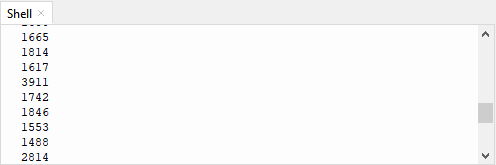

### Project 49: Rotary Encoder control RGB


**Introduction**

In this lesson, we will control the LED on the RGB module to show different colors through a rotary encoder.

When designing the code, we need to divide the obtained values by 3 to get the remainders. The remainder is 0 and the LED will become red. The remainder is 1, the LED will become green. The remainder is 2, the LED will turn blue.

**Components**

|  |  | 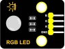               |  |
| ----------------------- | ----------------------- | ------------------------------------- | --------------------------------------- |
| ESP32Board*1            | ESP32 Expansion Board*1 | KeyestudioCommon Cathode RGB Module*1 | KeyestudioRotary Encoder Module*1       |
|  |  |                |                                         |
| 5P Dupont Wire*1        | 4P Dupont Wire*1        | Micro USB Cable*1                     |                                         |

**Connection Diagram**

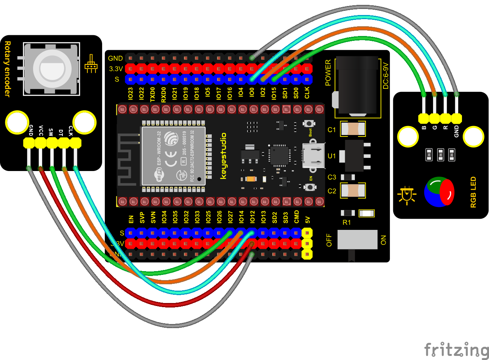

**Add Library**

Open “Thonny”, click “This computer” → “D:” → “2. ESP32\_code\_MicroPython” → “lesson 49. Encoder control RGB”.

Select “rotary\.py” and “rotary\_irq\_rp2\.py”, right-click and select “Upload to /”, waiting for the “rotary\.py” and “rotary\_irq\_rp2\.py” to be uploaded to the ESP32.

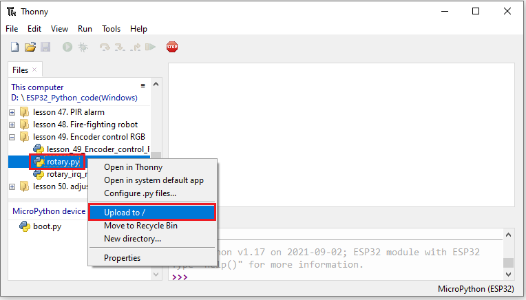

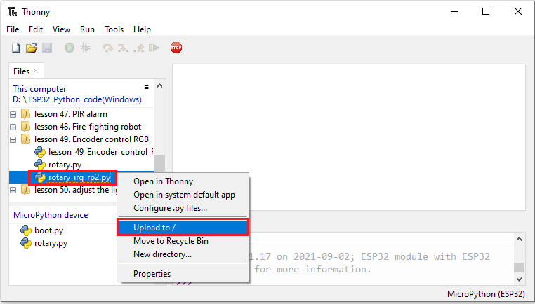

**Test Code**

```python
import time
from rotary_irq_rp2 import RotaryIRQ
from machine import Pin, PWM

pwm_r = PWM(Pin(0)) 
pwm_g = PWM(Pin(2))
pwm_b = PWM(Pin(15))

pwm_r.freq(1000)
pwm_g.freq(1000)
pwm_b.freq(1000)

def light(red, green, blue):
    pwm_r.duty(red)
    pwm_g.duty(green)
    pwm_b.duty(blue)

SW=Pin(27,Pin.IN,Pin.PULL_UP)
r = RotaryIRQ(pin_num_clk=12,
              pin_num_dt=14,
              min_val=0,
              reverse=False,
              range_mode=RotaryIRQ.RANGE_UNBOUNDED)

while True:
    val = r.value()
    print(val%3)
    if val%3 == 0:
        light(4950, 0, 0)
    elif val%3 == 1:
        light(0, 4950, 0)
    elif val%3 == 2:
        light(0, 0, 4950)
    time.sleep(0.1)
```

**Code Explanation**

In the experiment, we set the val to the remainder of Encoder\_Count divided by 3. Encoder\_Count is the value of the encoder. Then we can set pin GPIO0 (red), GPIO2 (green) and GPIO15 (blue) according to remainders.

Colors of the LEDs can be controlled by remainders.

**Test Result**

Connect the wires according to the experimental wiring diagram and power on. Click “Run current script”, the code starts executing. Rotate the knob of the rotary encoder to display the reminders, which can control colors of LED(red green blue). Press “Ctrl+C”or click “Stop/Restart backend”to exit the program.


### Project 50: Rotary Potentiometer


**Introduction**

In the previous courses, we did experiments of breathing light and controlling LED with button. In this course, we do these two experiments by controlling the brightness of LED through an adjustable potentiometer. The brightness of LED is controlled by PWM values, and the range of analog values is 0 to 4095 and the PWM value range is 0-255.

After the code is set successfully, we can control the brightness of the LED on the module by rotating the potentiometer.

**Required Components**

|   | 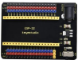                  | 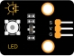                 |
| ---------------------------------------- | ---------------------------------------- | ---------------------------------------- |
| ESP32 Board*1                            | ESP32 Expansion Board*1                  | Keyestudio Purple LED*1                  |
| 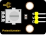 |  |  |
| Keyestudio Rotary Potentiometer*1        | 3P Dupont Wire*2                         | Micro USB Cable*1                        |

**Connection Diagram**

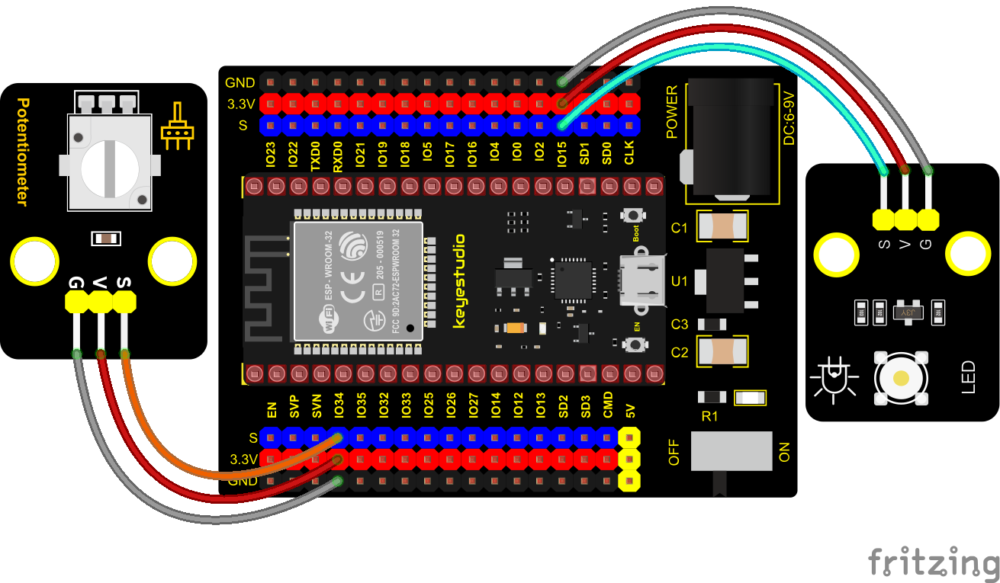

**Test Code**


```python
from machine import Pin,PWM,ADC
import time

pwm =PWM(Pin(15,Pin.OUT),1000)
adc=ADC(Pin(34))
adc.atten(ADC.ATTN_11DB)
adc.width(ADC.WIDTH_10BIT)

try:
    while True:
        adcValue=adc.read()
        pwm.duty(adcValue)
        print(adc.read())
        time.sleep_ms(100)
except:
    pwm.deinit()
```

**Code Explanation**

It is easy to control the brightness of the LED light by a potentiometer. Here we can find that MicroPython unifies the value range of the ADC between 0 and 1023, and assigns values directly, which is simple and convenient.

**Test Result**

Connect the wires according to the experimental wiring diagram and power on. Click “Run current script”, the code starts executing. Rotating the potentiometer on the module can adjust the brightness of the LED on the LED module. Press “Ctrl+C”or click “Stop/Restart backend”to exit the program.

### Project 51: Smart Windows


**Description**

In life, we can see all kinds of smart products, such as smart home. Smart homes include smart curtains, smart windows, smart TVs, smart lights, and more. In this experiment, we use a steam sensor to detect rainwater, and then achieve the effect of closing and opening the window by a servo.

**Required Components**

|  |  | 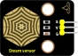 |
| ---------------------------------------- | ---------------------------------------- | ---------------------------------------- |
| ESP32 Board*1                            | ESP32 Expansion Board*1                  | Keyestudio Steam Sensor*1                |
|                  |                  |  |
| Servo*1                                  | 3P Dupont Wire*1                         | Micro USB Cable*1                        |

**Connection Diagram**

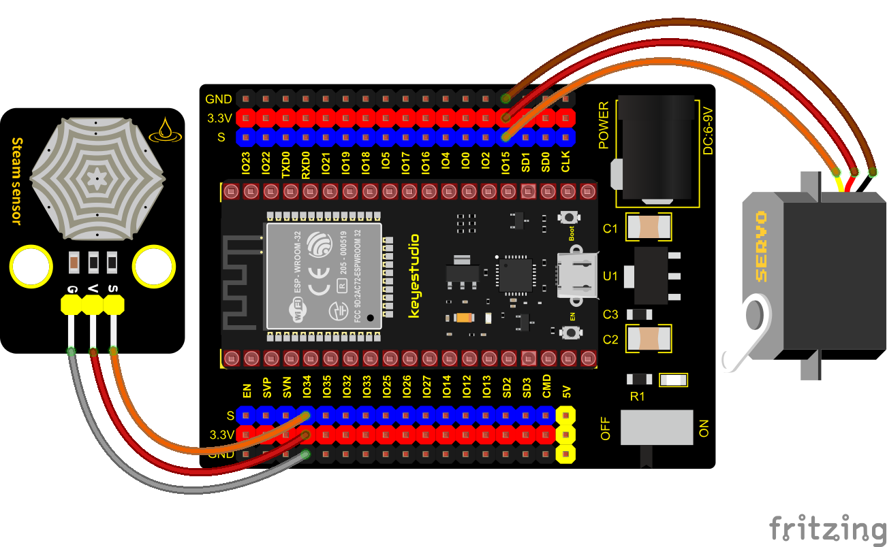

**Test Code**


```python
# Import Pin and ADC modules.
from machine import ADC,Pin,PWM
import time

# Turn on and configure the ADC with the range of 0-3.3V 
adc=ADC(Pin(34))
adc.atten(ADC.ATTN_11DB)
adc.width(ADC.WIDTH_12BIT)

pwm = PWM(Pin(15))#Steering pin connected to GP15
pwm.freq(50)#20ms period, so the frequency is 50Hz
'''
Duty cycle corresponding to the Angle
0°----2.5%----25
45°----5%----51.2
90°----7.5%----77
135°----10%----102.4
180°----12.5%----128
In consideration of the error, the duty cycle is set at 1000~9000, which can smoothly rotate 0~180 degrees
'''
angle_0 = 25
angle_90 = 77
angle_180 = 128
    
while True:
    adcVal=adc.read()
    print(adcVal)
    if adcVal > 2000:
        pwm.duty(angle_0)
        time.sleep(0.5)
    else:
        pwm.duty(angle_180)
        time.sleep(0.5)
```

**Code Explanation**

We can control a servo to rotate by a threshold.

**Test Result**

Connect the wires according to the experimental wiring diagram and power on. Click “Run current script”, the code starts executing. When the sensor detects a certain amount of water, the servo rotates to achieve the effect of closing or opening windows. Press “Ctrl+C”or click “Stop/Restart backend”to exit the program.

### Project 52: Sound Activated Light


**Introduction**

In this lesson, we will make a smart sound activated light using a sound sensor and an LED module. When we make a sound, the light will automatically turn on; when there is no sound, the lights will automatically turn off. How it works? Because the sound-controlled light is equipped with a sound sensor, and this sensor converts the intensity of external sound into a corresponding value. Then set a threshold, when the threshold is exceeded, the light will go on, and when it is not exceeded, the light will turn off.

**Components**

| 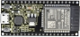                 | 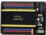 | 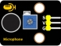  |
| ---------------------------------------- | ------------------------ | ------------------------- |
| ESP32 Board*1                            | ESP32 Expansion Board*1  | Keyestudio Sound Sensor*1 |
|  |  |   |
| Keyestudio Purple LED Module*1           | 3P Dupont Wire*2         | Micro USB Cable*1         |

**Connection Diagram**

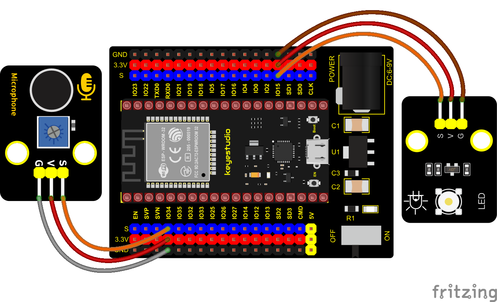

**Test Code**

```python
from machine import ADC, Pin
import time
 
# Turn on and configure the ADC with the range of 0-3.3V 
adc=ADC(Pin(34))
adc.atten(ADC.ATTN_11DB)
adc.width(ADC.WIDTH_12BIT)

led = Pin(15,Pin.OUT)

while True:
    adcVal=adc.read()
    print(adcVal)
    if adcVal > 600:
        led.value(1)
        time.sleep(3)
    else:
        led.value(0)
    time.sleep(0.1)
```

**Code Explanation**

We set the ADC threshold value to 600. If more than 600, LED will be on 3s; on the contrary, it will be off.

**Test Result**

Connect the wires according to the experimental wiring diagram and power on. Click “Run current script”, the code starts executing. The shell monitor displays the corresponding volume ADC value. When the analog value of sound is greater than 600, the LED on the LED module will light up, otherwise it will go off. Press “Ctrl+C”or click “Stop/Restart backend”to exit the program.


### Project 53: Fire Alarm


**Description**

In this experiment, we will make a fire alarm system. Just use a flame sensor to control an active buzzer to emit sounds.

**Required Components**

|  |  |  |  |
| ---------------------------------------- | ---------------------------------------- | ---------------------------------------- | ---------------------------------------- |
| ESP32 Board*1                            | ESP32 Expansion Board*1                  | Keyestudio DIY Active Buzzer*1           | keyestudio DIY Flame Sensor*1            |
|                  |                  |  |                                          |
| Micro USB Cable*1                        | 3P Dupont Wire*1                         | 4P Dupont Wire*1                         |                                          |

**Connection Diagram**

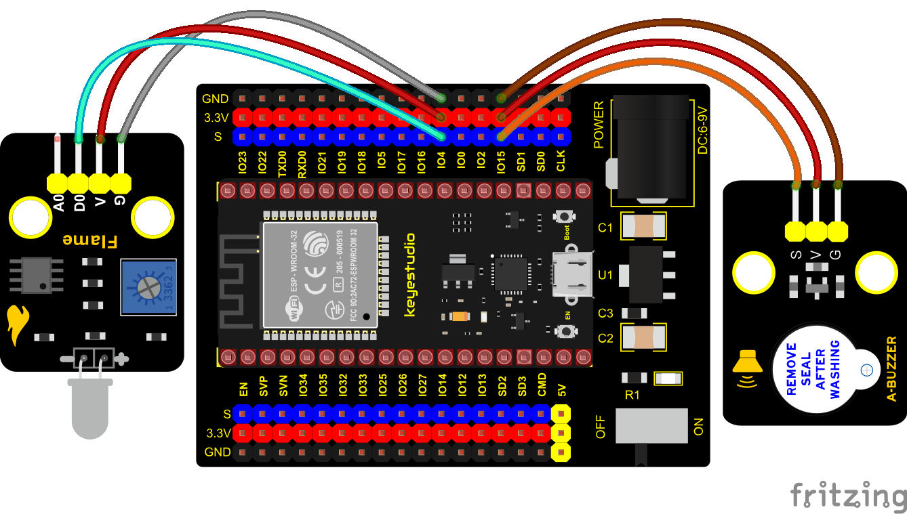

**Test Code**

```python
from machine import Pin
import time

buzzer = Pin(15, Pin.OUT)
sensor = Pin(4, Pin.IN)

while True:
    Val = sensor.value()
    print(Val)
    if Val == 0:
        buzzer.value(1)
    else:
        buzzer.value(0)
    time.sleep(0.5)
```

**Code Explanation**

This flame sensor uses an analog pin and a digital pin. When a flame is detected, the digital pin outputs a low level. In this experiment we will use the digital port.

**Test Result**

Connect the wires according to the experimental wiring diagram and power on. Click “Run current script”, the code starts executing. When the sensor detects the flame, the external active buzzer will emit sounds, otherwise the active buzzer will not emit sounds.

Press “Ctrl+C”or click “Stop/Restart backend”to exit the program.

### Project 54: Smoke Alarm


**Description**

In this experiment, we will make a smoke alarm by a TM16504-Digit segment module, a gas sensor and an active buzzer.

**Required Components**

|  |  |    |   |
| ---------------------------------------- | ------------------------ | -------------------------- | ----------------------------------------- |
| ESP32 Board*1                            | ESP32 Expansion Board*1  | Keyestudio Active Buzzer*1 | Keyestudio TM16504-Digit Segment Module*1 |
|                  |  |    |                   |
| keyestudio Analog Gas Senso*1            | 3P Dupont Wire*1         | 4P Dupont Wire*2           | Micro USB Cable*1                         |

**Connection Diagram**


**Test Code**


```python
# Import Pin and ADC modules.
from machine import ADC,Pin
import time

# Turn on and configure the ADC with the range of 0-3.3V
adc=ADC(Pin(34))
adc.atten(ADC.ATTN_11DB)
adc.width(ADC.WIDTH_12BIT)

buzzer = Pin(15, Pin.OUT)
# definitions for TM1650
ADDR_DIS = 0x48  #mode command
ADDR_KEY = 0x49  #read key value command

# definitions for brightness
BRIGHT_DARKEST = 0
BRIGHT_TYPICAL = 2
BRIGHTEST      = 7

on  = 1
off = 0

# number:0~9
NUM = [0x3f,0x06,0x5b,0x4f,0x66,0x6d,0x7d,0x07,0x7f,0x6f] 
# DIG = [0x68,0x6a,0x6c,0x6e]
DIG = [0x6e,0x6c,0x6a,0x68]
DOT = [0,0,0,0]

clkPin = 22
dioPin = 21
clk = Pin(clkPin, Pin.OUT)
dio = Pin(dioPin, Pin.OUT)

DisplayCommand = 0

def writeByte(wr_data):
    global clk,dio
    for i in range(8):
        if(wr_data & 0x80 == 0x80):
            dio.value(1)
        else:
            dio.value(0)
        clk.value(0)
        time.sleep(0.0001)
        clk.value(1)
        time.sleep(0.0001)
        clk.value(0)
        wr_data <<= 1
    return

def start():
    global clk,dio
    dio.value(1)
    clk.value(1)
    time.sleep(0.0001)
    dio.value(0)
    return
    
def ack():
    global clk,dio
    dy = 0
    clk.value(0)
    time.sleep(0.0001)
    dio = Pin(dioPin, Pin.IN)
    while(dio.value() == 1):
        time.sleep(0.0001)
        dy += 1
        if(dy>5000):
            break
    clk.value(1)
    time.sleep(0.0001)
    clk.value(0)
    dio = Pin(dioPin, Pin.OUT)
    return
    
def stop():
    global clk,dio
    dio.value(0)
    clk.value(1)
    time.sleep(0.0001)
    dio.value(1)
    return
    
def displayBit(bit, num):
    global ADDR_DIS
    if(num > 9 and bit > 4):
        return
    start()
    writeByte(ADDR_DIS)
    ack()
    writeByte(DisplayCommand)
    ack()
    stop()
    start()
    writeByte(DIG[bit-1])
    ack()
    if(DOT[bit-1] == 1):
        writeByte(NUM[num] | 0x80)
    else:
        writeByte(NUM[num])
    ack()
    stop()
    return
    
def clearBit(bit):
    if(bit > 4):
        return
    start()
    writeByte(ADDR_DIS)
    ack()
    writeByte(DisplayCommand)
    ack()
    stop()
    start()
    writeByte(DIG[bit-1])
    ack()
    writeByte(0x00)
    ack()
    stop()
    return
            
    def setBrightness(b = BRIGHT_TYPICAL):
        global DisplayCommand,brightness
        DisplayCommand = (DisplayCommand & 0x0f)+(b<<4)
        return
    def setMode(segment = 0):
    global DisplayCommand
    DisplayCommand = (DisplayCommand & 0xf7)+(segment<<3)
    return
    
def displayOnOFF(OnOff = 1):
    global DisplayCommand
    DisplayCommand = (DisplayCommand & 0xfe)+OnOff
    return

def displayDot(bit, OnOff):
    if(bit > 4):
        return
    if(OnOff == 1): 
        DOT[bit-1] = 1;
    else:
        DOT[bit-1] = 0;
    return
        
def InitDigitalTube():
    setBrightness(2)
    setMode(0)
    displayOnOFF(1)
    for _ in range(4):
        clearBit(_)
    return

def ShowNum(num): #0~9999
    displayBit(1,num%10)
    if(num < 10):
        clearBit(2)
        clearBit(3)
        clearBit(4)
    if(num > 9 and num < 100):
        displayBit(2,num//10%10)
        clearBit(3)
        clearBit(4)
    if(num > 99 and num < 1000):
        displayBit(2,num//10%10)
        displayBit(3,num//100%10)
        clearBit(4)
    if(num > 999 and num < 10000):
        displayBit(2,num//10%10)
        displayBit(3,num//100%10)
        displayBit(4,num//1000)

InitDigitalTube()

while True:
    adcVal=adc.read()
    print(adcVal)
    ShowNum(adcVal)
    if adcVal > 1000:
        buzzer.value(1)
    else:
        buzzer.value(0)
    time.sleep(0.1)
```

**Code Explanation**

Define an integer variable val to store the ADC value of the smoke sensor, and then we display the analog value in the four-digit digital tube, and then set a threshold, and when the threshold is reached, the buzzer will sound.

**Test Result**

Connect the wires according to the experimental wiring diagram and power on. Click “Run current script”, the code starts executing. When the concentration of combustible gas exceeds the standard, the active buzzer module will give an alarm, and the four-digit digital tube will display the concentration value. Press “Ctrl+C”or click“Stop/Restart backend”to exit
the program.

### Project 55: Alcohol Sensor


**Description**

In the last experiment, we made a smoke alarm. In this experiment, we combine the active buzzer, the MQ-3 alcohol sensor, and a four-digit digital tube to test the alcohol concentration through the alcohol sensor. Then, the concentration to control the active buzzer alarm and the four-digit digital tube to display the concentration. So as to achieve the simulation effect of alcohol detector.

**Components Required**

|  |  |  |  |
| ---------------------------------------- | ---------------------------------------- | ---------------------------------------- | ---------------------------------------- |
| ESP32 Board*1                            | ESP32 Expansion Board*1                  | Active Buzzer*1                          | Keyestudio DIY TM1650 4-Digit Display*1  |
| 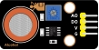                 |                  | 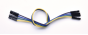 |  |
| keyestudio Alcohol Sensor*1              | 3P Dupont Wire*1                         | 4P Dupont Wire*2                         | Micro USB Cable*1                        |

**Connection Diagram**

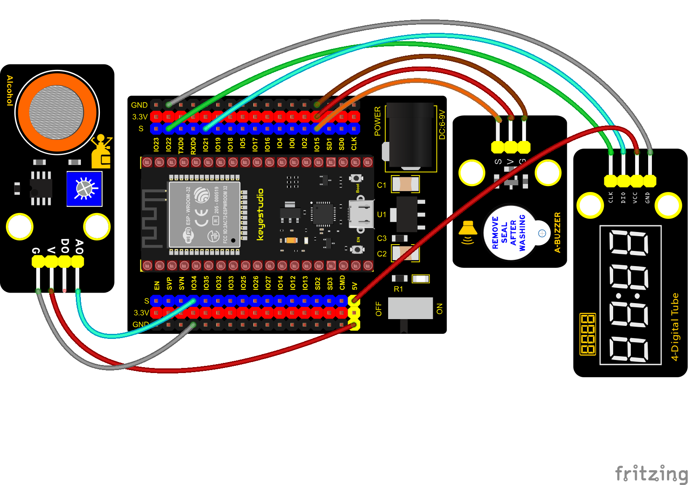

**Test Code**

```python
# Import Pin and ADC modules.
from machine import ADC,Pin
import time

adc=ADC(Pin(34))
adc.atten(ADC.ATTN_11DB)
adc.width(ADC.WIDTH_12BIT)

buzzer = Pin(15, Pin.OUT)
# definitions for TM1650
ADDR_DIS = 0x48  #mode command
ADDR_KEY = 0x49  #read key value command

# definitions for brightness
BRIGHT_DARKEST = 0
BRIGHT_TYPICAL = 2
BRIGHTEST      = 7

on  = 1
off = 0

# number:0~9
NUM = [0x3f,0x06,0x5b,0x4f,0x66,0x6d,0x7d,0x07,0x7f,0x6f] 
# DIG = [0x68,0x6a,0x6c,0x6e]
DIG = [0x6e,0x6c,0x6a,0x68]
DOT = [0,0,0,0]

clkPin = 22
dioPin = 21
clk = Pin(clkPin, Pin.OUT)
dio = Pin(dioPin, Pin.OUT)

DisplayCommand = 0

def writeByte(wr_data):
    global clk,dio
    for i in range(8):
        if(wr_data & 0x80 == 0x80):
            dio.value(1)
        else:
            dio.value(0)
        clk.value(0)
        time.sleep(0.0001)
        clk.value(1)
        time.sleep(0.0001)
        clk.value(0)
        wr_data <<= 1
    return

def start():
    global clk,dio
    dio.value(1)
    clk.value(1)
    time.sleep(0.0001)
    dio.value(0)
    return
    
def ack():
    global clk,dio
    dy = 0
    clk.value(0)
    time.sleep(0.0001)
    dio = Pin(dioPin, Pin.IN)
    while(dio.value() == 1):
        time.sleep(0.0001)
        dy += 1
        if(dy>5000):
            break
    clk.value(1)
    time.sleep(0.0001)
    clk.value(0)
    dio = Pin(dioPin, Pin.OUT)
    return
    
def stop():
    global clk,dio
    dio.value(0)
    clk.value(1)
    time.sleep(0.0001)
    dio.value(1)
    return
    
def displayBit(bit, num):
    global ADDR_DIS
    if(num > 9 and bit > 4):
        return
    start()
    writeByte(ADDR_DIS)
    ack()
    writeByte(DisplayCommand)
    ack()
    stop()
    start()
    writeByte(DIG[bit-1])
    ack()
    if(DOT[bit-1] == 1):
        writeByte(NUM[num] | 0x80)
    else:
        writeByte(NUM[num])
    ack()
    stop()
    return
    
def clearBit(bit):
    if(bit > 4):
        return
    start()
    writeByte(ADDR_DIS)
    ack()
    writeByte(DisplayCommand)
    ack()
    stop()
    start()
    writeByte(DIG[bit-1])
    ack()
    writeByte(0x00)
    ack()
    stop()
    return
            
    def setBrightness(b = BRIGHT_TYPICAL):
        global DisplayCommand,brightness
        DisplayCommand = (DisplayCommand & 0x0f)+(b<<4)
        return
    def setMode(segment = 0):
    global DisplayCommand
    DisplayCommand = (DisplayCommand & 0xf7)+(segment<<3)
    return
    
def displayOnOFF(OnOff = 1):
    global DisplayCommand
    DisplayCommand = (DisplayCommand & 0xfe)+OnOff
    return

def displayDot(bit, OnOff):
    if(bit > 4):
        return
    if(OnOff == 1): 
        DOT[bit-1] = 1;
    else:
        DOT[bit-1] = 0;
    return
        
def InitDigitalTube():
    setBrightness(2)
    setMode(0)
    displayOnOFF(1)
    for _ in range(4):
        clearBit(_)
    return

def ShowNum(num): #0~9999
    displayBit(1,num%10)
    if(num < 10):
        clearBit(2)
        clearBit(3)
        clearBit(4)
    if(num > 9 and num < 100):
        displayBit(2,num//10%10)
        clearBit(3)
        clearBit(4)
    if(num > 99 and num < 1000):
        displayBit(2,num//10%10)
        displayBit(3,num//100%10)
        clearBit(4)
    if(num > 999 and num < 10000):
        displayBit(2,num//10%10)
        displayBit(3,num//100%10)
        displayBit(4,num//1000)

InitDigitalTube()

while True:
    adcVal=adc.read()
    print(adcVal)
    ShowNum(adcVal)
    if adcVal > 1000:
        buzzer.value(1)
    else:
        buzzer.value(0)
    time.sleep(0.1)
```

**Code Explanation**

Define an integer variable val to store the ADC value of the alcohol sensor, then we display the analog value in the four-digit display module and set a threshold.

**Test Result**

Connect the wires according to the experimental wiring diagram and power on. Click “Run current script”, the code starts executing. When different alcohol concentrations are detected, the active buzzer module will alarm, and the four-digit digital display will show the concentration value. Press “Ctrl+C”or click “Stop/Restart backend”to exit the program.

### Project 56: Ultrasonic Radar


**Description**


We know that bats use echoes to determine the direction and the location of their preys. In real life, sonar is used to detect sounds in the water. Since the attenuation rate of electromagnetic waves in water is very high, it cannot be used to detect
signals, however, the attenuation rate of sound waves in the water is much smaller, so sound waves are most commonly used underwater for observation and measurement.

In this experiment, we will use a speaker module, an RGB module and a 4-digit tube display to make a device for detection through ultrasonic.

**Required Components**

| 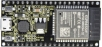 | 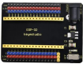 |  | 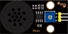                 | 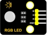    |
| ---------------------------------------- | ---------------------------------------- | ---------------------------------------- | ---------------------------------------- | ------------------------------------------- |
| ESP32 Board*1                            | ESP32 Expansion Board*1                  | Keyestudio HC-SR04 Ultrasonic Sensor*1   | Keyestudio 8002b Power Amplifier*1       | Keyestudio DIY Common Cathode RGB Module *1 |
|  | 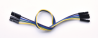 |                  |  |                                             |
| Keyestudio DIY TM1650 4-Digit Display*1  | 4P Dupont Wire*3                         | 3P Dupont Wire*1                         | Micro USB Cable*1                        |                                             |

**Connection Diagram**


**Test Code**

```python
from machine import Pin, PWM
import utime
 
# definitions for TM1650
ADDR_DIS = 0x48  #mode command
ADDR_KEY = 0x49  #read key value command

# definitions for brightness
BRIGHT_DARKEST = 0
BRIGHT_TYPICAL = 2
BRIGHTEST      = 7

on  = 1
off = 0

# number:0~9
NUM = [0x3f,0x06,0x5b,0x4f,0x66,0x6d,0x7d,0x07,0x7f,0x6f] 
# DIG = [0x68,0x6a,0x6c,0x6e]
DIG = [0x6e,0x6c,0x6a,0x68]
DOT = [0,0,0,0]

clkPin = 22
dioPin = 21
clk = Pin(clkPin, Pin.OUT)
dio = Pin(dioPin, Pin.OUT)

DisplayCommand = 0

def writeByte(wr_data):
    global clk,dio
    for i in range(8):
        if(wr_data & 0x80 == 0x80):
            dio.value(1)
        else:
            dio.value(0)
        clk.value(0)
        utime.sleep(0.0001)
        clk.value(1)
        utime.sleep(0.0001)
        clk.value(0)
        wr_data <<= 1
    return

def start():
    global clk,dio
    dio.value(1)
    clk.value(1)
    utime.sleep(0.0001)
    dio.value(0)
    return
    
def ack():
    global clk,dio
    dy = 0
    clk.value(0)
    utime.sleep(0.0001)
    dio = Pin(dioPin, Pin.IN)
    while(dio.value() == 1):
        utime.sleep(0.0001)
        dy += 1
        if(dy>5000):
            break
    clk.value(1)
    utime.sleep(0.0001)
    clk.value(0)
    dio = Pin(dioPin, Pin.OUT)
    return
    
def stop():
    global clk,dio
    dio.value(0)
    clk.value(1)
    utime.sleep(0.0001)
    dio.value(1)
    return
    
def displayBit(bit, num):
    global ADDR_DIS
    if(num > 9 and bit > 4):
        return
    start()
    writeByte(ADDR_DIS)
    ack()
    writeByte(DisplayCommand)
    ack()
    stop()
    start()
    writeByte(DIG[bit-1])
    ack()
    if(DOT[bit-1] == 1):
        writeByte(NUM[num] | 0x80)
    else:
        writeByte(NUM[num])
    ack()
    stop()
    return
    
def clearBit(bit):
    if(bit > 4):
        return
    start()
    writeByte(ADDR_DIS)
    ack()
    writeByte(DisplayCommand)
    ack()
    stop()
    start()
    writeByte(DIG[bit-1])
    ack()
    writeByte(0x00)
    ack()
    stop()
    return
            
    def setBrightness(b = BRIGHT_TYPICAL):
        global DisplayCommand,brightness
        DisplayCommand = (DisplayCommand & 0x0f)+(b<<4)
        return
    def setMode(segment = 0):
    global DisplayCommand
    DisplayCommand = (DisplayCommand & 0xf7)+(segment<<3)
    return
    
def displayOnOFF(OnOff = 1):
    global DisplayCommand
    DisplayCommand = (DisplayCommand & 0xfe)+OnOff
    return

def displayDot(bit, OnOff):
    if(bit > 4):
        return
    if(OnOff == 1): 
        DOT[bit-1] = 1;
    else:
        DOT[bit-1] = 0;
    return
        
def InitDigitalTube():
    setBrightness(2)
    setMode(0)
    displayOnOFF(1)
    for _ in range(4):
        clearBit(_)
    return

def ShowNum(num): #0~9999
    displayBit(1,num%10)
    if(num < 10):
        clearBit(2)
        clearBit(3)
        clearBit(4)
    if(num > 9 and num < 100):
        displayBit(2,num//10%10)
        clearBit(3)
        clearBit(4)
    if(num > 99 and num < 1000):
        displayBit(2,num//10%10)
        displayBit(3,num//100%10)
        clearBit(4)
    if(num > 999 and num < 10000):
        displayBit(2,num//10%10)
        displayBit(3,num//100%10)
        displayBit(4,num//1000)

pwm_r = PWM(Pin(0)) 
pwm_g = PWM(Pin(2))
pwm_b = PWM(Pin(15))

pwm_r.freq(1000)
pwm_g.freq(1000)
pwm_b.freq(1000)

def light(red, green, blue):
    pwm_r.duty(red)
    pwm_g.duty(green)
    pwm_b.duty(blue)

# Ultrasonic ranging, unit: cm
def getDistance(trigger, echo):
    # Generates a 10us square wave
    trigger.value(0)   #A short low level is given beforehand to ensure a clean high pulse:
    utime.sleep_us(2)
    trigger.value(1)
    utime.sleep_us(10)#After pulling high, wait 10 microseconds and immediately set it to low
    trigger.value(0)
    
    while echo.value() == 0: #Establish a while loop to detect whether the echo pin value is 0 and record the time at that time
        start = utime.ticks_us()
    while echo.value() == 1: #Establish a while loop to check whether the echo pin value is 1 and record the time at that time
        end = utime.ticks_us()
    d = (end - start) * 0.0343 / 2 #The travel time of the sound wave x the speed of sound (343.2 m/s, 0.0343 cm/microsecond), and the distance back and forth divided by 2.
    return d

# set the pin
trigger = Pin(13, Pin.OUT)
echo = Pin(14, Pin.IN)

buzzer = PWM(Pin(18))
def playtone(frequency):
    buzzer.duty(1000)
    buzzer.freq(frequency)

def bequiet():
    buzzer.duty(0)
    
# main program
InitDigitalTube()
while True:
    distance = int(getDistance(trigger, echo))
    ShowNum(distance)
    if distance <= 10:
        playtone(880)
        utime.sleep(0.1)
        bequiet()
        light(1023, 0, 0)
    elif distance <= 20:
        playtone(532)
        utime.sleep(0.2)
        bequiet()
        light(0, 0, 1023)
    else:
        light(0, 1023, 0)
```

**Code Explanation**

We set sound frequency and light color by adjusting different distance range.

We can adjust the distance range in the code.

**Test Result**

Connect the wires according to the experimental wiring diagram and power on. Click “Run current script”, the code starts executing. When the ultrasonic sensor detects different distances, the buzzer will produce different frequencies of sound(within 20 cm), the RGB will show different colors, and the measured distances are displayed on the 4-digit tube display. Press “Ctrl+C”or click “Stop/Restart backend”to exit the program.

### Project 57: IR Remote Control


**Introduction**

In the previous experiments, we learned how to turn on/off the LED and adjust its brightness via PWM and print the button value of the IR  remote control in the Shell window. Herein, we use an infrared remote control to turn on/off an LED.

**Components**

|  |                   |            | 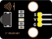 |
| ---------------------------------------- | ----------------------------------------- | ---------------------------------- | ----------------------------------------- |
| ESP32 Board*1                            | ESP32 Expansion Board*1                   | Keyestudio DIY Purple LED Module*1 | Keyestudio DIY IR Receiver*1              |
|                  |  |            |                                           |
| Micro USB Cable*1                        | IR Remote Control*1                       | 3P Dupont Wire*2                   |                                           |

**Connection Diagram**

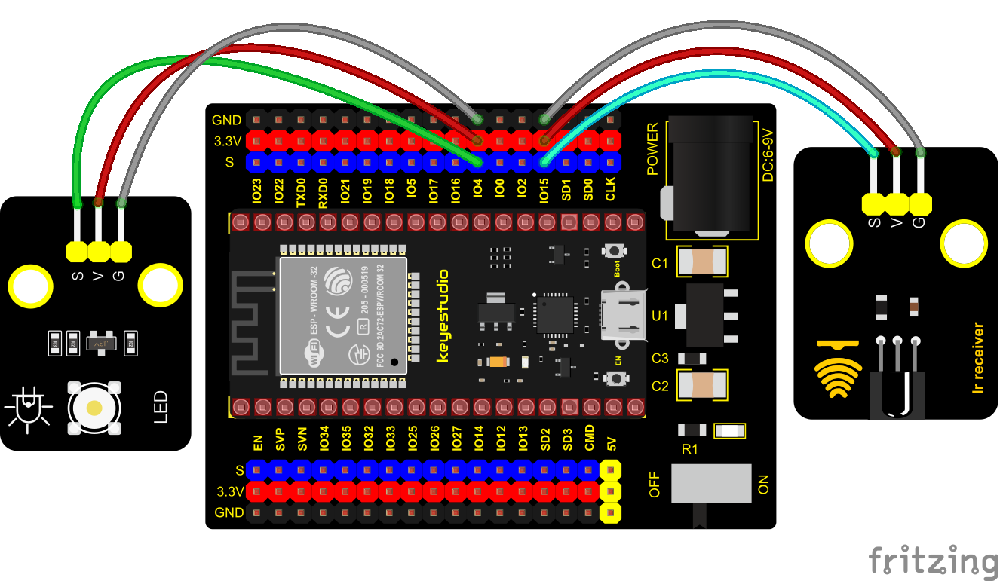

**Test Code**

```python
import time
from machine import Pin

led = Pin(4, Pin.OUT)
ird = Pin(15,Pin.IN)

act = {"1": "LLLLLLLLHHHHHHHHLHHLHLLLHLLHLHHH","2": "LLLLLLLLHHHHHHHHHLLHHLLLLHHLLHHH","3": "LLLLLLLLHHHHHHHHHLHHLLLLLHLLHHHH",
       "4": "LLLLLLLLHHHHHHHHLLHHLLLLHHLLHHHH","5": "LLLLLLLLHHHHHHHHLLLHHLLLHHHLLHHH","6": "LLLLLLLLHHHHHHHHLHHHHLHLHLLLLHLH",
       "7": "LLLLLLLLHHHHHHHHLLLHLLLLHHHLHHHH","8": "LLLLLLLLHHHHHHHHLLHHHLLLHHLLLHHH","9": "LLLLLLLLHHHHHHHHLHLHHLHLHLHLLHLH",
       "0": "LLLLLLLLHHHHHHHHLHLLHLHLHLHHLHLH","Up": "LLLLLLLLHHHHHHHHLHHLLLHLHLLHHHLH","Down": "LLLLLLLLHHHHHHHHHLHLHLLLLHLHLHHH",
       "Left": "LLLLLLLLHHHHHHHHLLHLLLHLHHLHHHLH","Right": "LLLLLLLLHHHHHHHHHHLLLLHLLLHHHHLH","Ok": "LLLLLLLLHHHHHHHHLLLLLLHLHHHHHHLH",
       "*": "LLLLLLLLHHHHHHHHLHLLLLHLHLHHHHLH","#": "LLLLLLLLHHHHHHHHLHLHLLHLHLHLHHLH"}

def read_ircode(ird):
    wait = 1
    complete = 0
    seq0 = []
    seq1 = []

    while wait == 1:
        if ird.value() == 0:
            wait = 0
    while wait == 0 and complete == 0:
        start = time.ticks_us()
        while ird.value() == 0:
            ms1 = time.ticks_us()
        diff = time.ticks_diff(ms1,start)
        seq0.append(diff)
        while ird.value() == 1 and complete == 0:
            ms2 = time.ticks_us()
            diff = time.ticks_diff(ms2,ms1)
            if diff > 10000:
                complete = 1
        seq1.append(diff)

    code = ""
    for val in seq1:
        if val < 2000:
            if val < 700:
                code += "L"
            else:
                code += "H"
    # print(code)
    command = ""
    for k,v in act.items():
        if code == v:
            command = k
    if command == "":
        command = code
    return command

flag = False
while True:
#     global flag
    command = read_ircode(ird)
    print(command, end = "  ")
    print(flag, end = "  ")
    if command == "Ok":
        if flag == True:
            led.value(1)
            flag = False
            print("led on")
        else:
            led.value(0)
            flag = True
            print("led off")
    time.sleep(0.1)
```

**Code Explanation**

We define a boolean variable. There are two boolean variables. true (true) or false (false).

When we press the OK button, the value of infrared reception is OK. At this time, we need to set a boolean variable flag. When the flag is true (true), the LED is turned on, and when it is false (false), the LED is turned off and turned on. After the LED is on and set it to false. We press the OK key, the LED will be off.

**Test Result**

Connect the wires according to the experimental wiring diagram and power on. Click “Run current script”, the code starts executing. Press the OK button of the remote, the LED will be on, press it again, the LED will be off.

Press “Ctrl+C”or click “Stop/Restart backend”to exit the program.

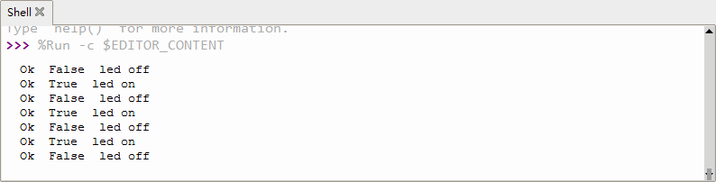

### Project 58: Heat Dissipation Device


**Description**

We will use a temperature sensor and some modules to make a smart cooling device in this experiment. When the ambient temperature is higher than a certain value, the motor is turned on, thereby reducing the ambient temperature and achieving the heat dissipation effect. Then display the temperature value in the four-digit segment display.

**Required Components**

|               |         |  |  |
| ------------------------------------- | ------------------------------- | ------------------------ | ----------------------------------------- |
| ESP32 Board*1                         | ESP32 Expansion Board*1         | keyestudio 130 Motor*1   | TM1650 4-Digit Segment Display*1          |
| 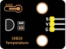              |         | 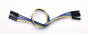 |                   |
| Keyestudio 18B20 Temperature Sensor*1 | 3P Dupont Wire*1                | 4P Dupont Wire*2         | Micro USB Cable*1                         |
|               | 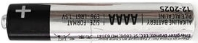        |                          |                                           |
| Battery Holder*1                      | Battery(provide for yourself)*6 |                          |                                           |

**Connection Diagram**

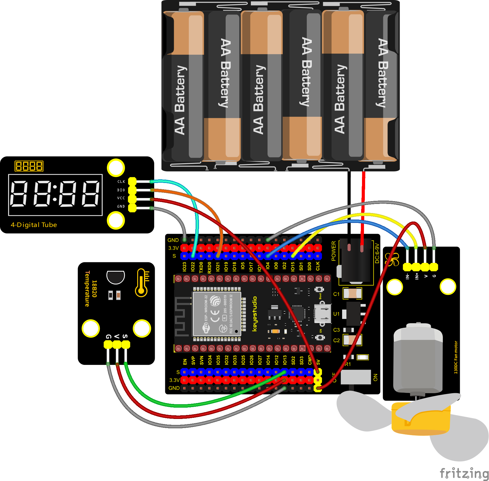

**Add Library**

Open“Thonny”, click“This computer”→“D:”→“2. ESP32\_code\_MicroPython”→“lesson 58. heat abstractor”.

Select“ds18x20\.py”and“ds18x20\.py”，right-click and select “Upload to/”，waiting for the “ds18x20\.py”and“ds18x20\.py”to be uploaded to the ESP32.

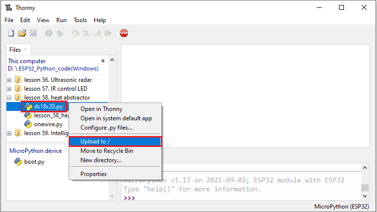

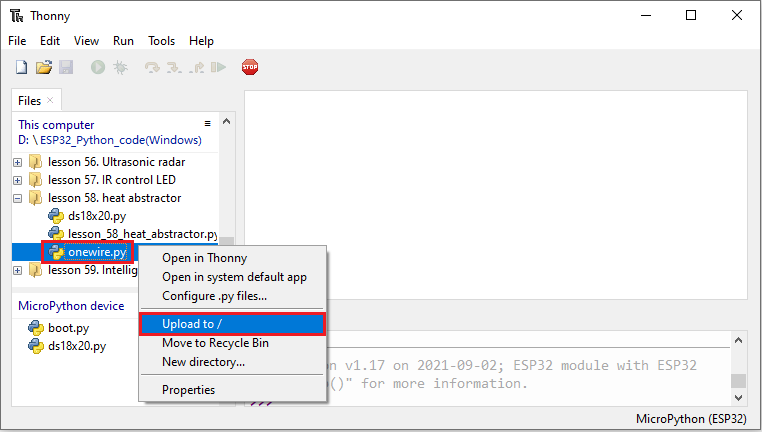

**Test Code**


```python
from machine import Pin
import machine, onewire, ds18x20, time

ds_pin = machine.Pin(13)

ds_sensor = ds18x20.DS18X20(onewire.OneWire(ds_pin))

roms = ds_sensor.scan()

#Two pins of the motor
INA = Pin(15, Pin.OUT) #INA corresponds to IN+
INB = Pin(4, Pin.OUT)#INB corresponds to IN-
# definitions for TM1650
ADDR_DIS = 0x48  #mode command
ADDR_KEY = 0x49  #read key value command

# definitions for brightness
BRIGHT_DARKEST = 0
BRIGHT_TYPICAL = 2
BRIGHTEST      = 7

on  = 1
off = 0

# number:0~9
NUM = [0x3f,0x06,0x5b,0x4f,0x66,0x6d,0x7d,0x07,0x7f,0x6f] 
# DIG = [0x68,0x6a,0x6c,0x6e]
DIG = [0x6e,0x6c,0x6a,0x68]
DOT = [0,0,0,0]

clkPin = 22
dioPin = 21
clk = Pin(clkPin, Pin.OUT)
dio = Pin(dioPin, Pin.OUT)

DisplayCommand = 0

def writeByte(wr_data):
    global clk,dio
    for i in range(8):
        if(wr_data & 0x80 == 0x80):
            dio.value(1)
        else:
            dio.value(0)
        clk.value(0)
        time.sleep(0.0001)
        clk.value(1)
        time.sleep(0.0001)
        clk.value(0)
        wr_data <<= 1
    return

def start():
    global clk,dio
    dio.value(1)
    clk.value(1)
    time.sleep(0.0001)
    dio.value(0)
    return
    
def ack():
    global clk,dio
    dy = 0
    clk.value(0)
    time.sleep(0.0001)
    dio = Pin(dioPin, Pin.IN)
    while(dio.value() == 1):
        time.sleep(0.0001)
        dy += 1
        if(dy>5000):
            break
    clk.value(1)
    time.sleep(0.0001)
    clk.value(0)
    dio = Pin(dioPin, Pin.OUT)
    return
    
def stop():
    global clk,dio
    dio.value(0)
    clk.value(1)
    time.sleep(0.0001)
    dio.value(1)
    return
    
def displayBit(bit, num):
    global ADDR_DIS
    if(num > 9 and bit > 4):
        return
    start()
    writeByte(ADDR_DIS)
    ack()
    writeByte(DisplayCommand)
    ack()
    stop()
    start()
    writeByte(DIG[bit-1])
    ack()
    if(DOT[bit-1] == 1):
        writeByte(NUM[num] | 0x80)
    else:
        writeByte(NUM[num])
    ack()
    stop()
    return
    
def clearBit(bit):
    if(bit > 4):
        return
    start()
    writeByte(ADDR_DIS)
    ack()
    writeByte(DisplayCommand)
    ack()
    stop()
    start()
    writeByte(DIG[bit-1])
    ack()
    writeByte(0x00)
    ack()
    stop()
    return
            
    def setBrightness(b = BRIGHT_TYPICAL):
        global DisplayCommand,brightness
        DisplayCommand = (DisplayCommand & 0x0f)+(b<<4)
        return
    def setMode(segment = 0):
    global DisplayCommand
    DisplayCommand = (DisplayCommand & 0xf7)+(segment<<3)
    return
    
def displayOnOFF(OnOff = 1):
    global DisplayCommand
    DisplayCommand = (DisplayCommand & 0xfe)+OnOff
    return

def displayDot(bit, OnOff):
    if(bit > 4):
        return
    if(OnOff == 1): 
        DOT[bit-1] = 1;
    else:
        DOT[bit-1] = 0;
    return
        
def InitDigitalTube():
    setBrightness(2)
    setMode(0)
    displayOnOFF(1)
    for _ in range(4):
        clearBit(_)
    return

def ShowNum(num): #0~9999
    displayBit(1,num%10)
    if(num < 10):
        clearBit(2)
        clearBit(3)
        clearBit(4)
    if(num > 9 and num < 100):
        displayBit(2,num//10%10)
        clearBit(3)
        clearBit(4)
    if(num > 99 and num < 1000):
        displayBit(2,num//10%10)
        displayBit(3,num//100%10)
        clearBit(4)
    if(num > 999 and num < 10000):
        displayBit(2,num//10%10)
        displayBit(3,num//100%10)
        displayBit(4,num//1000)

InitDigitalTube()
print('Found DS devices: ', roms)

while True:
    ds_sensor.convert_temp()
    time.sleep_ms(750)
    for rom in roms:
        value = ds_sensor.read_temp(rom)
        print(value)
        ShowNum(int(value))
        if value > 28:
            INA.value(0)
            INB.value(1)
        else:
            INA.value(0)
            INB.value(0)
```

**Code Explanation**

The setting of variables and the storage of detection values are the same as what we learned earlier. We also set a temperature threshold and control the rotation of the motor when the threshold is exceeded, and then we use the digital tube to display the temperature value.

**Test Result**

Connect the wires according to the experimental wiring diagram and power on. Switch the DIP switch on the ESP32 expansion board to the ON end. Click “Run current script”, the code starts executing. We can see the temperature of the current environment (unit is Celsius) on the four-digit segment display, as shown in the figure below. If this value exceeds the value we set, the fan will rotate to dissipate heat. Press“Ctrl+C”or click “Stop/Restart backend”to exit the program.

### Project 59: Intelligent Entrance Guard System


**Description**

In this project, we use the RFID522 card swiping module and the servo to set up an intelligent access control system. The principle is very simple.We use RFID522 swipe card module, an IC card or key card to unlock.

**Required Components**

|  |  |  |  |
| ------------------------ | ------------------------ | ------------------------ | ------------------------ |
| ESP32 Board*1            | ESP32 Expansion Board*1  | Key*1                    | IC Card*1                |
| 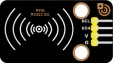 |  |  |  |
| Keyestudio RFID Module*1 | Servo*1                  | 4P Dupont Wire*1         | Micro USB Cable*1        |

**Connection Diagram**

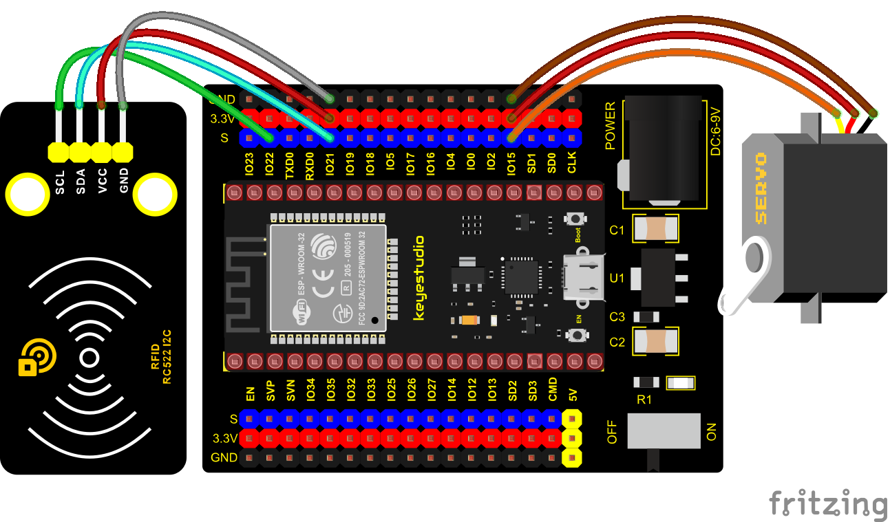

**Add Library**

Open “Thonny”, click “This computer” → “D:” → “2. ESP32\_code\_MicroPython” → “lesson 59. Intelligent access control”. Select “mfrc522\_config.py”, “mfrc522\_i2c.py” and “soft\_iic.py”, right-click and select “Upload to /”, waiting for the “mfrc522\_config.py”, “mfrc522\_i2c.py” and “soft\_iic.py” to be uploaded to the ESP32.

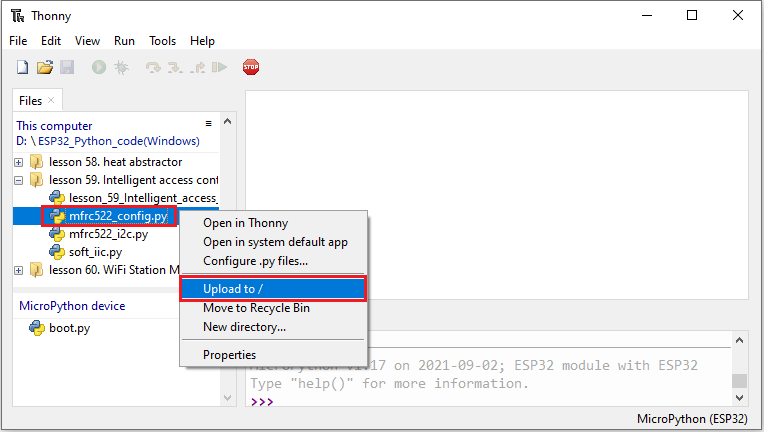

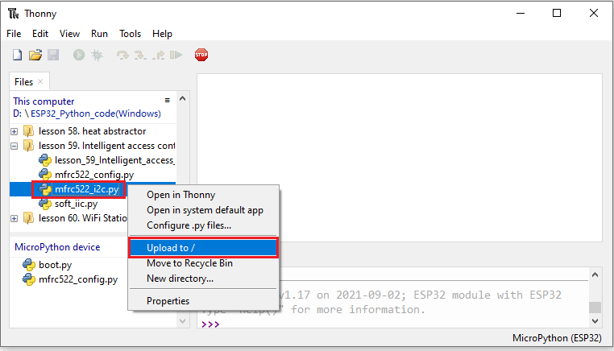

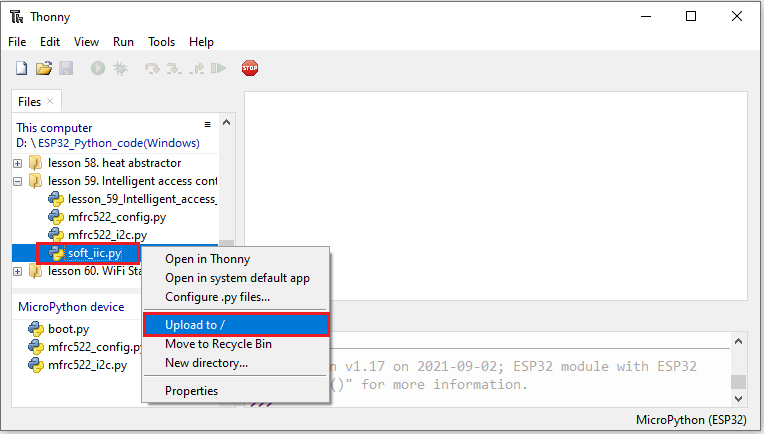

**Test Code：** 

Note: Different RFID-RC522 modules, ID cards and keys may different uid1 values and uid2 values. 

The uID1 and UID2 values of the white card and key chain read by your RRFID RC522 module can be replaced by the corresponding values in the program code. If not, click **“Run current script”** to run the code may cause your own white card and key chain to fail to control the servo.  

For example: You can replace the UID1 and UID2 values In the program code 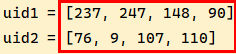 with your own white card and key chain values.

```python
from machine import Pin, PWM
import time
from mfrc522_i2c import mfrc522

pwm = PWM(Pin(15))
pwm.freq(50)

'''
Duty cycle corresponding to the Angle
Duty cycle corresponding to the Angle
0°----2.5%----25
45°----5%----51.2
90°----7.5%----77
135°----10%----102.4
180°----12.5%----128
'''
angle_0 = 25
angle_90 = 77
angle_180 = 128

#i2c config
addr = 0x28
scl = 22
sda = 21
    
rc522 = mfrc522(scl, sda, addr)
rc522.PCD_Init()
rc522.ShowReaderDetails()            # Show details of PCD - MFRC522 Card Reader details

uid1 = [237, 247, 148, 90]
uid2 = [76, 9, 107, 110]

pwm.duty(angle_180)
time.sleep(1)

while True:
    if rc522.PICC_IsNewCardPresent():
        print("Is new card present!")
        if rc522.PICC_ReadCardSerial() == True:
            print("Card UID:", end=' ')
            print(rc522.uid.uidByte[0 : rc522.uid.size])
            if rc522.uid.uidByte[0 : rc522.uid.size] == uid1 or rc522.uid.uidByte[0 : rc522.uid.size] == uid2:
                pwm.duty(angle_0)
            else :
                pwm.duty(angle_180)
            time.sleep(500)from machine import Pin, PWM
import time
from mfrc522_i2c import mfrc522

pwm = PWM(Pin(15))
pwm.freq(50)

'''
Duty cycle corresponding to the Angle
Duty cycle corresponding to the Angle
0°----2.5%----25
45°----5%----51.2
90°----7.5%----77
135°----10%----102.4
180°----12.5%----128
'''
angle_0 = 25
angle_90 = 77
angle_180 = 128

#i2c config
addr = 0x28
scl = 22
sda = 21
    
rc522 = mfrc522(scl, sda, addr)
rc522.PCD_Init()
rc522.ShowReaderDetails()            # Show details of PCD - MFRC522 Card Reader details

uid1 = [237, 247, 148, 90]
uid2 = [76, 9, 107, 110]

pwm.duty(angle_180)
time.sleep(1)

while True:
    if rc522.PICC_IsNewCardPresent():
        print("Is new card present!")
        if rc522.PICC_ReadCardSerial() == True:
            print("Card UID:", end=' ')
            print(rc522.uid.uidByte[0 : rc522.uid.size])
            if rc522.uid.uidByte[0 : rc522.uid.size] == uid1 or rc522.uid.uidByte[0 : rc522.uid.size] == uid2:
                pwm.duty(angle_0)
            else :
                pwm.duty(angle_180)
            time.sleep(500)
```

**Code Explanation**

In the previous experiment, our card swipe module has tested the information of IC card and key. Then we use this corresponding information to control the door.

**Test Result**

Connect the wires according to the experimental wiring diagram and power on. Click “Run current script”, the code starts executing. When we use the IC card or blue key to swipe the card, the shell displays the card and the key information , at the same time, the servo rotates to the corresponding angle to simulate opening the door.

Press “Ctrl+C”or click “Stop/Restart backend”to exit the program.

### Project 60：WIFI Station Mode

**Description**

ESP32 has three different WiFi modes: Station mode, AP mode and AP+Station mode. All WiFi programming projects must be configured with WiFi running mode before using, otherwise the WiFi cannot be used. In this project, we are going to learn the WiFi Station mode of the ESP32.

**Components**

| 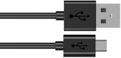 |  |
| ------------------------ | ------------------------ |
| USB  Cable x1            | ESP32*1                  |

**Wiring Diagram**

Plug the ESP32 to the USB port of your PC

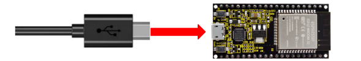

**Component Knowledge**

**Station mode：**

When setting Station mode, the ESP32 is taken as a WiFi client. It can connect to the router network and communicate with other devices on the router via a WiFi connection. As shown in the figure below, the PC and the router have been connected. If the ESP32 wants to communicate with the PC, the PC and the router need to be connected.


**Test Code**

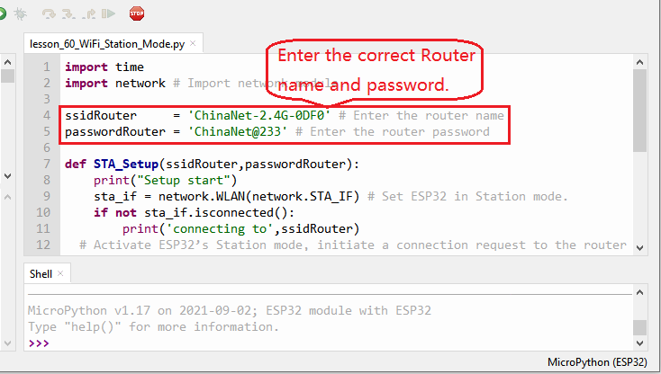


```python
import time
import network # Import network module.

ssidRouter     = 'ChinaNet-2.4G-0DF0' # Enter the router name
passwordRouter = 'ChinaNet@233' # Enter the router password

def STA_Setup(ssidRouter,passwordRouter):
    print("Setup start")
    sta_if = network.WLAN(network.STA_IF) # Set ESP32 in Station mode.
    if not sta_if.isconnected():
        print('connecting to',ssidRouter)
 # Activate ESP32’s Station mode, initiate a connection request to the router and enter the password to connect.      
        sta_if.active(True)
        sta_if.connect(ssidRouter,passwordRouter)
  #Wait for ESP32 to connect to router until they connect to each other successfully.      
        while not sta_if.isconnected():
            pass
  # Print the IP address assigned to ESP32-WROVER in “Shell”. 
    print('Connected, IP address:', sta_if.ifconfig())
    print("Setup End")

try:
    STA_Setup(ssidRouter,passwordRouter)
except:
    sta_if.disconnect()
```

**Test Result**

Since the router name and password are different in various places, so before running the code, the user needs to enter the correct router name and password in the red box shown above.

After entering the correct router name and password, click “Run current script”, the code will start executing.

The Shell monitor will print the IP address of the ESP32 when connecting the ESP32 to your router.


### Project 61：WIFI AP Mode

**Description**

In this project, we are going to learn the WiFi AP mode of the ESP32.

**Components**

|  |  |
| ------------------------------------------------------------ | ------------------------------------------------------------ |
| USB  Cable x1                                                | ESP32*1                                                      |

**Wiring Diagram**

Plug the ESP32 mainboard to the USB port of your PC


**Component Knowledge**

**AP Mode:**

When setting AP mode, a hotspot network will be created, waiting for other WiFi devices to connect. As shown below;

Take the ESP32 as the hotspot, if a phone or PC needs to communicate with the ESP32, it must be connected to the ESP32's hotspot. Communication is only possible after a connection is established via the ESP32.


**Test Code**

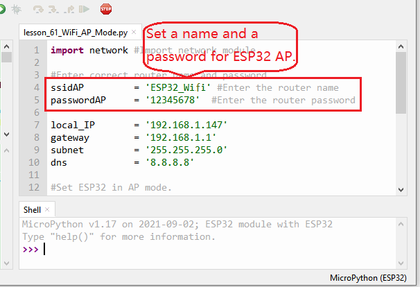

```python
import network #Import network module.

#Enter correct router name and password.
ssidAP         = 'ESP32_Wifi' #Enter the router name
passwordAP     = '12345678'  #Enter the router password

local_IP       = '192.168.1.147'
gateway        = '192.168.1.1'
subnet         = '255.255.255.0'
dns            = '8.8.8.8'

#Set ESP32 in AP mode.
ap_if = network.WLAN(network.AP_IF)

def AP_Setup(ssidAP,passwordAP):
    ap_if.ifconfig([local_IP,gateway,subnet,dns])
    print("Setting soft-AP  ... ")
    ap_if.config(essid=ssidAP,authmode=network.AUTH_WPA_WPA2_PSK, password=passwordAP)
    ap_if.active(True)
    print('Success, IP address:', ap_if.ifconfig())
    print("Setup End\n")

try:
    AP_Setup(ssidAP,passwordAP)
except:
    print("Failed, please disconnect the power and restart the operation.")
    ap_if.disconnect()
```

**Test Result**

You can modify the AP name and password or keep them unchanged.

Click “Run current script”, the code will start executing. Open the AP function of the ESP32, the Shell monitor will print the information

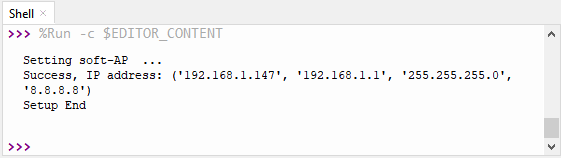

Turn on your phone's WiFi search function, then you can see the ssid\_AP which is called "ESP32\_Wifi" in this code. You can enter the password "12345678" to connect it, or you can modify its AP name and password by code.


### Project 62：WIFI AP+Station Mode

**Description**

In this project, we are going to learn the AP+Station mode of the ESP32.

**Components**

|  | 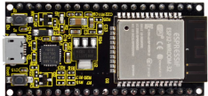 |
| ------------------------ | ------------------------ |
| USB  Cable x1            | ESP32*1                  |

**Wiring Diagram**

Plug the ESP32 mainboard to the USB port of your PC


**Component Knowledge**

**AP+Station mode**

In addition to the AP mode and the Station mode, **AP+Station mode** can be used at the same time. Turn on the Station mode of the ESP32, connect it to the router network, and it can communicate with the Internet through the router. Then turn on the AP mode to create a hotspot network. Other WiFi devices can be connected to the router network or the hotspot network to communicate with the ESP32.

**Test Code**

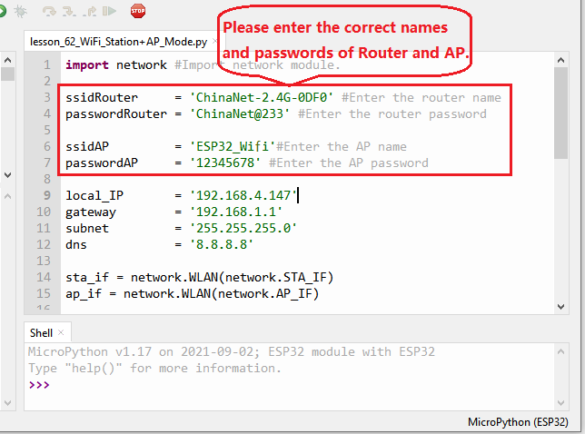

```python
import network #Import network module.

ssidRouter     = 'ChinaNet-2.4G-0DF0' #Enter the router name
passwordRouter = 'ChinaNet@233' #Enter the router password

ssidAP         = 'ESP32_Wifi'#Enter the AP name
passwordAP     = '12345678' #Enter the AP password

local_IP       = '192.168.4.147'
gateway        = '192.168.1.1'
subnet         = '255.255.255.0'
dns            = '8.8.8.8'

sta_if = network.WLAN(network.STA_IF)
ap_if = network.WLAN(network.AP_IF)
    
def STA_Setup(ssidRouter,passwordRouter):
    print("Setting soft-STA  ... ")
    if not sta_if.isconnected():
        print('connecting to',ssidRouter)
        sta_if.active(True)
        sta_if.connect(ssidRouter,passwordRouter)
        while not sta_if.isconnected():
            pass
    print('Connected, IP address:', sta_if.ifconfig())
    print("Setup End")
    
def AP_Setup(ssidAP,passwordAP):
    ap_if.ifconfig([local_IP,gateway,subnet,dns])
    print("Setting soft-AP  ... ")
    ap_if.config(essid=ssidAP,authmode=network.AUTH_WPA_WPA2_PSK, password=passwordAP)
    ap_if.active(True)
    print('Success, IP address:', ap_if.ifconfig())
    print("Setup End\n")

try:
    AP_Setup(ssidAP,passwordAP)    
    STA_Setup(ssidRouter,passwordRouter)
except:
    sta_if.disconnect()
    ap_if.idsconnect()
```

**Test Result**

Before running the code, you need to modify ssidRouter, passwordRouter, ssidAP, and passwordAP. After making sure that the code is modified correctly, click “Run current script” and the "Shell" window will display the following:


Then you can see the ssid\_A on the ESP32


### Project 63: Comprehensive Experiment


**Introduction**

We did a lot of experiments, and for each one we needed to re-upload the code, so can we achieve different functions through an experiment? In this experiment, we will use an external button module to achieve different functions.

**Components Required**

|            |          | 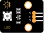                | 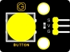                    |                             | 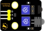                 |
| ---------------------------------- | -------------------------------- | --------------------------------------- | ------------------------------------------- | --------------------------------------------------- | ---------------------------------------- |
| ESP32 Board*1                      | ESP32 Expansion Board*1          | Keyestudio DIY Purple LED Module*1      | Keyestudio  Button Module*1                 | Keyestudio Rotary Potentiometer*1                   | Keyestudio Obstacle Avoidance Sensor*1   |
| 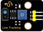           |          |                 |                     | 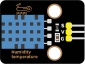                            |                  |
| Keyestudio  Line Tracking Sensor*1 | Keyestudio DIY Joystick Module*1 | Keyestudio HC-SR04 Ultrasonic sensor *1 | Keyestudio DIY Common Cathode RGB Module *1 | Keyestudio XHT11 Temperature and Humidity Sensor *1 | Keyestudio ADXL345 Acceleration Sensor*1 |
|            |          |                 |                     |                                                     |                                          |
| Micro USB Cable*1                  | 3P Dupont Wire*6                 | 4P Dupont Wire*3                        | 5P Dupont Wire*1                            |                                                     |                                          |

**Wiring Diagram**

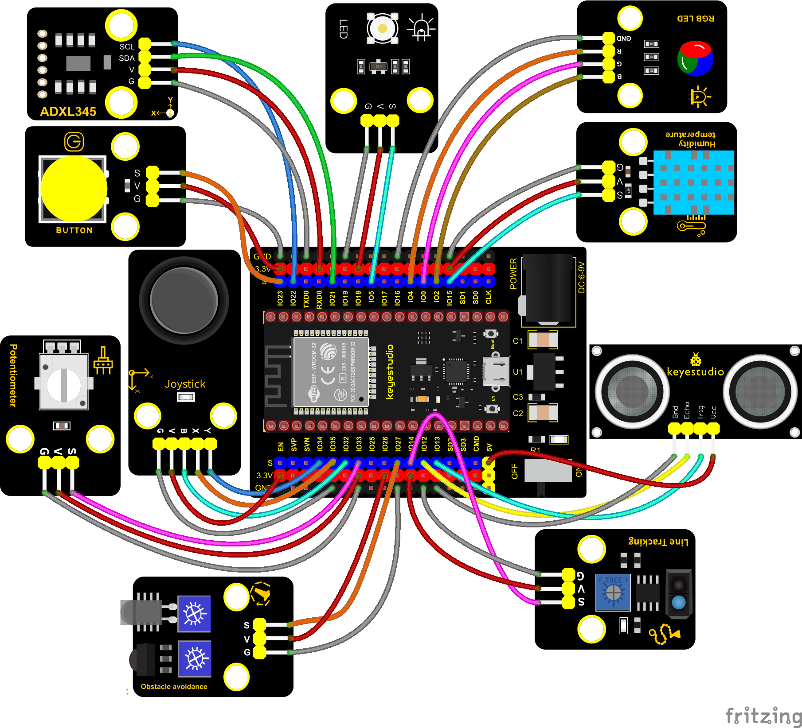

**Test Code**


```python
from machine import ADC, Pin, PWM
import time
import machine
import random
import dht
from ADXL345 import adxl345

scl = Pin(22)
sda = Pin(21)
bus = 0
snsr = adxl345(bus, scl, sda)

pwm_r = PWM(Pin(4))
pwm_g = PWM(Pin(0))
pwm_b = PWM(Pin(2))

pwm_r.freq(1000)
pwm_g.freq(1000)
pwm_b.freq(1000)

DHT = dht.DHT11(machine.Pin(15))

potentiometer_adc=ADC(Pin(33))
potentiometer_adc.atten(ADC.ATTN_11DB)
potentiometer_adc.width(ADC.WIDTH_12BIT)

button = Pin(23, Pin.IN)
led = PWM(Pin(5))
led.freq(1000)

tracking = Pin(14, Pin.IN, Pin.PULL_UP)

button_z=Pin(32,Pin.IN,Pin.PULL_UP)
rocker_x=ADC(Pin(35))
rocker_y=ADC(Pin(34))
rocker_x.atten(ADC.ATTN_11DB)
rocker_y.atten(ADC.ATTN_11DB)
rocker_x.width(ADC.WIDTH_12BIT)
rocker_y.width(ADC.WIDTH_12BIT)

avoid = Pin(27, Pin.IN)
# Set ultrasonic pins
trigger = Pin(13, Pin.OUT)
echo = Pin(12, Pin.IN)

def light(red, green, blue):
    pwm_r.duty(red)
    pwm_g.duty(green)
    pwm_b.duty(blue)

# Ultrasonic ranging, unit: cm
def getDistance(trigger, echo):
    # Generates a 10us square wave
    trigger.value(0)   #A short low level is given beforehand to ensure a clean high pulse:
    time.sleep_us(2)
    trigger.value(1)
    time.sleep_us(10)#After pulling high, wait 10 microseconds and immediately set it to low
    trigger.value(0)
    
    while echo.value() == 0: #Establish a while loop to detect whether the echo pin value is 0 and record the time at that time
        start = time.ticks_us()
    while echo.value() == 1: #Establish a while loop to check whether the echo pin value is 1 and record the time at that time
        end = time.ticks_us()
    d = (end - start) * 0.0343 / 2 #The travel time of the sound wave x the speed of sound (343.2 m/s, 0.0343 cm/microsecond), and the distance back and forth divided by 2
    return d
        
    keys = 0
    nums = 0
    print(keys % 8)
    def toggle_handle(pin):
        global keys
        keys += 1
        print(keys % 7)
    button.irq(trigger = Pin.IRQ_FALLING, handler = toggle_handle)

def showRGB():
    R = random.randint(0,1023)
    G = random.randint(0,1023)
    B = random.randint(0,1023)
    light(R, G, B)
    time.sleep(0.3)

def showxht11():
    DHT.measure() 
    print('temperature:',DHT.temperature(),'℃','humidity:',DHT.humidity(),'%')
    time.sleep(1)

def showtracking():
    if tracking.value() == 0:
        print("0   White")   #Press to print the corresponding information.
    else:
        print("1   Black")
    time.sleep(0.1) #delay 0.1s
    
def showJoystick():
    B_value = button_z.value()
    X_value = rocker_x.read()
    Y_value = rocker_y.read()
    print("button:", end = " ")
    print(B_value, end = " ")
    print("X:", end = " ")
    print(X_value, end = " ")
    print("Y:", end = " ")
    print(Y_value)
    time.sleep(0.1)

def adjustLight():
    pot_value = potentiometer_adc.read()
    print(pot_value)
    led.duty(pot_value)
    time.sleep(0.1)

def showAvoid():
    if avoid.value() == 0:
        print("There are obstacles")
    else:
        print("All going well")
    time.sleep(0.1)

def showDistance():
    distance = getDistance(trigger, echo)
    print("The distance is ：{:.2f} cm".format(distance))
    time.sleep(0.1)

def showADXL345():
    x,y,z = snsr.readXYZ()
    print('x:',x,'y:',y,'z:',z,'uint:mg')
    time.sleep(0.1)
 
while True:
    nums = keys % 8  #number of keystrokes mod 7 to get 0, 1, 2, 3, 4, 5, 6 
    if nums == 0:  #According to RGB
        showRGB()
    elif nums == 1:  #Displays the high and low level of the tracking sensor
        showtracking()
    elif nums == 2:  #Display temperature and humidity
        showxht11()
    elif nums == 3:  #Displays the rocker value
        showJoystick()
    elif nums == 4:  #The potentiometer adjusts the LED
        adjustLight()
    elif nums == 5:  #Display obstacle information
        showAvoid()
    elif nums == 6:  #Display ultrasonic ranging value
        showDistance()
    elif nums == 7:  #Display ADXL345_x/y/z value
        showADXL345()        
```

**Code Explanation**

Calculate how many times the button is pressed, divide it by 8, and get the remainder which is 0, 1 2, 3, 4, 5 , 6 and 7. According to different remainders, construct five unique functions to control the experiment and realize different functions.

<span style="color: rgb(255, 76, 65);">We add adxl345 library files in this project.</span>
<br>
<br>

Following the instructions, we can add or remove sensors/modules in the wiring, and then change the experimental function in the code.

**Test Result**

Connect the wires according to the wiring diagram, use the USB to power on, and then click  run the test code. At the beginning, the number of keys is 0, the remainder is 0, and the four lamp beads on the RGB module flash with random colors.

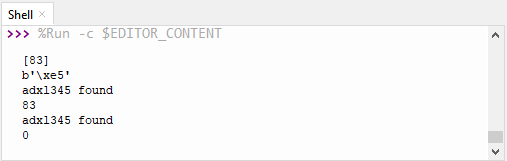

Press the button, the RGB stops flashing, press once, the remainder is the function of the experiment is to track the sensor according to black and white objects read high and low levels, the following information is displayed.

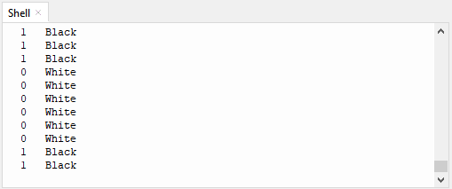

Press the key twice, the time of pressing buttons is 2 and the remainder is 2. Read temperature and humidity values. As shown below;

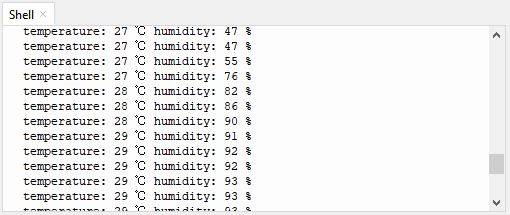

Press the key again, the time of pressing buttons is 3 and the remainder is 3. Read digital values at x, y and z axis of the joystick module. As shown below;

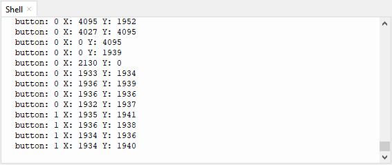

Press the key for the fourth time, the remainder is 4. Then the potentiometer can adjust the PWM value at the GPI05 port to control LED brightness of the purple LED;

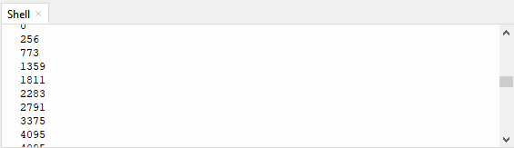

Press the key for the fifth time, the remainder is 5. Then the obstacle avoidance sensor can detect obstacles, as shown below;


Press the key for the sixth time, the remainder is 6. Then the ultrasonic sensor can detect distance away from obstacles, as shown below;

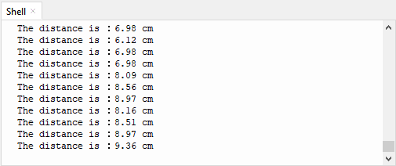

Press the key for seventh time and the remainder is 7. The shell will print out the acceleration value;

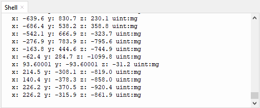

Press the key for eighth time and the remainder is 0. Then the RGB will flash. If you press keys incessantly, remainders will change in a loop way. So does functions.

Press “Ctrl+C”or click“Stop/Restart backend”to exit the program.


