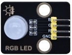
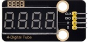

# Keyestudio ESP32 42 in 1 Sensor Kit

## 1. Description

The Keyestudio ESP32 42 in 1 sensor kit mainly contains 42 commonly usedsensors/modules, a ESP32 board, a ESP32 expansion board and Dupontwires.

The 42 sensors and modules are fully compatible with the ESP32 ExpansionBoard. You only need to stack the ESP32 mainboard onto the ESP32 Expansion Board, and hook up them with Dupont wires, which is simple and convenient.

To make you master the electronic knowledge, detailed tutorials (Micropython), schematic diagrams, wiring methods and test code are included. Through these projects, you will have a better understanding about programming, logic and electronics.

## 2. Kit

(Note: KS5003 kit include ESP32 mainboard；KS5004 kit does‘t include ESP32 mainboard.)

|  #   |         Picture         |                   Name                   | QTY  |
| :--: | :---------------------: | :--------------------------------------: | :--: |
|  1   |   |          keyestudio LED Module           |  1   |
|  2   |   |   Keyestudio Common Cathode RGB Module   |  1   |
|  3   |   |     Keyestudio Traffic Lights Module     |  1   |
|  4   |   |         Keyestudio Active Buzzer         |  1   |
|  5   |   |  Keyestudio 8002b Audio Power Amplifier  |  1   |
|  6   |   |         Keyestudio Button Module         |  1   |
|  7   |   |          Keyestudio Tilt Sensor          |  1   |
|  8   |   |       Keyestudio PIR Motion Sensor       |  1   |
|  9   |   |   Keyestudio Obstacle Avoidance Sensor   |  1   |
|  10  |  |        Keyestudio 6812 RGB Module        |  1   |
|  11  |  |     Keyestudio NTC-MF52AT Thermistor     |  1   |
|  12  |  |         Keyestudio Photoresistor         |  1   |
|  13  |  |         Keyestudio Sound Sensor          |  1   |
|  14  |  |      KeyestudioRotary Potentiometer      |  1   |
|  15  |  |          Keyestudio IR Receiver          |  1   |
|  16  |  |      Keyestudio Reed Switch Sensor       |  1   |
|  17  |  |     Keyestudio Rotary Encoder Module     |  1   |
|  18  |  |        Keyestudio Joystick Module        |  1   |
|  19  |  | Keyestudio HT16K33 8X8 Dot Matrix Module |  1   |
|  20  |  |  Keyestudio TM1650 4-Digit Tube Display  |  1   |
|  21  |  |   Keyestudio Thin-film Pressure Sensor   |  1   |
|  22  |  |      Keyestudio DS1307 Clock Sensor      |  1   |
|  23  |  |    Keyestudio SR01 Ultrasonic Sensor     |  1   |
|  24  |  |                  Servo                   |  1   |
|  25  |  |       Keyestudio Capacitive Sensor       |  1   |
|  26  |  |       Keyestudio Photo Interrupter       |  1   |
|  27  |  |          Keyestudio Hall Sensor          |  1   |
|  28  |  |         Keyestudio Flame Sensor          |  1   |
|  29  |  |     Keyestudio Line Tracking Sensor      |  1   |
|  30  |  |       Keyestudio Analog Gas Sensor       |  1   |
|  31  |  |     Temperature and Humidity Sensor      |  1   |
|  32  |  |   Keyestudio 18B20 Temperature Sensor    |  1   |
|  33  |  |           keyestudio 130 Motor           |  1   |
|  34  |  |                   Fan                    |  1   |
|  35  |  |         Keyestudio Laser Module          |  1   |
|  36  |  |         Keyestudio Steam Sensor          |  1   |
|  37  |  |         Keyestudio Relay Module          |  1   |
|  38  |  |          Keyestudio RFID Module          |  1   |
|  39  |  |       Keyestudio Collision Sensor        |  1   |
|  40  |  |        Keyestudio Alcohol Sensor         |  1   |
|  41  |  |     Kyestudio LCD_128X32_DOT Module      |  1   |
|  42  |  |        5-Channel AD Button Module        |  1   |
|  43  |  |        DXL345 Acceleration Module        |  1   |
|  44  |  |    Keyestudio ESP32 Development Board    |  1   |
|  45  |  |   Keyestudio ESP32-IO Expansion Board    |  1   |
|  46  |  |       Keyestudio IR Remote Control       |  1   |
|  47  |  |                USB Cable                 |  1   |
|  48  |  |             F-F Dupont Wire              |  1   |
|  49  |  |                White Card                |  1   |
|  50  |  |               ABS RFID Key               |  1   |
|  51  |  |              Battery Holder              |  1   |

## 3. Tutorials

* [1.ESP32_Mainboard_and_ESP32_Expansion_Board](1.ESP32_Mainboard_and_ESP32_Expansion_Board.md)

* [2.Python_Tutorial(Windows)](2.Python_Tutorial(Windows)/Python_Tutorial(Windows).md)

* [3.Arduino_C_Tutorial(Windows)](3.Arduino_C_Tutorial(Windows)/Arduino_C_Tutorial(Windows).md)

* [4.Arduino_C_Tutorial(Raspberry-Pi)](4.Arduino_C_Tutorial(Raspberry-Pi)/Arduino_C_Tutorial(Raspberry-Pi).md)

* [5.Libraries_Driver_Firmware_and_APP](5.Libraries_Driver_Firmware_and_APP.zip)

* [6.Codes](6.Codes.zip)

